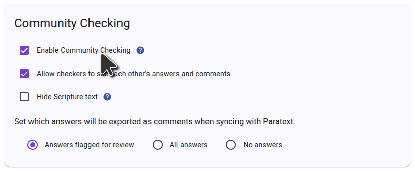

To use Scripture Forge community checking, you need to first log in to Scripture Forge using your Paratext credentials and connect your project. Once your project is connected, navigate to Settings and scroll down to the Community Checking section. Make sure the "Enable Community Checking" checkbox is ticked as shown in the screenshot below.

