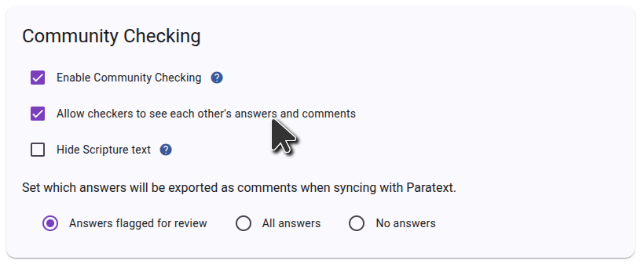
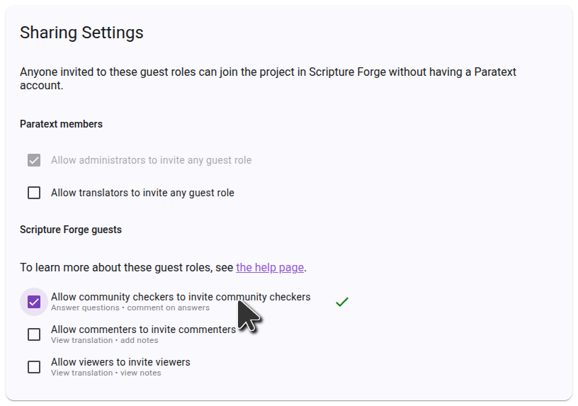
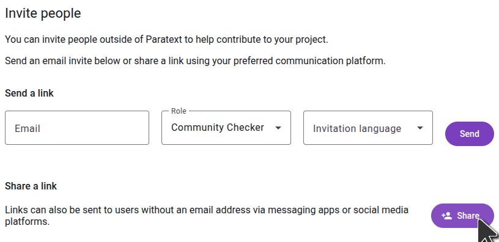

import ReactPlayer from "react-player";

## Invite people to check your project {#1850d745ac9e80caacf5e643bb216f77}

<ReactPlayer controls url="https://youtu.be/aBPHCF56hxA" />

Once you have the questions on your project, it's time to invite community checkers.

In the side bar, click **Settings**, and scroll down to **Sharing settings**.

### User interaction settings {#1850d745ac9e8018b5a7ff9f3ea349e9}

The first setting to consider is **Allow checkers to see each other's answers and comments**. When community checkers are presented with a question, existing answers from other community checkers are not shown so that they will not influence the answer that is given. Once a question is answered, any other answers to the question will be shown, and checkers can comment on and like each other's answers. If you don't want this interaction and want answers from other checkers to always be hidden, turn off **Allow checkers to see each other's answers and comments**.

### Sharing settings {#1850d745ac9e8097ad4efcb063fc2603}

If you want community checkers to be able to invite friends to the project, make sure **Allow community checkers to invite community checkers** is enabled. If this setting is off, only project admins will be able to add community checkers to the project.

### Inviting community checkers {#1850d745ac9e802d84d8e00da4fe25c2}

In the side bar, click **Users**, and you will be presented with sharing options.

To invite someone by sending a link, click **Share**, select the language you want Scripture Forge to show the recipient, and copy the link. You can then send this link to anyone you want to invite to the project. When they click the link, they will be able to join the project as a community checker.

If you want to send email invitations to users, type the email of the user you want to invite, select the **Community Checker** role, and choose an invitation language. Then click **Send**. An email with a link will be sent to the person, who will need to click the link and sign up to join the project.

