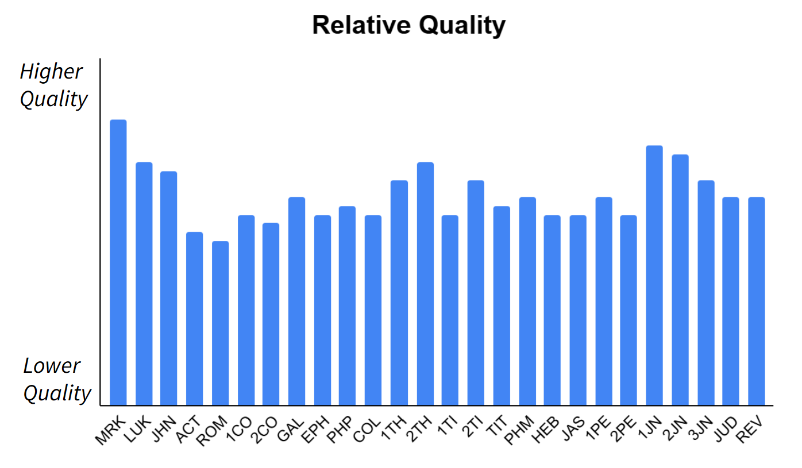
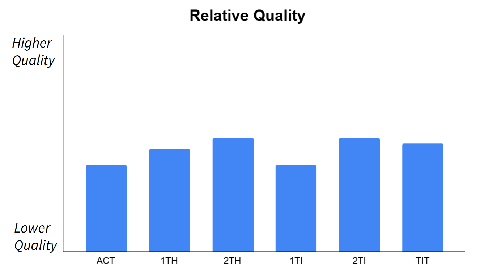
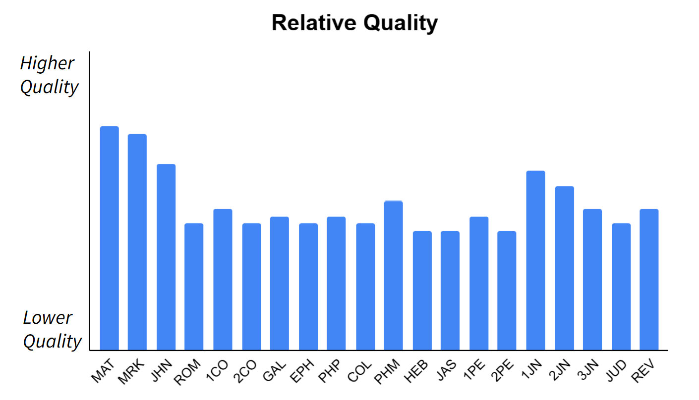
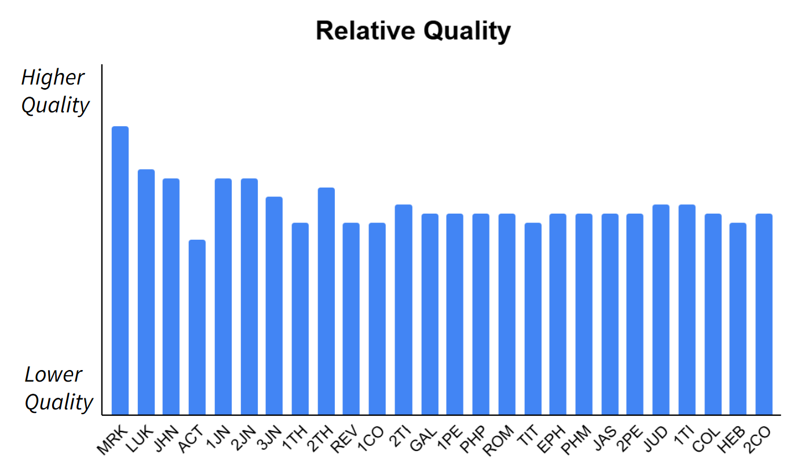

# Guidelines for New Testament Draft Generation

## Overview

*Scripture Forge* has successfully deployed **AI-assisted draft generation** to accelerate preparation of first drafts for **Old Testament** translation projects. This established capability has now been extended to benefit **New Testament** translation projects. This innovation can significantly reduce the time required for a translator to prepare a high quality first draft of their New Testament book.

Effective use of *Scripture Forge* draft generation for New Testament projects depends on several key considerations: 

* At least **one completed Gospel** is required to get started.   
* Some **book sequences** perform much better than other sequences for draft generation.   
* Understanding *Scripture Forge’s* new **incremental draft generation** capability and estimated **draft quality** is important to maximize benefits from New Testament draft generation for the Gospels and Acts.

This document provides essential **guidance** for using Scripture Forge draft generation in a New Testament translation project. The guidance offers insight into the likely draft quality for different New Testament books at various stages of a project, and explains how to get the most benefit from incremental draft generation and draft quality estimates.

## Audience

This guidance document is designed for those involved in the planning, execution, and quality control of New Testament projects using *Scripture Forge* draft generation.

##### *Primary Audience*

* **Project Planners:** To understand the effect of book sequencing on draft quality, and to anticipate the expected changes in draft quality when planning timelines and resource allocation.  
* **Team Leads:** To make informed, practical decisions when selecting the next book for translation to maximize the benefits of AI drafting.

##### *Secondary Audiences*

* **Translators and Reviewers:** To understand draft quality estimates and how book sequencing and incremental draft generation impact the quality of the drafts they will be working with.  
* **Translation Consultants:** To advise teams on the best implementation strategies for using draft generation.  
* **Trainers:** To understand the draft generation methodology for New Testament projects in order to effectively train translation teams.

## Background

*Scripture Forge* draft generation uses Artificial Intelligence to learn from your previously translated Scripture and to provide rough drafts of new books for your Paratext project. These rough drafts can be edited or consulted by the translation team to create a first draft, saving valuable time and effort while improving quality.

Draft generation is enabled by three important types of data \- your reference project, your Paratext project, and your drafting source.

* **Reference project**  
  The DBL resource or Paratext project that your translation team primarily consults as they translate (i.e., your “model text”).  
* **Paratext project**  
  Completed books from your Paratext project. Especially for New Testament projects, the specific completed books in your project influence generated draft quality.  
* **Drafting source**  
  The DBL resource or Paratext project that will be used for generating drafts. This is typically the same as the Reference Project.

### ***Key Concepts***

#### ***Draft Quality***

*Scripture Forge* drafts are not perfect and will always need review and improvement by experienced translators. Some drafts will be more accurate than others. This is due to inherent limitations in current Artificial Intelligence technology, as well as the challenges of translating novel New Testament vocabulary and concepts in the book being drafted. For example, when a project has translated the Gospels and is generating a draft for Acts, the draft may have poor translations for new words such as “Pentecost” and “Cappadocia”.

With the introduction of New Testament draft generation, *Scripture Forge* has developed a method of estimating the quality of the generated draft. Book-level draft quality can be used as a guide for strategic decisions regarding book sequencing. Chapter-level draft quality can be used to evaluate the need for incremental draft generation, or to anticipate the time needed for editing, improvement, and checking. It is important to understand these values as draft quality **estimates**, and use them for general insights and guidance, rather than as quality checking tools.

Book and chapter draft quality estimates are expressed using a green / yellow / red scheme.

* **Green**: the book (or chapter) draft is **likely** to be useful[^1].  
* **Yellow:** the book (or chapter) draft is **probably** useful.  
* **Red:** the book (or chapter) draft **may not** be useful.

Draft quality estimates can be provided by the *Scripture Forge* Engineer-in-the-Loop (EITL) support team.

#### ***Book Sequences***

*Scripture Forge* draft generation is intended to be used in a book-at-a-time manner, particularly for New Testament projects. After the first Gospel is translated, a draft can be generated for the next New Testament book. After the team uses this draft to complete their translation of this second book, the third book draft is generated, and so on. This New Testament book sequence can affect the quality of each book draft.

These guidelines are organized around two commonly used book sequences (*Canonical* and *Luke / Acts / 5 T’s*), and a new book sequence optimized for draft generation (*Draft- Optimized*).

* ***Canonical***  
  The *Canonical* book sequence begins with Matthew and progresses through to Revelation in canonical order. Draft generation can be introduced to the translation project after Matthew has been translated.

* ***Luke / Acts / 5 T’s***  
  The *Luke / Acts / 5 T’s* book sequence starts with Luke, then Acts, then 1 & 2 Thessalonians, 1 & 2 Timothy, and Titus (the *5 T’s*). For the remaining New Testament books, the sequence varies. Draft generation can be introduced after Luke has been translated.

* ***Draft-Optimized***  
  The *Draft-Optimized* book sequence is designed to offer the best draft quality as each book is drafted, minimizing fluctuations in quality as a team progresses through the New Testament. This book sequence mirrors the *Canonical* order through the Gospels and Acts, but differs for the remaining books. Draft generation can be introduced after Matthew has been translated.

#### ***Incremental Draft Generation*** {#incremental-draft-generation}

For most New Testament books, a draft is generated once for the entire book. However, for the Gospels and Acts, it can be helpful to use the **incremental draft generation** method, which involves the following steps:

* **Initial Draft:** An initial draft of the entire book is generated.  
* **Review & Improve:** The translation team reviews and improves **8-10 chapters** of this initial draft.  
* **Incremental Draft**: The *Scripture Forge* EITL support team uses these completed chapters to generate an **updated draft** of the *remaining* chapters.  
* **Integrate & Review:** The translation team imports the updated draft into their Paratext project, then reviews and improves additional chapters.  
* **Repeat**: Incremental draft generation is repeated for longer books:  
  * For Mark and John, incremental draft generation is only performed once.  
  * For Matthew, Luke and Acts, incremental draft generation is performed twice: once after the first 8-10 chapters, and again after the second 8-10 chapters.

Incremental Draft Generation is an optional method for translating the Gospels and Acts. The *Scripture Forge* EITL team can provide project-specific guidance and quality estimates for your project, as well as guidance regarding the estimated quality of the chapter drafts.

Incremental Draft Generation is not yet available as a self-service *Scripture Forge* feature, and must be requested through the *Scripture Forge* EITL team. 

#### ***Engineer-in-the-Loop (EITL)***

The *Scripture Forge* Engineer-in-the-Loop (EITL) team supports Old Testament translation projects as they begin using draft generation, offering advice and options for configuring *Scripture Forge* to get the best results.  With the introduction of New Testament draft generation, the *Scripture Forge* EITL team is now able to provide the same support for New Testament projects, as well as offering draft quality estimation and incremental draft generation.

## How to Use this Document

* Review the [*New Testament* *Drafting Guidance*](#new-testament-drafting-guidance) section below for insights about New Testament draft generation.  
* Review the book sequence descriptions (*Canonical, Luke / Acts / 5 T’s,* and *Draft- Optimized)* and select the book sequence that is most similar to your project’s progress and plans.  
* Review the general guidance and sequence-specific guidance to make decisions as you plan the book sequence for your project. Consider the use of incremental draft generation for the Gospels and Acts.  
* Review the *Frequently Asked Questions* section to explore common questions about New Testament draft generation, incremental draft generation, and EITL support for New Testament projects.

## Additional Information

Interested in accelerating your New Testament project using *Scripture Forge* draft generation? Contact us at [support\_team@scriptureforge.org](mailto:support_team@scriptureforge.org).

## New Testament Drafting Guidance {#new-testament-drafting-guidance}

### ***General Guidance***

Through experimentation, we’ve established both general guidance and book-sequence-specific guidance. Our **key general guidance** for New Testament draft generation is as follows:

* **Before starting draft generation:**  
  * The team should have already manually completed at least one of the Synoptic Gospels.  
    * Completing Matthew or Luke first before draft generation is preferable for higher quality drafts.  
    * Completing Mark first is also acceptable for most projects.  
* **When drafting the Gospels and Acts**:  
  * We recommend the sequence of **Matthew \-\> Mark \-\> Luke \-\> John \-\> Acts** for the best experience, with Luke \-\> Mark \-\> Matthew \-\> John \-\> Acts as another good alternative.  
    * Expect that the **Synoptic Gospels** will contain the **best** generated drafts.  
    * Drafts of **John** tend to be of a **lower quality** than drafts of the Synoptics, and drafts of **Acts** are usually the **lowest quality** of these books. Waiting until the Synoptics have been drafted will result in higher quality drafts for these books.  
  * **Incremental draft generation** provides a **significant improvement** in the **draft quality** of the **Gospels and Acts**.  
    * This process involves finishing 8-10 chapters of a book and then requesting a new draft of the remaining chapters for improved draft quality. For more information on how incremental draft generation works, please go to the earlier section on [Incremental Draft Generation](#incremental-draft-generation) under Key Concepts.  
    * If there is any concern about the draft quality of some chapters, consider leaving those for the end, so that those chapters can benefit the most from the incremental draft generation. The EITL team can offer chapter-by-chapter estimates of draft quality and flag chapters that may have significantly lower quality.  
* **Before drafting the Epistles**, it is highly recommended to draft **Acts**. This book, more than any of the Gospels, has the most impact on the draft quality of the Epistles.  
* **When drafting the Epistles**:  
  * **1-3 John** and **1-2 Thessalonians** are the best Epistles to start with due to their **higher draft quality**.  
  * **Hebrews** and **2 Corinthians** are recommended to be saved for the end because they usually have the **lowest draft quality** in the Epistles.  
  * For the numbered Epistles (**1-2 Thessalonians, 1-2 Timothy, 1-2 Peter, 1-3 John**), completing one of them will improve the draft quality of the other(s) in the set.  
    * We recommend completing books within a set in order (e.g., 1 Corinthians before 2 Corinthians), with the exception that 2 Timothy should be completed before 1 Timothy to maximize draft quality.  
  * We encourage drafting and completing Epistles **one book at a time** rather than generating drafts of multiple Epistles at once. This maximizes the draft quality of each Epistle.  
    * If drafts of a specific Epistle are initially not high enough quality, it can be saved for later and attempted again after more books have been completed.  
* For projects that are using a **non-Latin script**, there may be more of a need to stick closer to the outlined guidance to maximize draft quality.

### ***Sequence-Specific Guidance***

In addition to our general guidance, we’ve outlined **sequence-specific guidance** below tailored to different book sequences. Two specific book sequences are covered, *Canonical* and *Luke/Acts/5 T’s*, which reflect likely paths a translation team may take through the New Testament. There is also a third *Draft-Optimized* section for projects without a predetermined book sequence, which contains guidance to optimize draft quality for each stage of New Testament drafting.

#### ***Canonical Book Sequence***

**Definition:** MAT, MRK, LUK, JHN, ACT, ROM, 1CO, 2CO, GAL, EPH, PHP, COL, 1TH, 2TH, 1TI, 2TI, TIT, PHM, HEB, JAS, 1PE, 2PE, 1JN, 2JN, 3JN, JUD, REV

**Overview:** The *Canonical* book sequence is the canonical order from Matthew to Revelation. It produces the best draft quality for the Gospels and Acts and serves as the best starting point for drafting the Epistles. However, Epistle draft quality may vary significantly book to book in this sequence.

**Assumptions:** At least one book (Matthew) must already be finished before starting draft generation, so that Scripture Forge has enough data to learn from and so that translation teams gain the experience of translating one medium-to-large book.

**Sequence-specific Guidance:**

* **Gospels:** The *Canonical* sequence matches our guidance exactly for the Gospels and Acts, so there are no additional cautions here beyond what was described in the general guidance.  
* **Acts:** The initial draft quality of Acts tends to be lower than that of the Gospels, so applying incremental draft generation can be especially beneficial and important here.  
* **Before Epistles:** Completing all of the Gospels \+ Acts before generating drafts of the Epistles results in the highest Epistle draft quality.   
* **Epistles:**  
  * Expect draft quality fluctuations throughout the Epistles.  
    * For instance, 1 Timothy may be a drop in quality compared to 2 Thessalonians, but 2 Timothy will likely be noticeably better than 1 Timothy.  
  * 1-3 John and 1-2 Thessalonians often have the highest draft quality.  
  * Romans, 2 Corinthians, 1 Timothy, Hebrews, James, and 2 Peter all tend to have lower draft quality.  
    * If the draft for one of these books is not high enough quality for your team’s purposes, it may be worth considering leaving that book for the end to maximize its draft quality.  
* **Relative Quality Across Sequence:** Figure 1 provides a rough estimate of the relative draft quality you may experience across the *Canonical* book sequence.

**Figure 1\. Draft Quality by Book (Canonical Book Sequence)**

#### ***Luke / Acts / 5 T’s Book Sequence***

**Definition:** LUK; ACT; 1TH, 2TH, 1TI, 2TI, TIT; any other book

**Overview:** The *Luke/Acts/5T’s* book sequence prioritizes translating Acts and some of the Epistles earlier than the *Canonical* sequence. Although the draft quality of these early Epistles will not be as high compared to the *Canonical* and *Draft-Optimized* sequences, the inclusion of Acts as the second book helps improve the Epistle draft quality substantially.

**Assumptions:** At least one book (Luke) must already be finished before starting draft generation, so that Scripture Forge has enough data to learn from and so that translation teams gain the experience of translating one medium-to-large book.

**Sequence-specific Guidance:**

* **Acts:** Since there is only one book of training data (Luke), the drafts of Acts will be lower quality with this book sequence. Therefore, it’s more likely to be important for incremental draft generation to be applied every 8-10 chapters to improve the remaining chapters. Consider leaving certain chapters with lower quality for the end, so that those chapters can benefit the most from the incremental draft generation. The EITL team can offer chapter-by-chapter estimates of draft quality and flag chapters that may have significantly lower quality.  
* **5 T’s:** Once Acts is added to the training set, the drafts of the next Epistles in this sequence typically increase in quality significantly.  
  * Recommended sequence for the 5 T’s:   
    1 Thessalonians, 2 Thessalonians, 2 Timothy, Titus, 1 Timothy  
  * Figure 2 provides a rough estimate of the relative draft quality you may experience for Acts and the 5 T’s:

**Figure 2\.  Draft Quality by Book (Luke / Acts / 5 T’s \- Early Books)**

* **Remaining New Testament books:**  
  * The **remaining Gospels** can be done at any point and will almost certainly have the highest quality drafts of any remaining books. Translating the remaining Gospels earlier tends to increase the quality of the other Epistles due to their size.  
  * After the 5 T’s have been completed, the next best options for the **remaining Epistles** are the following: 1-3 John, Philemon, and 1 Corinthians.  
  * Once a few Epistles have been completed beyond the 5 T’s, see the [*Draft-Optimized* Book Sequence](#draft-optimized-book-sequence) for more guidance on the remaining Epistles.  
  * The *Scripture Forge* EITL team can provide book-by-book project-specific guidance on estimated draft quality as you progress through the remaining New Testament books.  
  * Figure 3 provides a rough estimate of the relative draft quality you may experience when choosing your next book after completing Luke, Acts, and the 5 T’s:

**Figure 3\.  Draft Quality by Book (Luke / Acts / 5 T’s \-\> Other Books)**

#### ***Draft-Optimized Book Sequence*** {#draft-optimized-book-sequence}

**Overview:** The *Draft-Optimized* book sequence provides guidance for those whose project plans have a degree of flexibility in their book sequence. It is designed to minimize fluctuations in draft quality throughout the New Testament. The book sequence begins with Matthew, then progresses through Mark, Luke, John, and Acts (in canonical order). After Acts, the optimal book sequence can vary from project to project, though common patterns exist that inform our recommendations.

**Assumptions:** One Synoptic Gospel must already be finished before starting draft generation, so that *Scripture Forge* has enough data to learn from and so that translation teams gain the experience of translating one medium-to-large book. If your team has not chosen their first book yet, consider this guidance on how the choice of first book impacts the draft quality of the rest of the Gospels and Acts:

* **Best first choices:** Matthew or Luke → results in the highest quality drafts  
* **Potential fallback:** Mark → results in a bit lower quality drafts than Matthew or Luke   
* **Not recommended:** John or Acts → results in much lower quality drafts

**Sequence-specific Guidance:**

* **After first book, and before drafting Epistles:**  
  * **Gospels+Acts Recommended Sequence:** Matthew, Mark, Luke, John, Acts  
  * **Considerations:**  
    * **Gospels+Acts:** Generally, drafting the Synoptic Gospels results in high-quality early drafts, followed by John, with Acts being the lowest quality.  
    * **If drafting Epistles before completing Gospels+Acts:**  
      * Draft at least Matthew and Acts, or Luke and Acts, before drafting Epistles  
      * Epistles should be no earlier than the third book  
      * Expect that Epistle draft quality will be lower than if you had finished all the Gospels and Acts first. Going back to do the rest of the Gospels will significantly improve the draft quality of the remaining Epistles, so we recommend doing the remaining Gospels earlier rather than later.  
* **Epistles**  
  * The following book sequence through the Epistles is recommended for projects following a draft-optimized sequence: 1JN, 2JN, 3JN, 1TH, 2TH, REV, 1CO, 2TI, GAL, 1PE, PHP, ROM, TIT, EPH, PHM, JAS, 2PE, JUD, 1TI, COL, HEB, 2CO  
  * Our recommendations for the Epistles are most consistent across projects for the first few and last few Epistles.  
    * Drafts of 1-3 John and 1-2 Thessalonians often have the highest draft quality.  
    * Drafts of Hebrews and 2 Corinthians often have the lowest draft quality unless drafted at the end or near the end of the New Testament.  
  * For the numbered Epistles (1-2 Thessalonians, 1-2 Timothy, 1-2 Peter, 1-3 John), completing one of them will improve the draft quality of the other(s) in the set. Generally, they should be done in order (e.g., 1 Corinthians before 2 Corinthians), with the exception that 2 Timothy should be completed before 1 Timothy to maximize draft quality.  
  * In general, Epistle drafts of a particular book will improve as more New Testament books are included in training. Therefore, if drafts of a specific Epistle are initially not high enough quality, then it could be attempted again after more books have been completed for increased draft quality.  
* **Relative Quality Across Sequence:** Figure 4 provides a rough estimate of the relative draft quality you may experience for the *Draft-Optimized* sequence. You may experience lower draft quality at times as you progress through your project. Please contact the EITL team if you encounter an unexpected dip in quality when generating a new book draft.

**Figure 4\.  Draft Quality by Book (Draft-Optimized Book Sequence)**

## Frequently Asked Questions (FAQ)

### ***General***

**Q: Can I use *Scripture Forge* New Testament draft generation to translate the first book in my New Testament project?**  
**A:** New Testament draft generation is only available after you have translated at least one book in your project. *Scripture Forge* uses this translated book to learn how to translate verses from your model text into your language, so that it can generate a draft of your next book. We recommend translating one of the Gospels (especially Matthew or Luke) as the first book of your project.

**Q: I already have a lot of books translated in my New Testament project. Can I still use *Scripture Forge* New Testament draft generation?**  
**A:** Yes, you can use *Scripture Forge* draft generation. Decide which book sequence (*Canonical; Luke/Acts/5 T’s;* or *Draft-Optimized*) best matches with the progress you’ve made on your project. If you have already decided on the next book that your team will translate, use the advice for your book sequence to anticipate the draft quality you might see for that book. If you have flexibility in selecting the next book for your team, use the advice for your book sequence to guide your selection.

**Q: I have some Old Testament books translated for my project. Can I still use *Scripture Forge* New Testament draft generation? Does it affect the book sequence that I should follow?**  
**A:** If you have some Old Testament books translated, but don’t yet have a Gospel translated, we recommend that you translate a Gospel before using New Testament draft generation. Otherwise, having these translated Old Testament books does not change the recommended book sequence for your New Testament books, and you can follow the guidance for the book sequence (*Canonical, Luke/Acts/5 T’s,* or *Draft-Optimized*) that best matches your New Testament progress and plan.  
If you’ve only translated non-narrative Old Testament books like Psalms and Proverbs, we recommend working with your EITL contact to evaluate the use of these Old Testament books in your drafting configuration. We also recommend working with your EITL contact if you have many translated Old Testament books (more than 8,000 verses) and would like to generate drafts for New Testament books.

**Q: *Am I required to follow the recommended book sequence?***  
**A:** No, you are not required to follow the recommended book sequence. The recommendations are offered as guidelines to help you get the most benefit from *Scripture Forge* draft generation. However, these drafting guidelines will need to be weighed against other factors when planning your project. If your project needs to follow a different book sequence, these guidelines can help you understand the draft quality you can anticipate for the book sequence you’ve chosen.

**Q: *How can I use a New Testament draft generated by Scripture Forge?***  
**A:** There are several methods for using *Scripture Forge* generated drafts:

* **Direct Editing**  
  With the **Direct Editing** method, the generated draft is added to your Paratext project, and then edited to prepare a first draft.  
* **Drafts as Resources**  
  With the **Drafts as Resources** method, the generated draft is added to a separate Paratext project, and then consulted by the translator for ideas and consistency checks as they prepare their first draft. The generated draft is **not** edited.  
* **Drafts for Checking**  
  With the **Drafts for Checking** method, the generated draft is added to a separate Paratext project, and then consulted by the translation team during team checking. The generated draft is **not** edited.

With the **Drafts as Resources** and **Drafts for Checking** methods, a separate Paratext project is created and managed by the translation team to hold their generated drafts.

**Q: *What do you mean when you talk about “draft quality”? Do all verses have the same “draft quality”?***  
**A:** Draft Quality is an automated metric that estimates the quality of each verse in a book draft. It can also be aggregated to estimate the quality of a chapter or a whole book. The basis for this estimate is how well the training examples match the task of translating that particular verse. For example, a verse with several new vocabulary words that did not occur in the training examples will generally have a lower estimated draft quality. Draft quality will not always match human judgment. However, it can be used to help teams select the best book or chapter to work on next, or to anticipate which verses may need additional attention. 

**Q: *I received a warning that my draft quality was low. What should I do?***  
**A:** Low draft quality means that more time and attention will likely be needed to produce a quality translation when working from the draft. This may happen because there is not yet enough translated Bible text to produce a high-quality draft for the specific linguistic context. In that case, you may choose to continue manual translation using the draft as a reference, for example, to help with spelling and vocabulary choice. After completing the book, you can add it to the training set to improve the quality of future book drafts.

In other cases, the low quality warning may indicate that the book chosen for translation is not the best fit to benefit from the book(s) that have been translated so far. In this case, the EITL team may suggest an alternative book with higher draft quality. You may choose to change the order of translation in order to work with a higher quality draft first, and then add that finished book to the training set to improve the draft quality of the remaining New Testament books. Alternatively, you may choose to skip draft generation for the current book and translate manually from the reference text. Especially at a genre transition, e.g. Gospels to Epistles, adding a single manually translated book to the training set can significantly improve draft quality for future books. 

**Q: *My New Testament translation does not use Latin script. What should I do?***  
**A:** Languages that use Latin script often have an advantage in machine translation because there is more electronic text in Latin script to be used as training data. This is true with the NLLB model used by Scripture Forge. However, many projects have had success using drafting with non-Latin scripts, and even with new scripts never before seen by the model. 

If your language uses a non-Latin script, be sure to mention this to the EITL team and discuss with them what may be the best options. The team may help you run additional tests and preview several drafts to look for a configuration that produces useful drafts. 

**Q: *Can I create a back translation draft of my New Testament book?***  
**A:** Yes, you can use *Scripture Forge* to draft a back translation of a New Testament book if you have an existing back translation of at least one Gospel or Acts. You will need to connect your back translation project to *Scripture Forge* and request the book draft from that project. On the “Configure sources” page, you will enter your primary translation project as both the “Reference project” and the “Draft source.” 

**Q: *What do I do if my book sequence doesn’t look like any of the 3 in this document?***  
**A:** The book sequences described in this document have been well-tested, yet results vary by project and context. If you have completed at least one of the Gospels, we recommend testing a draft of your next book. As you begin drafting, you should still be able to benefit from the general guidance and to get some idea of which books of the remaining New Testament may perform better or worse as you progress. For example, even with varying book orders, translating the book of Acts is helpful for producing drafts of the epistles. In addition, 1-2 Thessalonians and 1-3 John are still likely to have good drafts early, whereas 2 Corinthians and Hebrews will perform better if saved for later. 

### ***Incremental Draft Generation***

**Q: Can I use Incremental Draft Generation for any New Testament book?**  
**A:** When needed, Incremental Draft Generation is recommended just for the Gospels and Acts. It is not necessary or recommended to use it for other New Testament books.

**Q: How many chapters do I need to translate before using Incremental Draft Generation?**  
**A:** We recommend using Incremental Draft Generation after you’ve translated 8-10 chapters of your book (Gospel or Acts). Using Incremental Draft Generation after translating less than 8-10 chapters of your book will generally not provide an appreciable difference in the draft quality for the remaining chapters.

**Q: The EITL team recommended using Incremental Draft Generation for the book I’m working on, but the generated draft is already good enough for my needs. Do I have to use Incremental Draft Generation?**  
**A:** No, you do not have to use Incremental Draft Generation. If the original draft is already usable, or if it would be too challenging to coordinate the incremental drafting workflow with your team, you are free to use the entire initial draft without requesting incremental drafts.

**Q: Can I request Incremental Draft Generation with less than 8-10 chapters translated?**  
**A:** With less than 8-10 translated chapters in your book, Incremental Draft Generation will not typically give you a better draft of the remaining chapters in the book. We do not recommend using it until you have 8-10 translated chapters ready.

**Q: Does it matter which chapters I translate before using Incremental Draft Generation?**  
**A:** For drafts of the Gospels and Acts, your EITL contact can identify the 10 chapter drafts that are expected to have the best quality. These chapter drafts are likely to be easier to review and improve than other chapter drafts. Translating these chapters will often provide the greatest improvement to incremental drafts of the remaining chapters.  
However, you are free to translate the chapters in the order that best meets the needs of your project.

**Q: Do I need to have the translated chapters consultant checked before requesting an incremental draft?**  
**A:** It is not necessary to consultant check the translated chapters before using Incremental Draft Generation. Since *Scripture Forge* will be learning from these translated chapters, and then using what was learned to draft the remaining chapters, the translated chapters should be team-checked, or free of obvious errors. Using rough draft chapter translation is not advisable.

**Q: Can I use Incremental Draft Generation more than once for the same New Testament book?**  
**A:** If you’re translating Mark or John, we recommend generating an incremental draft once after you’ve translated 8-10 chapters. If you’re translating Matthew, Luke, or Acts, we recommend generating an incremental draft after you’ve translated 8-10 chapters, and then again after you’ve translated another 8-10 chapters.

**Q: After I request Incremental Draft Generation for the book I am working on, how long will it take for the EITL team to provide me with a new draft of the remaining chapters?**  
**A:** The incremental draft will usually be provided to you within 1-3 business days.

**Q: I’m ready for an incremental draft for the book I’m translating. Can I use *Scripture Forge* self-service draft generation to do that?**  
**A:** Always request incremental drafts from the EITL team. Be sure to tell the EITL team which chapters you have finished translating, so that those chapters can be used to improve your incremental draft.

*Scripture Forge* self-service drafting currently does **not** support generating incremental drafts. If you are using Incremental Draft Generation to translate a book, you should not use *Scripture Forge* self-service draft generation to draft that same book. Drafts created in this way are not able to benefit from the completed chapters of the book. 

**Q: I’m ready for a draft of my next book, but I’m still finishing work on the current book. For the current book, some chapters are in good shape, while others are still generated drafts. What should I do?**  
**A:** Finishing the translation of the current book before generating a draft for the next book is likely to give you the best draft for the next book. If you need to generate a draft for the next book before finishing the current book, and can provide a list of completed chapters to the EITL team, the EITL team can provide you with a draft for the next book that benefits from the completed chapters in the current book. If the chapters in the current book are a mix of completed passages and generated draft passages, it is probably best to avoid using the current book when you generate the next book draft.

**Q: I’m going to use Incremental Draft Generation for the book I’m translating. Should I add the entire initial draft in my project?**  
**A:** Adding the entire initial draft to your project will give you the most flexibility to decide which chapters you work on. You may need to adjust your plan as you work, so it is helpful to have all chapter drafts available in Paratext.

**Q: How do I add an incremental draft to my Paratext project?**  
**A:** After you have communicated with the EITL team about which chapters in a book are complete and which should be drafted, the team will send you a draft which contains only the newly-drafted chapters. Importing this draft to your Paratext project will overwrite only those chapters. 

Incremental drafts should begin with a book ID line, and should have **no content** between the book ID and the line marking the first new chapter. For example, here is a sample opening for a draft of Matthew 11-28.  
Line 1: \\id MAT  
Line 2: \\c 11  
Line 3: \[Continue with chapter content, such as section or verse marker \+ text\]

It is a good idea to visually inspect the draft (using any text editor) before importing it. Should any content be accidentally overwritten, use the history feature in Paratext to undo the most recent import, and then adjust the draft before importing it again.

### ***Engineer in the Loop (EITL)***

**Q: How do I get my New Testament project set up to use *Scripture Forge* New Testament draft generation?**  
**A:** 

* Log in to *Scripture Forge* ([www.scriptureforge.org](http://www.scriptureforge.org)) using your Paratext credentials.  
* You’ll be shown a list of your Paratext projects. Find the project and click **Connect**. *Scripture Forge* will retrieve a copy of the project from the Paratext servers and open it.  
* Go to the **Generate draft** page and click on **Sign up for drafting**. This will open a sign up form in a new tab.  
* Tell us a little bit about your project, and submit the form.  
* The EITL team will be notified and will work with you to get started with *Scripture Forge* draft generation.

**Q: After I fill out the onboarding request, how long will it take for the EITL team to respond?**  
**A:** The EITL team will usually respond to you by email within 1-3 business days. The email will include a recommended drafting configuration for your New Testament project, as well as a sample draft of the New Testament book you requested. The email may also include:

* the estimated draft quality (*likely useful*, *probably useful*, or *may not be useful*);  
* (optional) additional sample drafts generated using other drafting configurations;  
* (optional) a recommendation to use Incremental Draft Generation, along with a list of the 10 chapter drafts with the best quality.  
* (optional) recommendation(s) for other New Testament books that may have better draft quality.

**Q: When the EITL team sends me a sample draft, how do I use it?**  
**A:** Scripture Forge drafts are USFM formatted text files. The text with its USFM markers can be viewed or edited in any text editor, such as Notepad or Word. They can also be imported to a Paratext project, and how you do this will be determined by your chosen workflow. If you plan to directly edit the draft, you can import it into your main Paratext project. However, if you plan to view the draft as a resource while translating, you will need to create a separate Paratext project to hold drafts, and import the draft into that project. This will allow you to view it side-by-side with your project and other resources in Paratext. 

Drafts from Scripture Forge or from the EITL team can be imported into a Paratext project by using the “Manage books → Import books” option, and selecting the draft file you received. This must be done by a user with edit permission on the book being imported in the desired project. 

## Glossary

| Book Sequence | The sequence for translating New Testament books. |
| :---- | :---- |
| Draft Quality | A quality estimate for generated drafts: **Green**: likely to be useful **Yellow**: probably useful **Red**: may not be useful Draft quality estimates can be for an entire book draft or for each chapter draft. A draft is considered useful if a translator would choose to edit and improve the draft, rather than creating their own translation. |
| Draft Source | The Paratext project or resource used as a source for generating drafts. The text in this project / resource is translated into your project’s language to generate the draft. The Draft Source must be in the same language as the Reference Project. |
| EITL | *Scripture Forge’s* Engineer-in-the-Loop (EITL) team provides guidance to translation projects as they get started with draft generation, and can also provide incremental drafts for teams using Incremental Draft Generation. |
| Incremental Draft Generation | A method for translating a book incrementally. An initial draft of the entire book is generated, and then the translation team reviews and improves 8-10 chapters. An incremental draft of the rest of the chapters is generated, using the completed chapters (and any other completed books) to improve the incremental draft. This method is an option when translating the Gospels and Acts. |
| Initial Book Draft | When Incremental Draft Generation is being used to translate a book, the initial book draft contains drafts for all the chapters in the book. |
| Incremental Book Draft | When Incremental Draft Generation is being used to translate a book, an incremental book draft contains drafts only for the chapters that have not yet been translated. The incremental book draft contains only the USFM markers for the book identifier and for the completed chapters and verses. It does not contain the already completed chapters and verses. |
| Reference Project | The Paratext project or resource that *Scripture Forge* learns to translate into your project’s language. Usually, this is the translation that you refer to most often as you are translating. |
| 5 T’s | 1 Thessalonians, 2 Thessalonians, 1 Timothy, 2 Timothy, Titus |

## Paratext New Testament Book Abbreviations

| MAT | Matthew |  | 1TI | 1 Timothy |
| :---- | :---- | :---- | :---- | :---- |
| **MRK** | Mark |  | **2TI** | 2 Timothy |
| **LUK** | Luke |  | **TIT** | Titus |
| **JHN** | John |  | **PHM** | Philemon |
| **ACT** | Acts |  | **HEB** | Hebrews |
| **ROM** | Romans |  | **JAS** | James |
| **1CO** | 1 Corinthians |  | **1PE** | 1 Peter |
| **2CO** | 2 Corinthians |  | **2PE** | 2 Peter |
| **GAL** | Galatians |  | **1JN** | 1 John |
| **EPH** | Ephesians |  | **2JN** | 2 John |
| **PHP** | Philippians |  | **3JN** | 3 John |
| **COL** | Colossians |  | **JUD** | Jude |
| **1TH** | 1 Thessalonians |  | **REV** | Revelation |
| **2TH** | 2 Thessalonians |  |  |  |

[^1]:  A draft is considered *useful* if a translator would choose to edit and improve the draft, rather than creating their own translation.