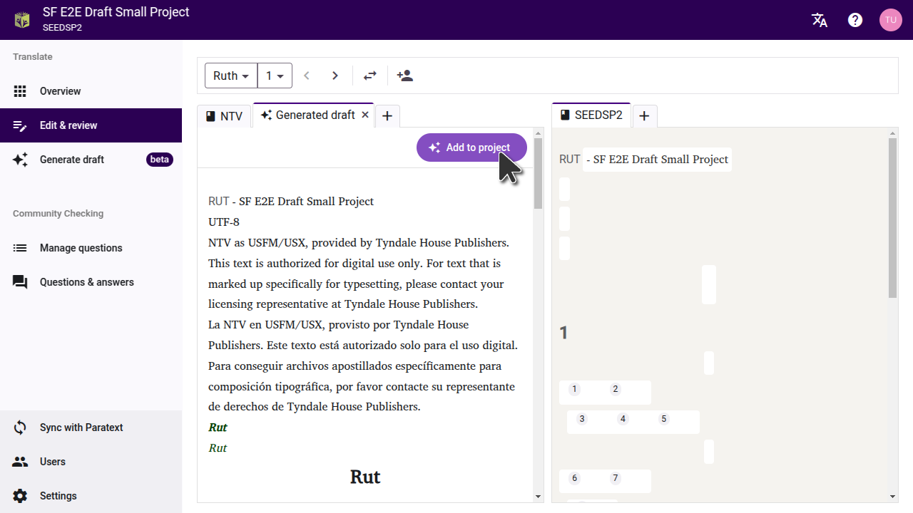

Click on a book title to view the draft. The draft will open in a new tab on the editor page.

:::tip

To compare the draft to the text it was translated from, set a source on the settings page. This will allow you to see a source and the resulting draft side-by-side.

If you drafted a book the team has already finished translating, you can move the draft tab to the other side of the page, and compare it with the team's translation.

:::

