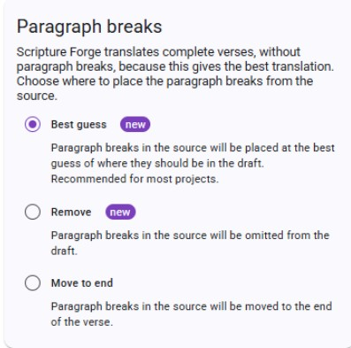
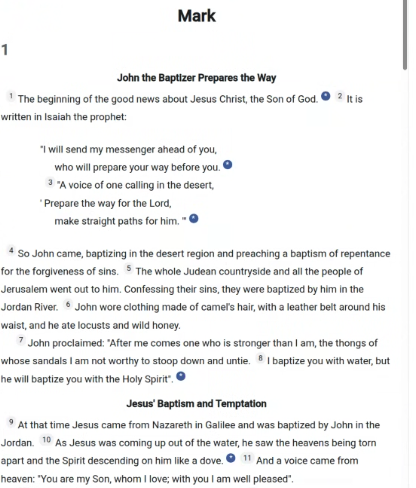

# Using Paragraph Breaks

The Paragraph Breaks feature provides additional options for handling the paragraph breaks in generated drafts. Paragraph breaks are brought over from the drafting source and there are three options for how to handle them. The options are named "Best Guess", "Remove", and "Move to End". 

"Remove" will remove all the Paragraph breaks that appear within a verse. Paragraph breaks that are between verses are not affected. If you use this option you will need to use Paratext to add in any paragraph break markers that are required in your translation. The "Move to End" option will move all Paragraph breaks to the end of the drafted verse text. This was the way that Scripture Forge originally handled Paragraph breaks, before this feature was released. Scripture Forge can attempt to place paragraph markers correctly in the drafted verse and this is the default option and called "Best Guess".  Where the system works well, it should save significant work. The "Best Guess" option is especially useful for books like Psalms where there are many paragraph breaks within verses. 

The button for the formatting options is on the “Generate Draft” page.  When you change the settings a preview of the changes will be shown. Changing the option does not affect drafts that have been added to a project; changing the options only affects the draft previews before they are added to a project.

Use the "Formatting Options" button to set up the paragraph breaks and quote styles for your draft. After the initial set up, you can return to the “Formatting Options” page and change your settings at any time.

# Using the Paragraph Breaks feature (step-by-step)

1. Navigate to the Generate Draft page in Scripture Forge.
2. Select "Formatting Options".
3. Select which option of paragraph breaks that will be applied to your draft. Those options are Best Guess, Remove, or Move to End.

4. Review the newly generated text—the paragraph breaks will now be placed with the updated formatting.

:::tip

If you have an older draft of any book in your project, and you want to benefit from the new formatting, simply regenerate the draft for that book.

:::

## Feature Notes
**Feature Availability:** Drafts generated before September 25, 2025 cannot be updated.

**Saves time:** Especially helpful for books with verses that contain many paragraph breaks.

**Future drafts:** Any new drafts generated after the release will use the "Best Guess" option by default. 

**User control:** You can control the Paragraph breaks feature by using the "Formatting options".

**Remarks:** Remarks are added to the top of the drafts indicating which formatting option was applied to the draft.

**Existing books and drafts:** The feature cannot format Paragraph marks in books that are already in your project.

