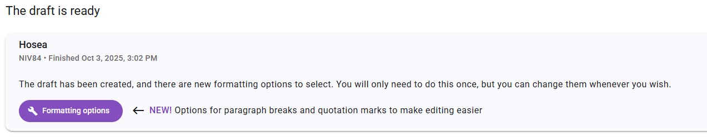
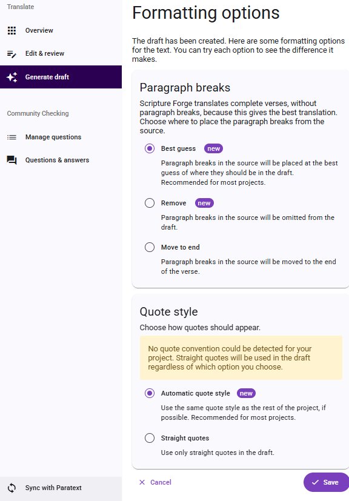
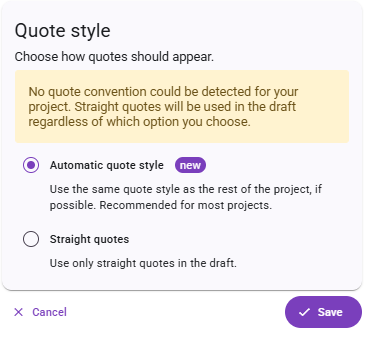

# Using Quote Styles

The Quote Style feature automatically restores quotation marks in new drafts so they match the conventions already used in your project. When Scripture Forge generates AI drafts, some punctuation distinctions are lost. This is part of the process and it generally improves the quality of the generated drafts. However, it can create a lot of work for translators who need to restore the distinctions that have been lost. One key distinction is that curly quotation marks are simplified to straight quotes:

'...' (single quotes)

"..." (double quotes)

However, many projects use other styles for quotation marks, such as:

‘ … ’ or “ … ”
« … »
「 … 」

On the Generate Draft page is Formatting Options button which will allow you to set up the paragraph breaks and quote styles for your draft. 

After the initial set up, you can return to the “Formatting Options” page and change your settings.

## How to Use Quote Styles (step-by-step)

1. Navigate to the Generate Draft page in Scripture Forge.
2. Select the book you want to draft (e.g. 1 Kings).
3. Before generating  a new draft, select Formatting Options.
4. Select the options for quote styles to apply to the draft. The two options are  "Automatic quote style" or "Straight quotes".

5. Click save.
6. Review the output:
    If quote styles  are applied, you will see the project’s preferred quotation marks.
    If the style could not be determined, you will receive a clear notification to edit the quotes manually when editing the draft.
7. Accept or reject the changes at the book or chapter level.

:::tip

Scripture Forge uses straight, single, and double quotes by default. If you are working in a language that uses a different style of quotation marks, always review the notifications after drafting to confirm that the system has used the correct quotation marks for your project.

:::

## Feature Notifications
1. **Quote styles applied successfully:**
	Quotation marks in this chapter were adjusted to match your project’s style.
2. **Unable to determine quote styles:**
	Quotation marks were not adjusted because your project’s style could not be detected. Straight quotes were used in this chapter.
3. **Unable to apply to this chapter:**
	Quotation marks in this chapter were used in this chapter because styles could not be applied accurately.

## Feature Notes
**Feature Availability:** Drafts generated before September 25, 2025 cannot be updated.

**Future drafts:** Any new drafts generated after the release will automatically use the improved formatting.

**User control:** Quote styles are controlled by the user based on the formatting options that have been chosen.

**Remarks:** Remarks are added to the top of the drafts indicating which formatting option was applied to the draft.

**Existing drafts:** Existing drafts in your project cannot be reformatted automatically.

**Undetermined quote styles:** If Scripture Forge cannot confidently determine the quote style, you will be notified so that you can edit manually.

