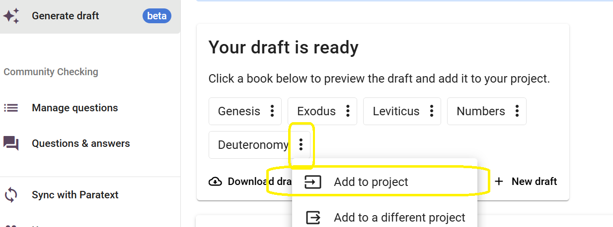

import ReactPlayer from "react-player";

# Apply and Edit a Draft {#2a0f75e3f955442e9b4f4b375f8cc58f}

<ReactPlayer controls url="https://youtu.be/S4yvGDlcZ9o" />

# How to Apply a Draft {#1430d745ac9e80878a51d2b8e2be7d05}

After a draft has been generated, it is ready to be reviewed and edited by a translator and must go through the next translation steps.

To begin editing, the draft needs to first be added to your project. There are 3 options to do this:

### **1) Chapter by chapter** {#1430d745ac9e80a29085eecf41dc2997}

Click the Book name of the draft that was generated. This shall take you to the “Edit and Review” interface. The image below shows the draft of Deuteronomy.

Here you will see the draft of the first available chapter on one side. On the other side you will see your project, which shall be empty and have no data in it for the selected chapter. To add the draft to your project, click on “Add to Project.” This will add only the current chapter to your project and you can begin to review and edit it.

### 2) Add the entire book {#1430d745ac9e803183c8d916bc54de64}

Once your drafts are generated, click the 3-dot menu by the name of the book you wish to add to your project. Then, click on “Add to project” to add the entire book to your project.

### 3) Download the Draft and add it through Paratext {#1430d745ac9e80cdb498cad97099687e}

Click “Download Draft” which will download the draft in a .usfm file. This file can then be added to your project through Paratext. After it has been added through Paratext, please make sure to run a send/receive in Paratext and then a synchronize in Scripture Forge to reflect this in your project in Scripture Forge.

# **How to Edit a Draft** {#1430d745ac9e80cb8debce126560e7b5}

This can be done in Scripture Forge by clicking on “Edit and Review” which will take you to the screen shown below. The image below shows the book of Mark.

The interface will provide you with two sections; one will show the primary reference translation (known as source), and the other will have the newly generated draft (known as target). Here you can review the draft and make any changes if necessary, just like in Paratext.

### **Navigating the Draft** {#1430d745ac9e803187c2ff37b7ee519c}

If you generated a draft for more than one book, you can navigate through books from the dropdown list available in the top left section of the screen as show below.

You can also navigate to a specific chapter using the dropdown list right next to it. Alternatively, you can also navigate to the previous or next chapter by using the arrows next to the dropdown.

If you wish to swap the placement of the source and target (left and right panes), you may do so by clicking the swap button as shown below.

Note that selecting a verse in the draft will highlight the corresponding Primary Reference Translation verse in yellow.

As you select a verse and begin working on it, the corresponding primary reference translation will auto-navigate and will display the same verse in the source language, making it easier to keep track and follow the draft.

### **Adding Comments** {#1430d745ac9e8038aee0f2290df4172b}

Scripture Forge allows users to add additional comments as they are working on the drafts.

This can be done by selecting the verse where the comment needs to be added and then clicking on the “Add Comment” button.

Once a comment is added it will be marked by a star as shown below. To update or edit the comment, simply click the star and you will be prompted to make the desired changes.

When the draft is applied to your Paratext project, comments will be exported to your Paratext project as notes.

### **Viewing History** {#1430d745ac9e809d90bbf0371c2d6c6d}

Scripture Forge saves a history of the drafts whenever a sync is run. If you ever need to go back to an older version of the draft, you can do so by checking its history.

To do this, click on the New Tab button as shown below and select “History.”

Now, using the dropdown list, select the date to open the desired version of your draft.

**Please note that when a new draft is generated, any older drafts that have not been saved will be lost. Remember to download the draft or apply it to your Paratext project and run a sync before generating a new draft.**

