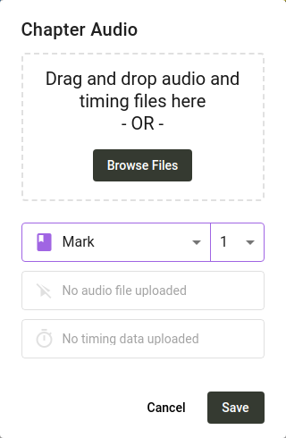

import ReactPlayer from "react-player";

This guide describes how to use [Scripture Forge](https://scriptureforge.org/) for community checking. The basic steps are as follows:

1. Connect a [Paratext](https://paratext.org/) project to Scripture Forge
2. Create or import questions for checkers to answer
3. Attach audio recording of the text (optional)
4. Invite people to check your project
5. Receive and interact with responses to the questions
6. Sync the project so answers show up as notes in Paratext

## Connect a Paratext project to Scripture Forge {#a49ffad707ee4ff69860080e6e805c3b}

1. Go to [scriptureforge.org](https://scriptureforge.org/) and click **Log in**.
2. On the log in page, click **Log in with Paratext**.
3. Log in through Paratext and authorize Scripture Forge to access your Paratext account.
4. When you’re redirected back to Scripture Forge, go to the [connect project page](https://scriptureforge.org/connect-project). If you don’t have any projects yet you’ll be sent there automatically. If you already have projects in Scripture Forge, click the project selector in the top left corner, and click **Connect project**.
5. The connect project page shows a list of projects you have access to in Paratext. Select the project you want to connect from the list.
6. Make sure the **Enable Community Checking** checkbox is selected. Don’t worry about the source text right now. That setting can be changed later on the project settings page.
7. Click **Connect**. Within less than a minute you should be taken to the project in Scripture Forge.

## Add Questions to the Project {#47b7c1e2e8a74a3489b167849470745e}

In order to get feedback on your translation, you’ll need to add comprehension checking questions. You can import questions created by someone else, or create your own.

:::note

Currently the only way to get feedback from community checkers is to ask checking questions. Some project administrators have asked for checkers to be able to add comments to the text even without a question present. If that’s something your project may benefit from, please [voice your support for the proposal](https://community.scripture.software.sil.org/t/feature-request-comments-to-any-bible-verse-chosen/2506/6) on the [Scripture Forge community site](https://community.scripture.software.sil.org/).

:::

<ReactPlayer controls url="https://youtu.be/J-led5En3D8" />

### Creating questions individually in Scripture Forge {#0c67e74b02944b61a33b3ea2d101effd}

To add questions to your project, click on **Overview** under the **Community Checking** section in the navigation sidebar. Then click on the **Add Question** button. A dialog will open that will allow you to create a question.

A question can apply to a single verse, or multiple verses. Type a reference into the **Scripture reference** box, or click the dropdown arrow to select a book, chapter, and verse. If you want the question to span multiple verses, enter an end reference in the second box. Once you’ve input a reference, the text will show up, with the verses you chose highlighted.

Type your question into the **Question** box. If you want to add an audio version of the question, click the **Record** button. You may be prompted to give permission to access your microphone. When you have finished recording, click **Stop Recording**. You can then play the recording to hear how it sounds. Click the **Try Again** button if you’re not satisfied with it. You can also upload an audio file instead of recording, if you prefer.

Click **Save** and your question will be added to the list of community checking questions.

### Importing questions from a spreadsheet {#42107c9def434bf396442d0004577710}

Creating questions one by one can be tedious, so we’ve also made it possible to import questions from a spreadsheet. You can use a program such as Microsoft Excel, Google Sheets, or LibreOffice Calc to create or edit a list of questions. If you’re looking for a set of pre-made questions, consider the [unfoldingWord® Translation Questions](https://git.door43.org/unfoldingWord/en_tq). If you go to the linked page and click on one of the files, you can then download it, open it as a spreadsheet, and edit the list of questions. 

Here’s an example of how the rows in your spreadsheet should look in order to be able to import it to Scripture Forge:

| Reference | Question                                                |
| --------- | ------------------------------------------------------- |
| HEB 1:1   | What does “our fathers” refer to?                       |
| HEB 1:2   | What does it mean that the Son is “heir of all things”? |
| HEB 1:2-3 | Who is the “Son” spoken of in these verses?             |

The spreadsheet can have more columns as well, but all columns except the “reference” and “question” columns will not be used. The TSV files published by unfoldingWord are in a slightly different format, but can be imported to Scripture Forge too.

:::note

The reference needs to have the book name abbreviated the same way Paratext abbreviates book names. For example, **HEB 1:1** will work, but **Hebrews 1:1** will not work.

:::

If you need help getting your spreadsheet into the right format to import to Scripture Forge, we would be happy to help you. Just send an email to [help@scriptureforge.org](mailto:help@scriptureforge.org).

1. Save your spreadsheet as a CSV file.
2. Then in Scripture Forge, click on **Overview** under the **Community Checking** section in the navigation sidebar.
3. Then click on the **Bulk import** button. A dialog will open requesting for you to choose where you want to import questions from.
4. Click on **Import from CSV file** and select the file.
	1. If you have some rows in your file that don’t have a valid reference and question, a warning will be shown letting you know that these rows will be skipped.
	2. Otherwise you will be shown a list of questions.

### Import all questions {#3f10139da5904f1883acafad811b422c}

To import all of the questions in the CSV file, follow these steps:

1. Click the checkbox at the top of the list. This will select all the questions.
2. Click **Import Selected Questions**.

### Import a subset of questions {#f8f6b299154e4caca7aa04661a820efd}

You can also filter for a subset of the questions:

1. Use the **Reference from** and **Reference to** boxes to specify the verses that you want the questions to start and end at.
2. For example, if you only want to import questions for Mark 5:
	1. Put **MRK 5:1** in the **Reference from** box.
	2. Put **MRK 5:43** in the **Reference to** box.
3. Click the checkbox at the top of the list to select all questions. Only the questions that are shown will be selected.
4. Click **Import Selected Questions**.

:::note

You don’t have to remember that there are 43 verses in Mark 5 in order to filter for all the verses in the chapter. If you click the dropdown arrow in the **Reference to** box, a dialog will open allowing you to select a book, chapter, and verse. Once you select Mark 5, it will list the verses in Mark 5, and you’ll be able to select the last one, which is verse 43. Alternatively you can type **MRK 5:100** in the **Reference to** box, and all the verses in Mark 5 will be included, even though there isn’t actually a verse 100 in Mark 5.

:::

### Importing questions from Transcelerator {#1ed2e353d94847a3861ad3a69d531aac}

[Transcelerator](https://software.sil.org/transcelerator/) is a plugin for Paratext that has a bank of ready-made comprehension checking questions in several major languages. Those questions can be translated within Paratext, exported to Scripture Forge, and then after a sync, imported into Scripture Forge.

To import questions from Transcelerator:

1. Download and install Transcelerator from [software.sil.org/transcelerator/download](https://software.sil.org/transcelerator/download/).
2. From within Paratext, launch Transcelerator.
3. Within Transcelerator, open the **File** menu and click **Produce Scripture Forge Files**.
4. Type the translations of the English questions you want to use in the **Translation** column. For each question that’s ready, select the **Confirmed** check box for the questions.
5. Close Transcelerator, and do a send and receive with Paratext.
6. In Scripture Forge, in the navigation sidebar, click **Synchronize**. On the page that opens, click **Synchronize** to send and receive the Transcelerator questions from Paratext.
7. Click on **Overview** under the **Community Checking** section in the navigation sidebar. Then click on the **Bulk import** button.
8. A dialog will open requesting for you to choose where you want to import questions from. Click **Import from Transcelerator**.
9. Select the questions you want to import. The steps for doing this are exactly the same as in the section above titled **Importing questions from a spreadsheet**. Refer to that section for instructions on filtering for the questions you want.
10. Click **Import Selected Questions** and your questions will be added to the project.

## Attach audio recording of the text {#fd31ef9b6d74417099996e7dadb5068e}

Scripture Forge can play an audio recording of each passage for community checkers. To do this, you will need to upload an audio file and a timing file for each chapter. Timing files allow Scripture Forge to highlight each verse as it is being spoken.

### Recording the text {#1926abf6118c46bba16353d2ef85169f}

Scripture Forge supports audio in .mp3 and .wav file formats. Timing files are supported from HearThis, aeneas, Audacity, and Adobe Audition.

One of the simplest options is to use [HearThis](http://software.sil.org/hearthis) to record the translation. [This guide](https://software.sil.org/downloads/r/scriptureappbuilder/Scripture-App-Builder-08-Using-HearThis-for-Audio-Recording.pdf) will walk you through the process of recording scripture and producing audio and timing files. Skip the steps at the end about using Scripture App Builder.

The [resources](https://software.sil.org/scriptureappbuilder/resources/) for Scripture App Builder discuss more advanced approaches, such as using Glyssen for a dramatized audio recording.

### Creating timing files {#066182aa22c64dc7a74ad0556619c4b9}

If you already have audio recorded, there are several options for creating timing data.

You can automatically generate timing files using aeneas by following [these instructions](https://software.sil.org/downloads/r/scriptureappbuilder/Scripture-App-Builder-07-Using-aeneas-for-Audio-Text-Synchronization.pdf).

Alternatively, you can manually create timing files using Audacity by following [this guide](https://software.sil.org/downloads/r/scriptureappbuilder/Scripture-App-Builder-06-Using-Audacity-for-Audio-Text-Synchronization.pdf). Another option is Adobe Audition. Timing data from Adobe Audition is supported in decimal or FPS time formats. We don’t support the “samples” format.

### Attaching audio {#a4d3ee4a4d8b4e1d9bca42b837e57f77}

To upload audio and timing files, in the sidebar click **Questions & answers**, navigate to the chapter you want to attach audio to, and then click the **Manage Audio** icon in the top right corner. Click **Browse Files** and select the audio recording and associated timing file for that chapter, then click **Save**.

## Invite people to check your project {#678dca00aaa54fd79319ecf815049301}

<ReactPlayer controls url="https://youtu.be/aBPHCF56hxA" />

Once you have the questions on your project, it’s time to invite community checkers.

In the side bar, click **Settings**, and scroll down to **Community Checking Settings**.

### User interaction settings {#84a006f1fbaa4c50a8ce8bac248c0e1d}

The first setting to consider is **Allow checkers to see each other's answers**. When community checkers are presented with a question, existing answers from other community checkers are not shown so that they will not influence the answer that is given. Once a question is answered, any other answers to the question will be shown, and checkers can comment on and like each other’s answers. If you don’t want this interaction and want answers from other checkers to always be hidden, turn off **Allow checkers to see each other's answers**.

### Sharing settings {#5aa7e3d8451f40cfa6b33c5dd39a3c6f}

If you want community checkers to be able to invite friends to the project, make sure **Allow users to invite others to the project** is enabled. If this setting is off, only project admins will be able to add community checkers to the project.

If you turn this setting on, there are two sharing modes to choose from. If you select **Anyone with a link**, you can send people a link to the project, and anyone who clicks the link can join the project. This is ideal if you want to invite a group of people (for example, you could share the link in a Facebook or WhatsApp group). Anyone with the link will be able to send the link to anyone else to join the project. Alternatively you can select **Email invitations only**, and community checkers will only be able to invite friends by sending an invitation in Scripture Forge (Scripture Forge will send an email invitation to the person).

### Inviting community checkers {#2271d918980445fd8bc89587ccf33c4f}

In the side bar, click **Users**, and you will be presented with sharing options.

If you enabled link sharing in the previous step, there will be a link that you can copy to share the project. To copy the link, click the copy icon on the right side of the link.

If link sharing is turned off, or if you want to send email invitations to users, type the email of the user you want to invite, select the **Community Checker** role, and choose an invitation language. Then click **Send**. An email with a link will be sent to the person, who will need to click the link and sign up to join the project.

## Receive and interact with responses to the questions {#d09b7e47859e451783e6dcca8a80f40a}

To monitor community checking responses, click on **Overview** under the **Community Checking** section in the navigation sidebar. Along with a list of questions, basic statistics about responses will be shown.

To view the answers from community checkers, click on one of the books under the **Community Checking** section in the navigation sidebar. Then click on a question to see the answers that have been given. If you want an answer to be exported to Paratext, click **Mark for export** on that answer. If you don’t want to do anything further with the answer, click **Resolve**. This does not remove the answer, but it marks it as not needing any further action. 

If you want to find answers that have not been marked for export, or marked resolved, use the filter above the list of questions to find **Unreviewed answers**.

If you would prefer to have all answers exported to Paratext without individually marking them for export, go to the project settings and find the **Exporting Answers** section. The default option is to only export **Answers marked for export**, but this setting can be changed to **All answers** or **No answers**.

## Sync the project so answers show up as notes in Paratext {#1502b9d293ff4c3aacbe91834fd02bb2}

In the navigation sidebar, click **Synchronize**. On the page that opens, click **Synchronize** to send and receive changes from Paratext. Then open your project in Paratext and do a send and receive. Answers from community checkers will show up in your project as notes. Please note that if you reply to these notes in Paratext, your replies will not appear as comments on the answer in Scripture Forge. 

The note will show the original question, the name of the community checker who answered, and the answer itself, as shown below.

Notes generated from community checking answers will have a unique note tag, with an icon that is different from other notes in your Paratext project. You can change the icon by editing the note tag. For details, see [the Paratext help article on custom note tags](https://paratext.org/paratext-training/tutorials/custom-project-note-tags-tutorial/). You can also [filter notes by their note tag](https://paratext.org/2022/08/15/custom-note-tags/#Filter_for_Custom_Note_Tags), allowing you to show only community checking responses, or hide them from view altogether.

:::note

Currently audio answers show up in Paratext but the audio cannot be played. In order to play the audio from an answer it has to be opened in Scripture Forge. This may be improved in the future.

:::

## Feedback {#f7d132ecbb04437e9d5a81440f84b6df}

If you have questions, problems, or suggestions, please reach out to the Scripture Forge team at [help@scriptureforge.org](mailto:help@scriptureforge.org). You can also post on the [community support site](https://community.scripture.software.sil.org/c/scripture-forge/19), which allows others to participate in the conversation. We value your feedback and frequently make changes or fix problems at the request of our users.

