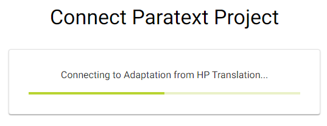

## Introduction {#6222bdf3db3a44b4bf01a9cc6ffdaa80}

:::tip

Paratext projects only need to be connected once within Scripture Forge.

:::

After a Paratext project is connected to Scripture Forge, every user that is a member of the project in Paratext (under User Permissions) will be able to open the project in Scripture Forge.

To be able to open a project in Scripture Forge, a user just needs to [login to Scripture Forge with their Paratext account information](/log-in).

## How to Connect a Paratext Project to Scripture Forge {#a71dfc268ebb43a0b19c0ab7018f92b4}

1. If you have **never connected** a project to Scripture Forge:
	1. Click the Connect project button:

		

2. If you have already connected a project to Scripture Forge, follow these instructions to connect any additional projects:
	1. Click on the Scripture Forge navigation pane:

		

	2. The navigation page may also look like this:

		

	3. Click Connect project:

		

3. Click in the Paratext Project drop-down:

	

4. Choose the project that you want to connect:

	

5. Optional: If you want to use Translation suggestions or view another project/resource beside your project:
	1. Click the Source text area:

		

	2. Select the source project:

		

6. Optional: Enable translation suggestions (#1 below)

	

7. Optional: Enable Community Checking (#2 above)
8. Click Connect:

	

9. Wait for Scripture Forge to connect the Paratext project:

	

10. Scripture Forge may take a while to connect your project, the green progress bar will stop moving when your project is fully connected:

	

Note: You may be able to work in Scripture Forge before it is fully connected.

