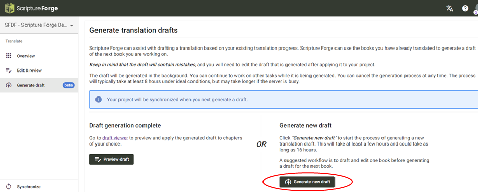
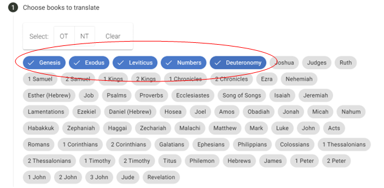

import ReactPlayer from "react-player";

<ReactPlayer controls url="https://youtu.be/binHoeAGGvU" />

Once you have signed-up for Drafting and configured the required settings, you can access Scripture Forge AI Drafting by clicking the “Generate Draft” button in the main menu. You shall now have access to the "Generate New Draft” button.

Once you click it, you will be taken to a **2-Step Process** to generate your draft.

- **Step 1:** The first step to generate a draft is to select the books you want to translate. Only the books that are already added in your Paratext project will be displayed here. We recommend selecting up to 5 books to translate at a time.

- **Step 2:** Next, you will select the books to be used to train the language model. These books should be well checked but need not be consultant checked. The more books, the better the result of the drafting. If you have picked a book to translate in step 1, you can’t pick it to train the model in this step

- Step 3 (optional): Next, you can also upload any additional files for training the language model. These need to be in .csv format. This step is optional.

After you complete these steps, you shall see the “Generate Draft” button available. Once you click it, please give Scripture Forge time to generate the drafts. This may take roughly 3 hours or longer depending on how busy our servers are.

Once the Draft is ready you should see a notification as shown in the below screenshot.

