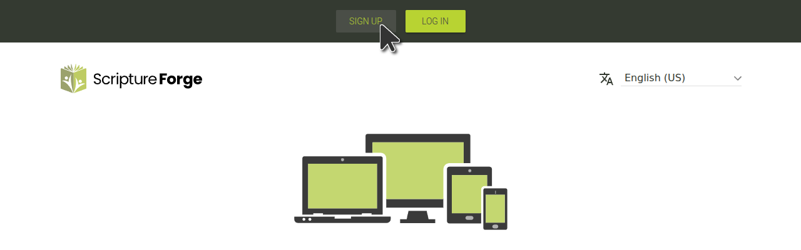
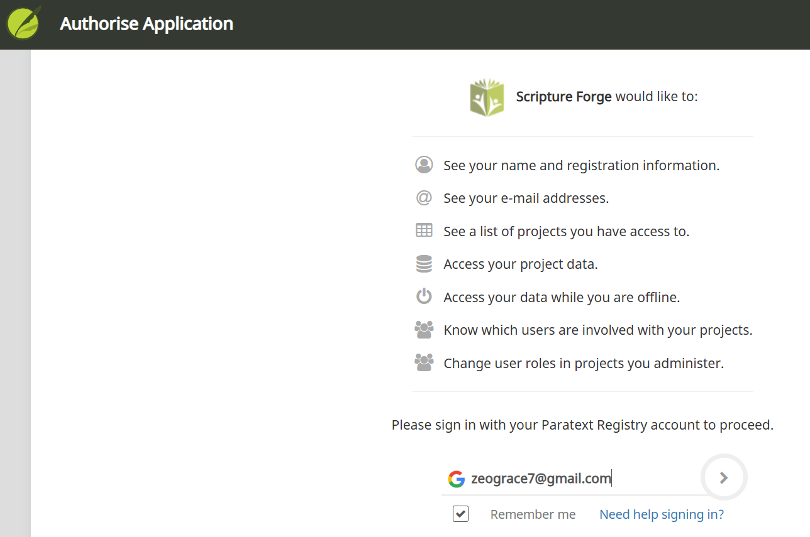

## Log in to Scripture Forge with a Paratext Account {#68acbb7da03045a7b357e41c0107f6d1}

1. Go to [https://scriptureforge.org/](https://scriptureforge.org/)
2. If you already have a Paratext registration (or have created a Scripture Forge account), click the Log In button:

Then Click Log in with Paratext:

Next, Authorize Scripture Forge to connect with your Paratext account. When prompted, type the email address associated with your [Paratext Registry account](https://registry.paratext.org/users/me) and then click the Login arrow (or press the Enter key)

