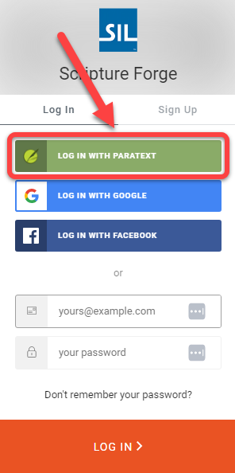
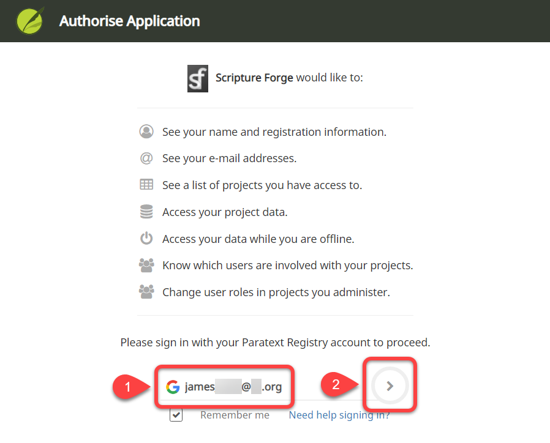

## Log in to Scripture Forge with a Paratext Account {#68acbb7da03045a7b357e41c0107f6d1}

1. Go to [https://scriptureforge.org/](https://scriptureforge.org/)
1. If you already have a Paratext registration (or have created a Scripture Forge account), click the Log In button:

	

1. Click Log in with Paratext:

	

1. Authorize Scripture Forge to connect with your Paratext account.
	1. Type the email address associated with your [Paratext Registry account](https://registry.paratext.org/users/me) (#1 below):

		

	2. Click the login arrow (#2 above).
