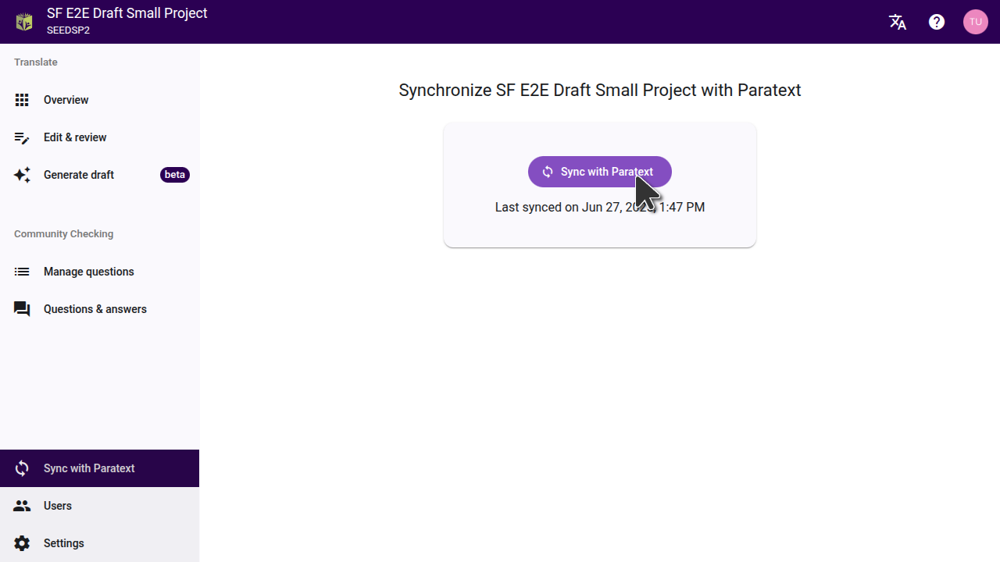

<!-- The following paragraph is an EXACT copy of one of the paragraphs on the /connect-paratext-project page and should be kept in sync with it. Both pages have the need to explain the relationship between Paratext and Scripture Forge projects, and having them identical means translators only have to translate it once. -->

In Paratext, each member of the project has a copy of the project on their own computer, and Send/Receive is used to share changes with other members. When a project is connected to Scripture Forge, all members of the project in Scripture Forge work on a single copy of the project, so any change made by one member is immediately seen by another member, if both members are online. These changes will be sent to the Paratext project when a sync is done in Scripture Forge, and any changes made in Paratext will be synced to the Scripture Forge project.

## How to sync your project {#d0af3ae0f98640c6a88fe4132a015be0}

To sync a project, click **Sync with Paratext** in the main navigation menu. Then click the **Sync with Paratext** button as shown below. Progress will be shown while the sync is running, which usually takes 1 to 3 minutes, depending on the size of the project.

If Scripture Forge is busy syncing other projects it may take a while before the sync actually starts, though this is rare. Sometimes a sync will fail and you will need to try it again. If a sync keeps failing, or it is taking a very long time, please [contact us for help](mailto:help@scriptureforge.org).

## When to sync a project {#b19f92d1a5714c4fb57b61672d95b898}

At various times Scripture Forge will automatically sync your project with Paratext. These include:
- The first time you connect a project.
- When you start generating a new draft.
- When the source for a project is changed, or drafting sources are configured.

You should run a sync whenever you want to send changes from Paratext to Scripture Forge, or from Scripture Forge to Paratext. Here are some examples of when you should run a sync:
- A book has just been completed in Paratext and you want to generate a draft of another book. You should do a send/receive in Paratext and then a sync in Scripture Forge so the completed book will be available as training data in Scripture Forge.
- A book is ready for community checking. You should do a send/receive in Paratext and then a sync in Scripture Forge so the latest copy of the book will be shown to community checkers.
- Translators have edited the text in Scripture Forge, or made other changes that you want in Paratext. You should do a sync in Scripture Forge and then a send/receive in Paratext to get the latest changes. 

You should avoid waiting a long time to sync after editing the text in Scripture Forge. If someone makes edits in Paratext before you sync the changes to Paratext, it may cause conflicts in Paratext.