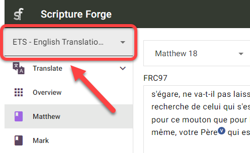
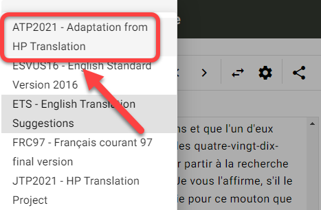
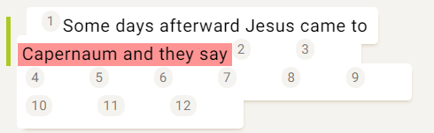

## What are Translation Suggestions? {#5f721bd65922446f8eefb001acc89f30}

Translation suggestions allow for Scripture Forge to analyze a source and target language together, and automatically suggest words/phrases to use in the translation process.

- Translation suggestions are based on Scripture Forge analyzing verses in the target project that have already been translated from the source project.
- The more verses that you have in both the source and target, the better the suggestions will be.
- Suggestions work better with languages that are more similar, and do not work well with languages that are not related to each other.
- Before you start using translation suggestions, an administrator of the Paratext project must enable translation suggestions for your project.

## Setup Your Translation Suggestions Window {#055dfd61aa9442e3b6c787613c8085d6}

:::note

This must be done by each user who wants to use translation suggestions.

:::

### Select Your Project {#4de2ee23101e4a498e465465740c5a51}

:::tip

First you need to **select your project** from the navigation page, if you haven’t already.

:::

1. Click on the Scripture Forge navigation pane:

	

2. Select your project:

	

**OR**

1. Click on the Scripture Forge menu icon:

	

2. Click on the project drop-down:

	

3. Click on your project:

	

### Setup the Translation Suggestions Window {#8798a078b0464f5190de5d6dd7e4d132}

1. In the navigation pane, click the Translate section:

	

2. Click the book that you want to work on:

	

3. The source text will display in the left-hand section, and the target text project will display in the right-hand section:

	

	1. **Note:** The name of the project/resource you are using is in the upper-left corner of each window:

		

4. To switch between books:
	1. Go to the navigation pane > Translate section.
	2. Click on the book name:

	

5. To switch between chapters:
	1. Click the right and left arrows at the top of the window:

	

6. To switch source and target project sides:
	1. Click the “swap source and target” button:

	

	1. This will move the target project to the left side, and the source project/resource to the right-side:

	

## What is a Segment? {#3931f83c77104d27bfa1bcd797303914}

:::tip

Before doing translation work in Scripture Forge, you should understand what a “**segment**” is.

:::

In Scripture Forge, a segment is a section of Scripture to be translated. This can be a section heading, a verse, or a part of a verse (like in poetry).

For example, the following passage has 6 segments (Title, Section Heading, Verse 1, etc): 

In this next passage, there are 8 total segments (note: verse 23 has 6 segments):

## How to Use Translation Suggestions {#007fd10ab17d498ea44ffb913d92663f}

Now that you understand how to navigate in Scripture Forge, it’s time to learn how to use **translation suggestions**. Remember, translation suggestions are when Scripture Forge analyzes your translation work and automatically suggests words/phrases to use in the translation process.

1. In your project, go to the book and chapter that you want to translate.
2. Click in the segment that you want to translate.
3. Start typing your translation (right-hand side):

	

	1. Note: Scripture Forge will save edits as you type.
4. As you type, suggestions may appear in a box below where you are typing:

	

5. Next to the suggestions are a percentage:

	

	1. This indicates how confident the system is that this suggestion is correct. A higher percentage suggestion is more likely to be a higher quality suggestion.
6. If you want to use a suggestion, click on it or press **Enter** when that suggestion is highlighted.

	

7. This will insert that suggestion into the text:

	

8. If you do not like a suggestion that was inserted into the text:
	1. Just delete or edit whatever words need to be changed.

		

9. If none of the suggestions are good enough, you can ignore the suggestions and keep on translating.

### Continue Translating {#9e130c3ad9c048a4822e37e0d0ba0750}

:::tip

Scripture Forge will continue to learn and make better suggestions as you translate.

To adjust the _**translation suggestion settings**_ for your user, see the [steps here 🔗](/translation-suggestions).

:::

### Keyboard Shortcuts {#228a943ddd984192b78ae4ccb39c6211}

1. When Scripture Forge shows you translation suggestions, you can use the **Up** and **Down arrow keys** to highlight the suggestion that you want.

	

	1. Then press **Enter** to use the suggestion.
2. You can also press **CTRL + &lt;a number key&gt;** to insert that number of words for the highlighted suggestion.
	1. For example, if “Capernaum and they say” was highlighted:

		

	2. Here is what the shortcut keys would insert:

		| Shortcut | Words inserted         |
		| -------- | ---------------------- |
		| Ctrl + 1 | Capernaum              |
		| Ctrl + 2 | Capernaum and          |
		| Ctrl + 3 | Capernaum and they     |
		| Ctrl + 4 | Capernaum and they say |

## Adjust Translation Suggestion Settings - Per User {#3822d035acfd42ae888cefbd7b71fcb5}

:::note

You can configure the translation suggestion settings for your individual user.

:::

1. Select your project from the Navigation pane.
2. Click the Translate section.
3. Click the book you want to work on:
	1. **Note:** You can actually select any book for this part, the settings are the same for all books.
4. Click the Translation suggestions settings button:

	

5. The Translation suggestions settings dialog box appears:

	

6. **Translation suggestions**: This only shows or hides suggestions in the **current project** for **your user**.
	1. Click the Translation suggestions switch to show or hide translation suggestions while you type:

	

7. **Number of suggestions**: This changes the number of suggestions you will see at one time.
	1. Click the number of suggestions area:

		

	2. Then click the maximum number of suggestions you want to see at once:

		

8. **Suggestion confidence:** The percentage value that appears above the slider shows the minimum confidence level of the suggestions that will be offered.
	1. Click and drag the slider control to adjust the confidence level:

		

	2. **More** _increases_ the number of suggestions by including _more_ suggestions that have a low confidence level.
	3. **Better** _decreases_ the number of suggestions by including _better_ suggestions that have a higher confidence level.
9. Click Close when you are done.
