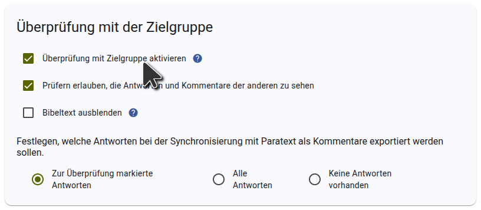

Um die Überprüfung mit der Zielgruppe in Scripture Forge einzurichten, [melde Dich mit Paratext an](log-in). Du musst einer der Administratoren des Projekts sein, um die Überprüfung mit der Zielgruppe einzurichten.

Wenn das Projekt noch nicht mit Scripture Forge verbunden ist, [verbinde das Projekt](connect-paratext-project) und lass das Kontrollkästchen **Überprüfung mit der Zielgruppe aktivieren** angekreuzt.

Falls das Projekt bereits verbunden ist, kannst Du die Überprüfung mit der Zielgruppe auf der Seite **Einstellungen** aktivieren. Aktiviere im Abschnitt **Überprüfung mit der Zielgruppe** der Einstellungsseite das Kontrollkästchen **Überprüfung mit der Zielgruppeaktivieren**, wie im folgenden Bild dargestellt.

