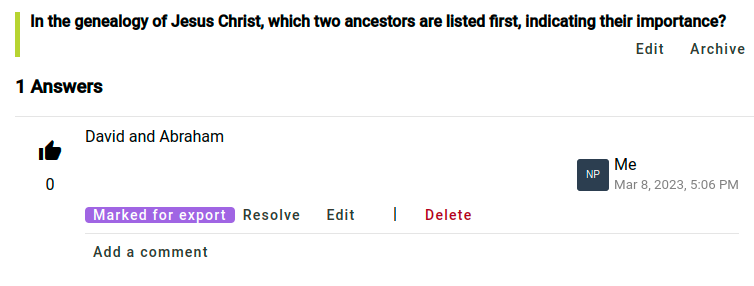
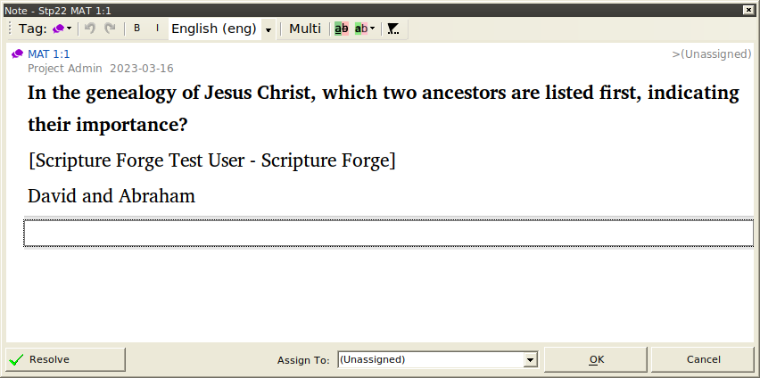

import ReactPlayer from "react-player";

## Antworten auf die Fragen erhalten und damit austauschen {#1850d745ac9e800db3dacdee0053beca}

<ReactPlayer controls url="https://youtu.be/C3bgh3yufVg" />

Um Antworten bei der Überprüfung mit der Zielgruppe zu überwachen, klicke auf **Übersicht** unter dem Abschnitt **Überprüfung mit der Zielgruppe** in der Navigationsleiste. Neben einer Liste von Fragen werden grundlegende Statistiken über die Antworten angezeigt.

Um Antworten von Überprüfern der Zielgruppe zu sehen, klicke auf eines der Bücher unter **Überprüfung mit der Zielgruppe** in der Navigationsleiste. Dann klicke auf eine Frage, um die Antworten zu sehen, die gegeben wurden. Wenn Du eine Antwort nach Paratext exportieren möchtest, klicke auf **Für Export markieren** für diese Antwort. Wenn Du mit der Antwort nichts weiter tun möchtest, klicke auf **Erledigt**. Damit wird die Antwort nicht entfernt, aber sie so markiert, dass keine weiteren Maßnahmen erforderlich sind.

Wenn Du Antworten finden möchtest, die nicht für den Export oder als erledigt markiert wurden, findest Du mit dem Filter oben auf der Liste der Fragen **Nicht überprüfte Antworten**.

Wenn Du es vorziehst, alle Antworten nach Paratext zu exportieren, ohne sie einzeln für den Export zu markieren, gehe zu den Projekteinstellungen und suche den Abschnitt **Antworten exportieren**. Die Standardoption besteht darin, nur **Für den Export markierte Antworten** zu exportieren, aber diese Einstellung kann auf **Alle Antworten** oder **Keine Antworten** geändert werden.

## Das Projekt synchronisieren, damit Antworten als Notizen in Paratext angezeigt werden {#1850d745ac9e80a8b3f0f50bcdd0be58}

Klicke in der Navigationsleiste auf **Synchronisieren**. Klicke auf der sich öffnenden Seite auf **Synchronisieren**, um Änderungen von Paratext zu senden und zu empfangen. Öffne dann Dein Projekt in Paratext und führe "Senden/Empfangen" aus. Antworten von Überprüfern der Zielgruppe werden in Deinem Projekt als Notizen angezeigt. Bitte beachte, dass, wenn Du auf diese Notizen in Paratext antwortest, Deine Antworten nicht als Kommentare zu der Antwort in Scripture Forge erscheinen.

Die Notiz zeigt die ursprüngliche Frage, den Namen des Überprüfers der Zielgruppe, der geantwortet hat, und die Antwort selbst, wie unten gezeigt.

Notizen, die aus Antworten durch die Überprüfung mit der Zielgruppe generiert wurden, werden ein eigenes Notizsymbol haben, das sich von anderen Notizen in Deinem Paratext-Projekt unterscheidet. Du kannst das Symbol ändern, indem Du das Notizsymbol bearbeitest. Details dazu findest Du im [Paratext-Hilfeartikel über benutzerdefinierte Notizensymbole](https://paratext.org/paratext-training/tutorials/custom-project-note-tags-tutorial/). Auch kannst Du [die Notizen nach Notizensymbol filtern](https://paratext.org/2022/08/15/custom-note-tags/#Filter_for_Custom_Note_Tags), sodass Du nur die Antworten auf die Überprüfung durch die Zielgruppe anzeigen oder sie ganz ausblenden kannst.

:::note

Im Moment werden Audioantworten in Paratext angezeigt, aber der Ton kann nicht abgespielt werden. Um das Audio von einer Antwort abzuspielen, muss es in Scripture Forge geöffnet werden. Das wird unter Umständen in Zukunft erweitert.

:::

