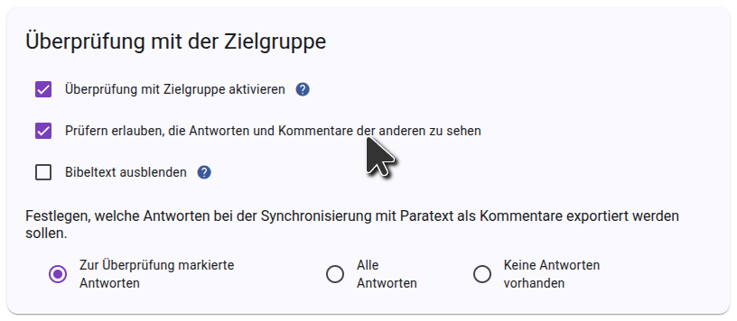
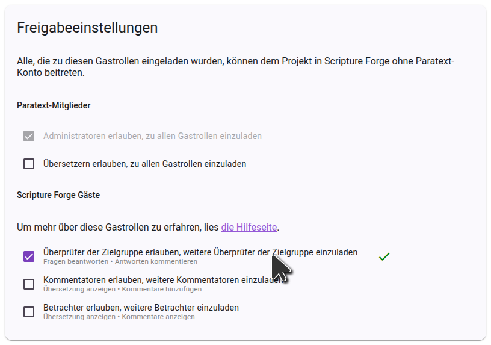
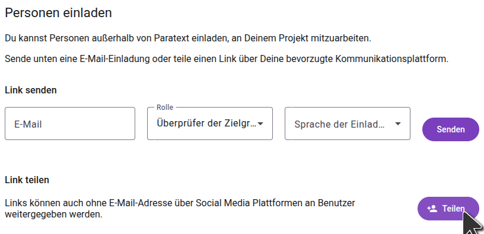

import ReactPlayer from "react-player";

## Leute einladen, Dein Projekt zu überprüfen {#1850d745ac9e80caacf5e643bb216f77}

<ReactPlayer controls url="https://youtu.be/aBPHCF56hxA" />

Sobald Du die Fragen zu Deinem Projekt hast, wird es Zeit, Überprüfer aus der Zielgruppe einzuladen.

In the side bar, click **Settings**, and scroll down to **Sharing settings**.

### Einstellungen Benutzerinteraktion {#1850d745ac9e8018b5a7ff9f3ea349e9}

The first setting to consider is **Allow checkers to see each other's answers and comments**. Wenn Überprüfern der Zielgruppe eine Frage angezeigt wird, werden existierende Antworten von anderen Überprüfern der Zielgruppe nicht angezeigt, damit dies die erhaltene Antwort nicht beeinflusst. Sobald eine Frage beantwortet ist, werden alle anderen Antworten auf die Frage angezeigt, und die Überprüfer können die Antworten des anderen kommentieren und gegenseitig Antworten mit "Gefällt mir" markieren. If you don’t want this interaction and want answers from other checkers to always be hidden, turn off **Allow checkers to see each other's answers and comments**.

### Freigabeeinstellungen {#1850d745ac9e8097ad4efcb063fc2603}

If you want community checkers to be able to invite friends to the project, make sure **Allow community checkers to invite community checkers** is enabled. Wenn diese Einstellung deaktiviert ist, können nur Projektadministratoren Überprüfer der Zielgruppe zum Projekt hinzufügen.

### Überprüfer der Zielgruppe einladen {#1850d745ac9e802d84d8e00da4fe25c2}

Klicke in der Seitenleiste auf **Benutzer** und es werden Dir Freigabeoptionen angezeigt.

To invite someone by sending a link, click **Share**, select the language you want Scripture Forge to show the recipient, and copy the link. You can then send this link to anyone you want to invite to the project. When they click the link, they will be able to join the project as a community checker.

If you want to send email invitations to users, type the email of the user you want to invite, select the **Community Checker** role, and choose an invitation language. Klicke dann auf **Senden**. Eine E-Mail mit einem Link wird an die Person gesendet, die dann den Link anklicken und sich anmelden muss, um dem Projekt beizutreten.

