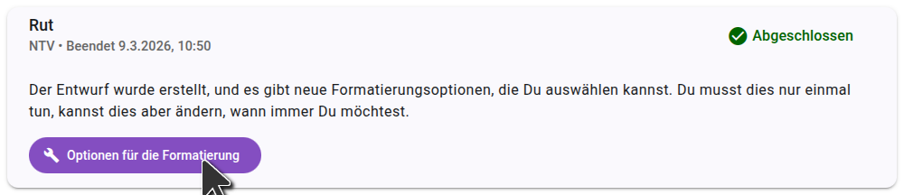
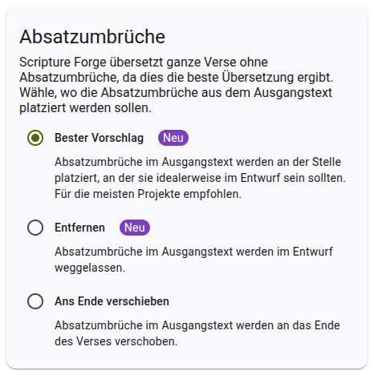
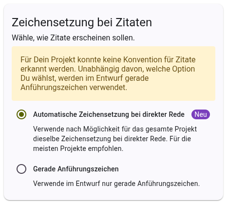

Nach dem Generieren eines Entwurfs in Scripture Forge musst Du die Formatierungsoptionen auswählen. Diese Optionen steuern, wie Scripture Forge den Entwurfstext formatiert.

Die Formatierungsoptionen werden in Deinem Projekt gespeichert, so dass Du sie nur einmal auswählen musst, obwohl Du sie später bei Bedarf ändern kannst.

## Optionen für den Absatzumbruch auswählen

Es gibt drei Optionen für Absatzumbrüche. Die Standardeinstellung ist "Best Guess", was für die meisten Projekte empfohlen wird. Wenn Du eine Option auswählst, wird rechts auf der Seite eine Vorschau angezeigt, damit Du weist, wie sich die Optionen auf die Formatierung Deines Entwurfs auswirken.

## Optionen für den Zitierstyl auswählen

Es gibt zwei Optionen für den Zitierstil. Die Standardeinstellung ist "Automatisch", was für die meisten Projekte empfohlen wird. Wenn Du eine Option auswählst, wird rechts auf der Seite eine Vorschau angezeigt, damit Du weist, wie sich die Optionen auf die Formatierung Deines Entwurfs auswirken.

Sobald Du Deine Formatierungsoptionen ausgewählt hast, klicke auf "Speichern", um die Optionen in Deinem Projekt zu speichern. Diese Optionen werden für alle künftigen Entwürfe für das Projekt verwendet. Du kannst diese Optionen jederzeit ändern, und sie werden für alle zukünftigen Entwürfe übernommen.