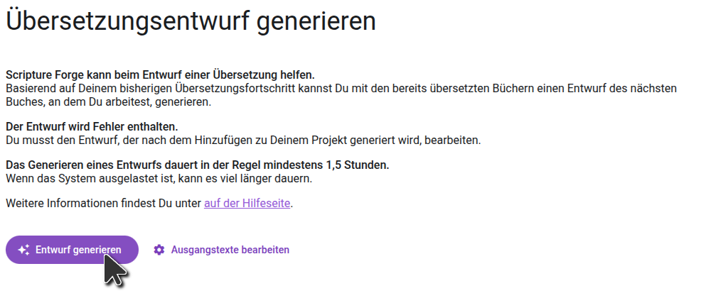
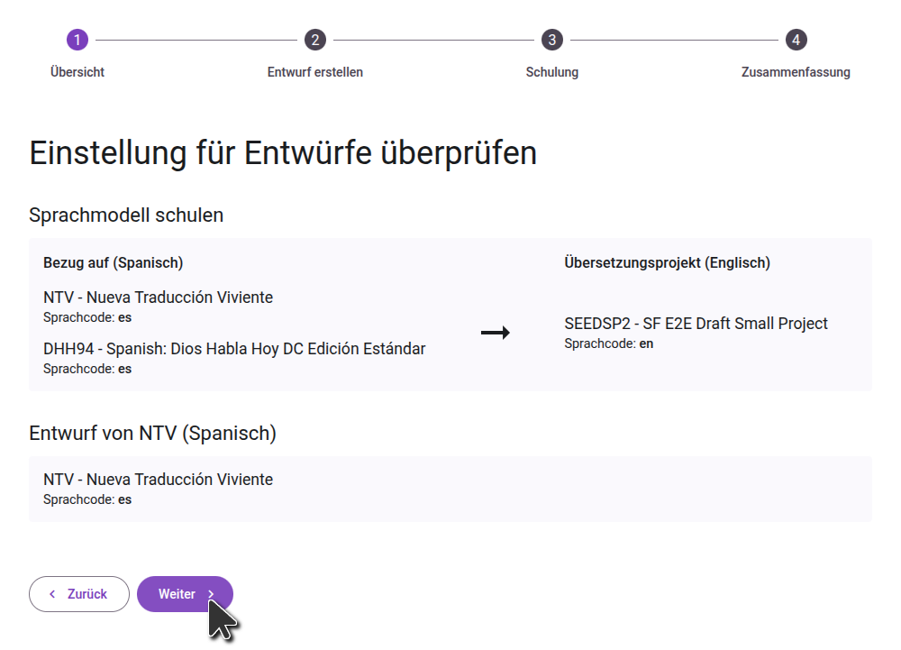
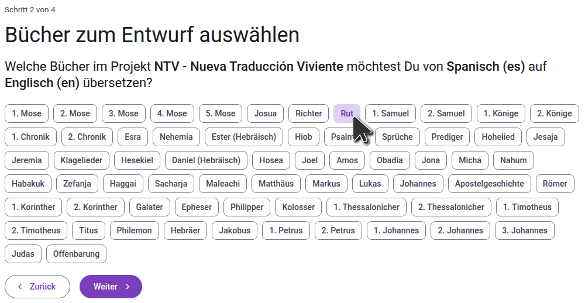
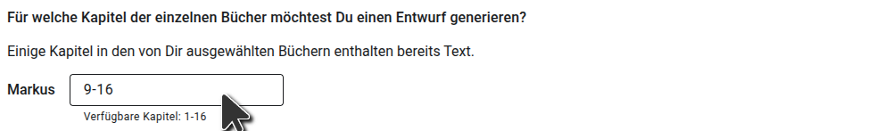
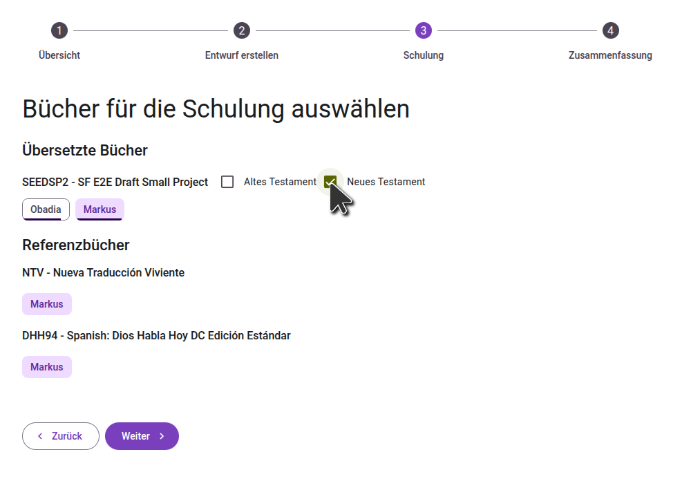
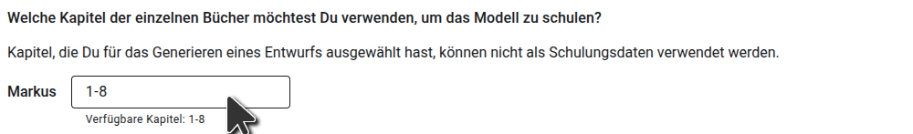
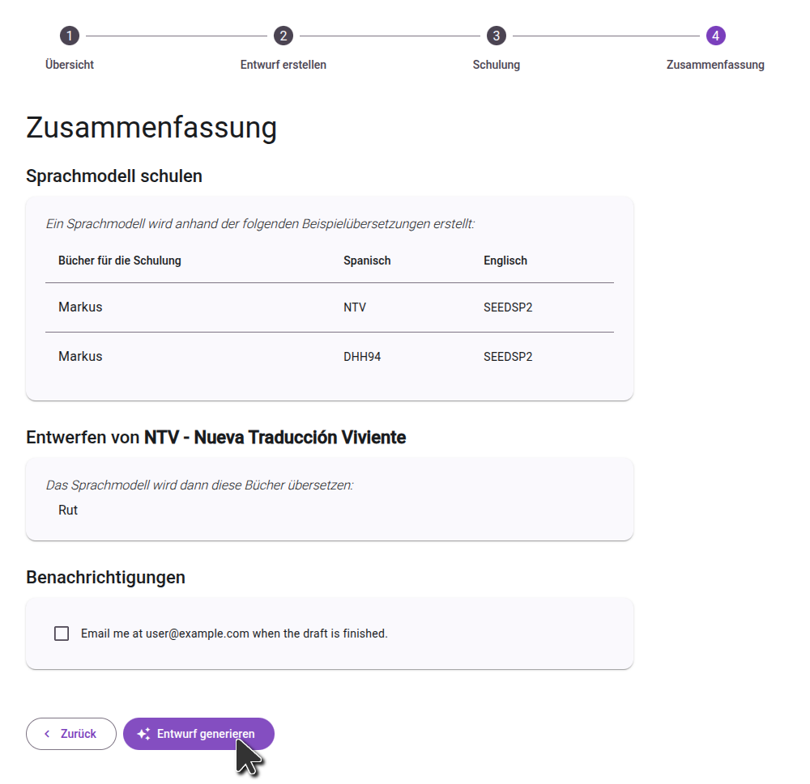

import ReactPlayer from "react-player";

<ReactPlayer controls url="https://youtu.be/binHoeAGGvU" />

## Einen Entwurf generieren

Sobald Dein Projekt aktiviert und die Ausgangstexte konfiguriert sind, klicke auf die Schaltfläche "Entwurf generieren", um zu beginnen:

### Projektkonfiguration bestätigen

Überprüfe auf dem ersten Bildschirm die konfigurierten Ausgangstexte und Sprachcodes, und stelle sicher, dass diese korrekt sind. Geh dann zum nächsten Schritt über.

:::note

Falls Du ein separates Paratext-Projekt benutzt, um KI-generierte Entwürfe abzulegen, vergewissere Dich, dass Dein Haupübersetzungsprojekt im Bereich **Daten der Zielsprache** aufgelistet ist. Entwürfe müssen von Deinem Hauptprojekt aus generiert werden, damit das Modell von Deiner vollständigen Übersetzungsarbeit lernen kann.

:::

### Bücher für den Entwurf auswählen {#select-the-books-to-draft}

Im zweiten Schritt wählst Du die Bücher aus, die Du übersetzen möchtest. Falls das Buch, für das Du den Entwurf generieren möchtest, nicht in Deinem Paratext-Projekt vorhanden ist, musst Du das Buch vorgängig in Paratext erstellen. Im Allgemeinen schlagen wir vor, den Entwurf für jeweils ein Buch zu generieren. Falls Du jedoch Entwürfe für kleinere Bücher generieren möchtest, kannst Du auch Entwürfe für mehrere Bücher auf einmal generieren. Bei langen Büchern solltest Du einen neuen Entwurf generieren, nachdem ein wesentlicher Teil des Buches fertiggestellt wurde.

:::note

**Schrittweise Generieren eines Entwurfs:** Falls Du ein Buch auswählst, das mindestens 12 Kapitel umfasst und bereits Text enthält, wird Dir die Option angezeigt, auszuwählen, für welche Kapitel Du einen Entwurf generieren möchtest. Falls Du Dich dafür entscheidest, nur einige Kapitel als Entwurf zu generieren, kannst Du im nächsten Schritt einige oder alle der verbleibenden Kapitel für die Schulung des Modells auswählen. Unterteile Kapitel durch Kommas und verwende einen Bindestrich für mehrere Kapitel, zum Beispiel: 1-10,25,40-50.

:::

:::tip

Wenn Du das Generieren von Entwürfen bereits in einer frühen Phase des Projekts einsetzest, empfehlen wir, mit den Evangelien und der Apostelgeschichte zu beginnen und jedes Mal, wenn 8 bis 10 weitere Kapitel fertiggestellt sind, einen neuen, schrittweisen Entwurf zu generieren. Siehe [Leitfaden für das Generieren von Entwürfen das Neuen Testaments](/new-testament-drafting). Spezifische Empfehlungen für das schrittweise Generieren von Entwürfen von Büchern des Alten Testaments sind derzeit nicht verfügbar. Wir empfehlen, nach der Übersetzung jeweils eines Drittels eines langen Buches einen neuen Entwurf zu generieren, um zu prüfen, ob noch Verbesserungen möglich sind.

:::

### Die Bücher zur Schulung des Sprachmodells auswählen

Im nächsten Schritt wählst Du die Bücher aus, die zur Schulung des Sprachmodells verwendet werden sollen, sowohl in Deinem Hauptprojekt als auch in den Referenzprojekten. **Wähle alle Bücher Deines Projekts aus, die angemessen überprüft wurden. Auch wenn diese nicht bereits durch einen Berater überprüft sein müssen, sollten sie doch genaue Übersetzungen des Grundtextes sein.**

:::note

Falls Du im vorherigen Schritt ausgewählt hast, einen Entwurf von nur enzelner Kapitel eines Buches zu generieren, kannst Du entscheiden, ob Du die verbleibenden Kapitel ganz oder teilweise in die Schulung einbeziehen möchtest. Alle Kapitel, die für den Entwurf ausgewählt wurden, stehen nicht für Schulungszwecke zur Verfügung. Unterteile Kapitel durch Kommas und verwende einen Bindestrich für mehrere Kapitel, zum Beispiel: 1-10,25,40-50.

:::

### Auswahl bestätigen

Im letzten Schritt überprüfst Du die Bücher, die Du zur Schulung des Modells ausgewählt hast, sowie die Bücher, die Du fürs Generieren des Entwurf ausgewählt hast. Falls Du Änderungen vornehmen musst, kannst Du mit den vorherigen Schritten fortfahren. Sobald Du mit Deiner Auswahl zufrieden bist, klicke auf die Schaltfläche "Entwurf generieren", um den Vorgang zu starten.

