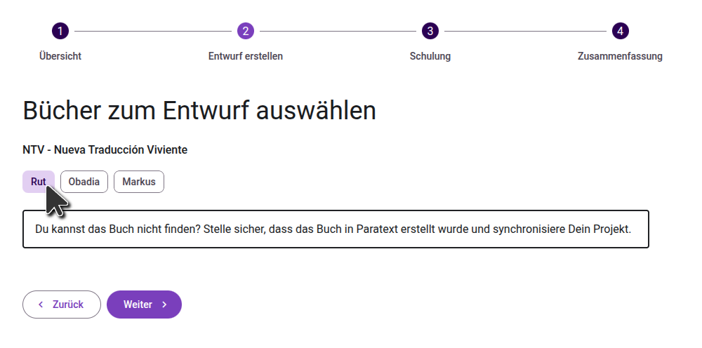
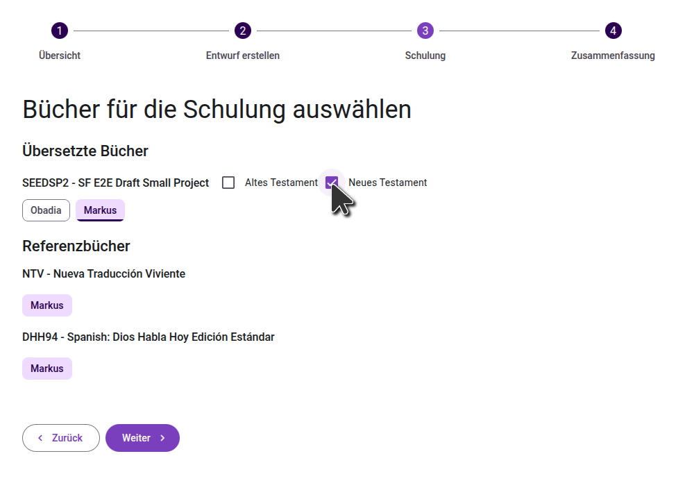
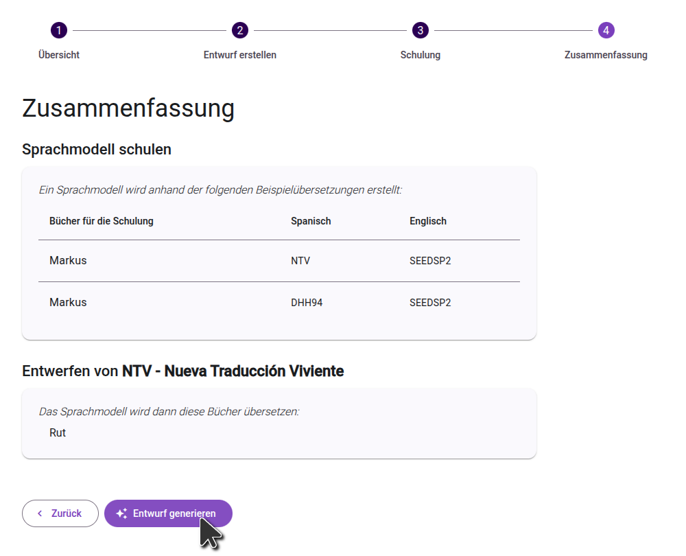

import ReactPlayer from "react-player";

<ReactPlayer controls url="https://youtu.be/binHoeAGGvU" />

## Einen Entwurf generieren

Sobald Dein Projekt aktiviert und die Ausgangstexte konfiguriert sind, klicke auf die Schaltfläche "Entwurf generieren", um zu beginnen:

### Projektkonfiguration bestätigen

Überprüfe auf dem ersten Bildschirm die konfigurierten Ausgangstexte und Sprachcodes, und stelle sicher, dass diese korrekt sind. Geh dann zum nächsten Schritt über.

:::note

Falls Du ein separates Paratext-Projekt benutzt, um KI-generierte Entwürfe abzulegen, vergewissere Dich, dass Dein Haupübersetzungsprojekt im Bereich "Daten der Zielsprache\*\* aufgelistet ist. Entwürfe müssen von Deinem Hauptprojekt aus generiert werden, damit das Modell von Deiner vollständigen Übersetzungsarbeit lernen kann.

:::

### Bücher für den Entwurf auswählen

Im zweiten Schritt wählst Du die Bücher aus, die Du übersetzen möchtest. Falls das Buch, für das Du den Entwurf generieren möchtest, nicht in Deinem Paratext-Projekt vorhanden ist, musst Du das Buch vorgängig in Paratext erstellen. Im Allgemeinen schlagen wir vor, den Entwurf für jeweils ein Buch zu generieren. Falls Du jedoch Entwürfe für kleinere Bücher generieren möchtest, kannst Du auch Entwürfe für mehrere Bücher auf einmal generieren.

### Die Bücher zur Schulung des Sprachmodells auswählen

Im nächsten Schritt wählst Du die Bücher aus, die zur Schulung des Sprachmodells verwendet werden sollen, sowohl in Deinem Hauptprojekt als auch in den Referenzprojekten. **Wähle alle Bücher Deines Projekts aus, die angemessen überprüft wurden. Auch wenn diese nicht bereits durch einen Berater überprüft sein müssen, sollten sie doch genaue Übersetzungen des Grundtextes sein.**

### Auswahl bestätigen

Im letzten Schritt überprüfst Du die Bücher, die Du zur Schulung des Modells ausgewählt hast, sowie die Bücher, die Du fürs Generieren des Entwurf ausgewählt hast. Falls Du Änderungen vornehmen musst, kannst Du mit den vorherigen Schritten fortfahren. Sobald Du mit Deiner Auswahl zufrieden bist, klicke auf die Schaltfläche "Entwurf generieren", um den Vorgang zu starten.

