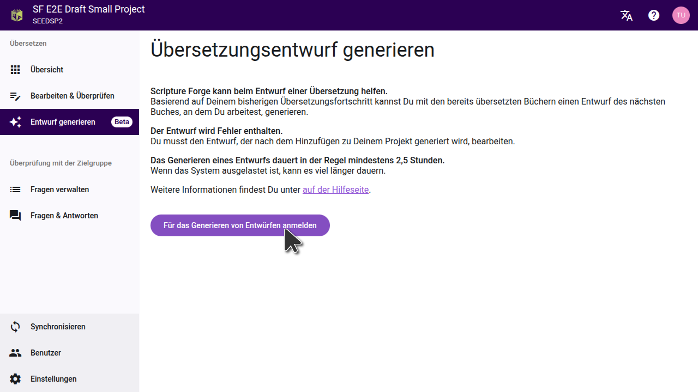
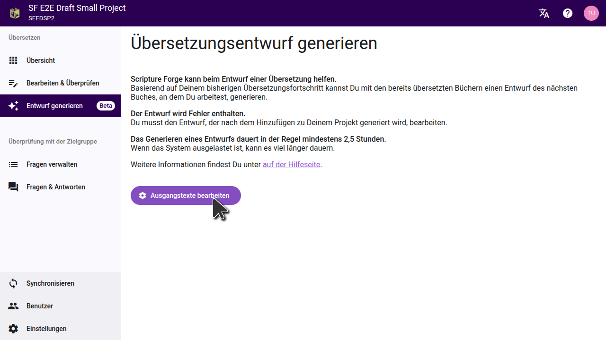
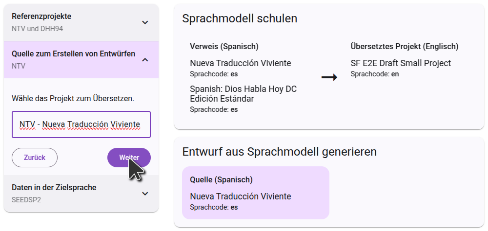

## Registrieren um einen Entwurf zu generieren {#c01e77600a3b440ead3f1b816837d614}

Um einen Entwurf in Scripture Forge zu regeistrieren, klicke auf die Schaltfläche "Entwurf generieren" im Hauptmenu. Klicke dann auf "Für Übersetzungsentwurf generieren anmelden" und fülle das Formular aus, das erscheint, um Deinem Projekt den Zugang zu ermöglichen. Rückübersetzungsprojekte sind standardmäßig aktiviert. Das Formular muss dafür nicht ausgefüllt werden.

Nachdem Du das Formular ausgefüllt hast, wird das Scripture Forge Onboarding-Team Deine Anfrage prüfen und die besten Einstellungen für Dein Projekt ermitteln. Du erhältst einen oder mehrere Entwürfe zur Durchsicht. Fall Du Dich dafür entscheidest, dass die Erstellung von Entwürfen für Dein Projekt das Richtige ist, wird das Team das Generieren von Entwürfen für Dein Projekt aktivieren und Dich durch den Prozess der Auswahl der besten Einstellungen führen.

## Konfigurieren des Entwurfs {#26e1244e99c0459bad277d7cff4417b8}

Sobald das Generieren von Entwürfen für Dein Projekt aktiviert ist, wird die Schaltfläche "Für das Generieren von Entwürfen anmelden" durch die Schaltfläche "Ausgangstexte konfigurieren" ersetzt. Klicke auf diese Schaltfläche, um die Projekte auszuwählen, die als Ausgangstext für Deinen Entwurf verwendet werden sollen.

### Auswahl der Referenzprojekte

Das Referenzprojekt wird für die Schulung des Sprachmodells verwendet. Normalerweise ist dies das Projekt, auf das Du Dich während der Übersetzung am häufigsten beziehst, aber in manchen Fällen kannst Du bessere Ergebnisse erzielen, wenn Du ein anderes Projekt verwendest. In einzelnen Projekten ist die Wahl eines zweiten Referenzprojekts möglicherweise sinnvoll. Ein häufiger Anwendungsfall ist es, Deine Rückübersetzung als zweites Referenzprojekt auszuwählen.

Jedes Projekt ist anders. Befolge daher die Anweisungen, die Du vom Onboarding-Team erhalten hast.

### Wähle das Ausgangsprojekt aus

Der zweite Schritt besteht darin, das Projekt auszuwählen, aus dem der Entwurf übersetzt werden soll. Dies kann ein Paratext-Projekt oder eine Ressource der Digitalen Bibelbibliothek sein. Gib den Anfang des Projektnamens (oder den Kurznamen des Projektes) ein und die Liste wird so gefiltert, dass Du nur die passenden Projekte siehst. Klicke auf das Projekt, das Du als Ausgangstext verwenden möchtest, und fahre mit dem nächsten Schritt fort.

### Die Sprachen bestätigen

Im letzten Schritt werden die Daten in der Zielsprache angezeigt. Dazu gehört immer auch Dein Projekt selbst, das bereits ausgewählt ist und nicht entfernt werden kann. Du kannst in diesem Schritt zusätzliche Schulungsdaten hinzufügen, indem Du ein Arbeitsblatt mit gepaarten Daten hochlädst, wobei die Ausgangssprache in der ersten Spalte und die Zielsprache in der zweiten Spalte steht.

Auf der rechten Seite siehst Du ein Diagramm, das zeigt, wie die von Dir ausgewählten Projekte zur Generierung des Entwurfs verwendet werden. Im ersten Schritt lernt das Sprachmodell aus dem Vergleich zwischen den Referenzprojekten und dem übersetzten Projekt. Im zweiten Schritt nutzt es dieses Wissen, um das Ausgangsprojekt zu übersetzen.

