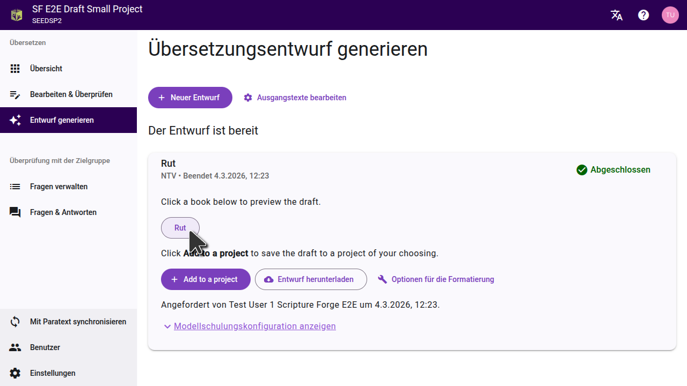
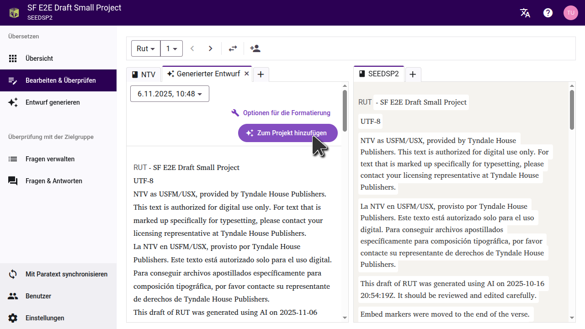
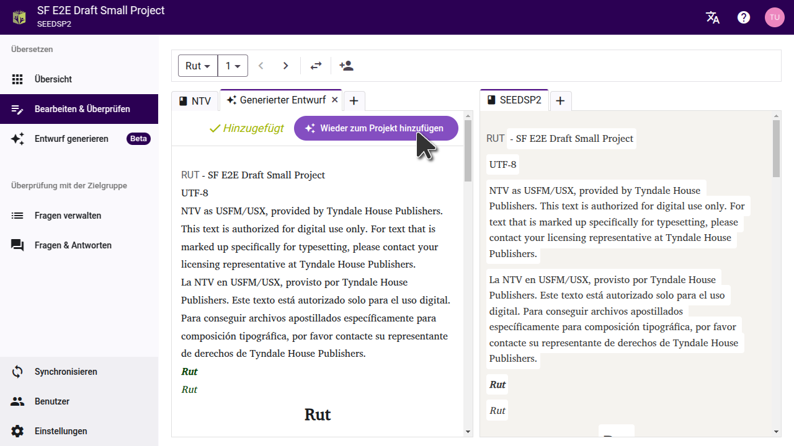
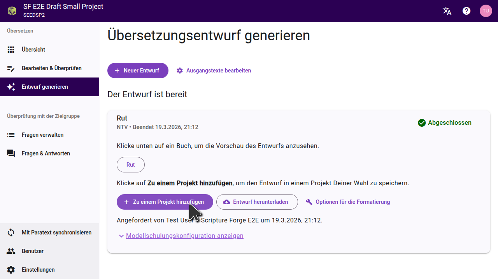
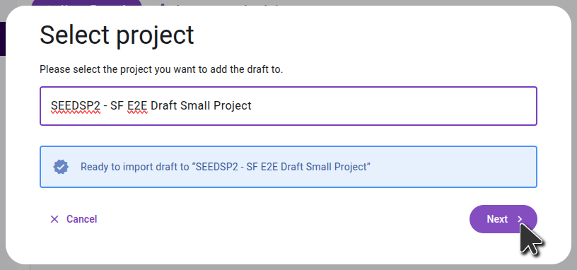
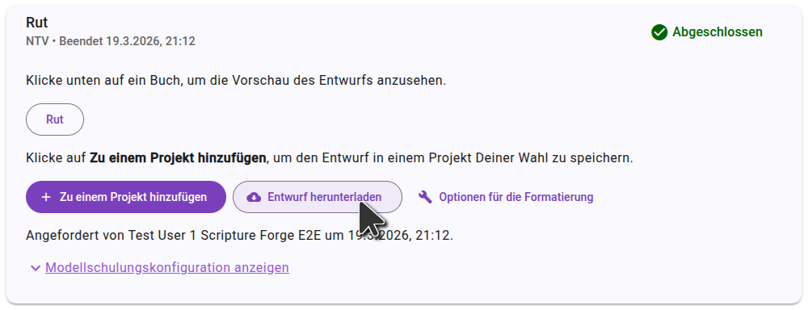

Scripture Forge zeigt an, wenn Dein Entwurf fertig ist und listet die Bücher auf, die erstellt wurden. Generierte Entwürfe werden **nicht** automatisch in Dein Projekt importiert. Aus **Entwürfe Generieren** kannst Du eine Voransicht öffnen oder Entwürfe importieren.

- Um **einzelne Kapitel** zu importieren, klicke auf ein Buch und dann oberhalb des Kapitels, das sich öffnet, auf "Zum Projekt hinzufügen". Einzelne Kapitel können nur zum aktuellen Projekt hinzugefügt werden.
- Um ein **komplettes Buch** zu importieren, klicke auf "Zu einem Projekt hinzufügen". Du kannst wählen, ob Du das Buch in Dein Hauptprojekt oder in ein anderes Projekt importieren möchtest.

## Vorschau eines Entwurfs ansehen

Klicke auf den Titel des Buches um den Entwurf zu sehen. Der Entwurf wird in einer neuen Registerkarte auf der Editor-Seite geöffnet.

:::tip

Um den Entwurf mit dem Text zu vergleichen, aus dem er übersetzt wurde, wähle auf der Einstellungsseite einen Ausgangstext. So kannst Du einen Ausgangstext und den daraus entstandenen Entwurf nebeneinander ansehen.

Falls Du den Entwurf eines Buches generiert hast, dessen Übersetzung das Team bereits fertig übersetzt hat, kannst Du die Registerkarte "Entwurf" auf die andere Seite der Seite verschieben und sie mit der Übersetzung des Teams vergleichen.

:::

## Ein einzelnes Kapitel importieren

Wenn Du eine Voransicht des Entwurfes öffnest, kannst Du den Entwurf der aktuellen Kapitel in Dein Projekt importieren, indem Du auf "Zum Projekt hinzufügen" klickst. Du kannst zu jedem Kapitel des Buches gehen, eine Vorschau anzeigen und die Kapitel nacheinander importieren. Auf diese weise werden die Kapitel zum aktuellen Projekt hinzugefügt; nicht zu einem anderen Projekt.

## Ein ganzes Buch importieren

Falls Du ein ganzes Buch oder mehrere Bücher importieren möchtest, kannst Du dies auf der Seite "Entwurf generieren" tun. Klicke auf "Zu einem Projekt hinzufügen" und wähle dann das Projekt aus, in das Du importieren möchtest.

Wähle im sich öffnenden Dialogfeld das Projekt aus, in das der Entwurf importiert werden soll. **Wichtig:** Das Importieren des Entwurfs ersetzt alle vorhandenen Inhalte im Projekt für dieses Buch.

Sobald Du den Entwurf in ein Projekt importiert hast, synchronisiere das Projekt in Scripture Forge und führe dann einen Sende-/Empfangsvorgang in Paratext durch, um die Änderungen zu sehen.

## USFM-Dateien exportieren

Falls Du den Entwurf nicht direkt in Dein Projekt importieren möchtest, kannst Du den Entwurf auch als USFM-Dateien herunterladen. Klicke auf der Seite "Entwurf generieren" auf "Entwurf herunterladen" und entpacke die Dateien auf Deinem Computer. Du kannst diese Dateien dann in ein Projekt in Paratext importieren.

## Entwürfen in Paratext 10 Studio ansehen

Paratext 10 Studio beinhaltet eine Erweiterung für Scirpture Forge. Du kannst Entwürfe ansehen, ohne diese zu importieren:

1. Öffne die Erweiterung für Scripture Forge.
2. Bei Scripture Forge anmelden.
3. Wähle Dein Projekt, um den Entwurf anzusehen.
