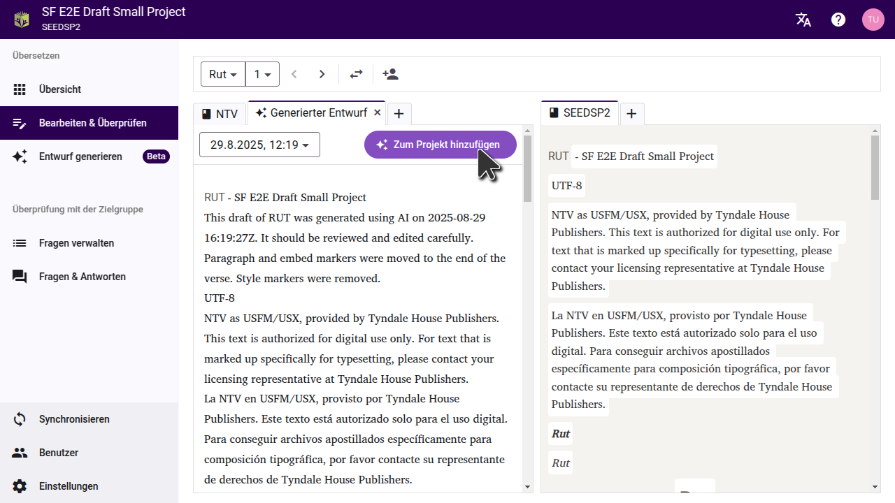

Sobald Dein Entwurf generiert ist zeigt Scripture Forge an, dass er bereit ist sowie die Liste der Bücher, die generiert wurden.

## Vorschau eines Entwurfs ansehen

Der Entwurf, den Scripture Forge generiert hat, wird nicht automatisch in Dein Projekt importiert. Du kannst eine Vorschau des Entwurfs anzeigen und dann jeweils ein Kapitel oder ein Buch in Dein Projekt oder in ein anderes Projekt importieren.

Klicke auf ein Buch, um den Entwurf anzusehen. Der Entwurf wird in einer neuen Registerkarte auf der Editor-Seite geöffnet.
:::tip
Um den Entwurf mit dem Text zu vergleichen, aus dem er übersetzt wurde, wähle auf der Einstellungsseite einen Ausgangstext. So kannst Du einen Ausgangstext und den daraus entstandenen Entwurf nebeneinander ansehen.

Falls Du den Entwurf eines Buches generiert hast, dessen Übersetzung das Team bereits fertig übersetzt hat, kannst Du die Registerkarte "Entwurf" auf die andere Seite der Seite verschieben und sie mit der Übersetzung des Teams vergleichen.
:::

## Ein einzelnes Kapitel importieren

Um den Entwurf des aktuellen Kapitels ins Projekt zu importieren, klicke auf "Zum Projekt hinzufügen". Du kannst zu jedem Kapitel des Buches gehen, eine Vorschau anzeigen und die Kapitel nacheinander importieren.

## Ein ganzes Buch importieren

Falls Du ein ganzes Buch ins Projekt importieren möchtest, kannst Du dies auf der Seite "Entwurf generieren" tun. Klicke auf das Menü mit den drei Punkten neben dem Buch und wähle dann die Option, es in das aktuelle Projekt oder in ein anderes Projekt zu importieren.

Wähle im sich öffnenden Dialogfeld das Projekt aus, in das der Entwurf importiert werden soll. Wenn das Projekt noch nicht mit Scripture Forge verbunden wurde, musst Du es zuerst verbinden. **Wichtig:** Das Importieren des Entwurfs ersetzt alle vorhandenen Inhalte im Projekt für dieses Buch.

:::note
Das Projekt muss das zu importierende Buch bereits enthalten. Stelle sicher, dass Du das Buch bereits in Paratext erstellt und mit Scripture Forge synchronisiert hast.
:::

Sobald Du den Entwurf in ein Projekt importiert hast, synchronisiere das Projekt in Scripture Forge und führe dann einen Sende-/Empfangsvorgang in Paratext durch, um die Änderungen zu sehen.

## USFM-Dateien exportieren

Falls Du den Entwurf nicht direkt in Dein Projekt importieren möchtest, kannst Du den Entwurf auch als USFM-Dateien herunterladen. On the "Generate draft" page, click "Download draft", and extract the files on your computer. Du kannst diese Dateien dann in ein Projekt in Paratext importieren.

## Entwürfen in Paratext 10 Studio ansehen

Paratext 10 Studio ist direkt mit Scripture Forge verbunden und ermöglicht es Dir, einen Entwurf anzusehen, ohne diesen in ein Projekt zu importieren. Die Scripture Forge-Erweiterung ist bereits vorinstalliert. Du musst Dich also nur bei Scripture Forge in der Erweiterung anmelden und dann Dein Projekt auswählen, um den Entwurf anzusehen.
