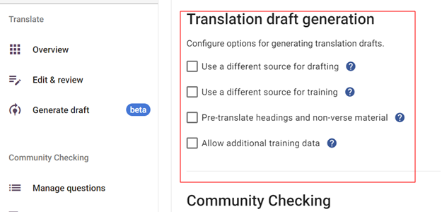

## **Registriere Dich für Auto Drafting (automatisches Entwerfen)** {#c01e77600a3b440ead3f1b816837d614}

Um auf Scripture Forge Auto Drafting (automatisches Entwerfen) zuzugreifen, musst Du im Hauptmenü auf die Schaltfläche „Entwurf generieren“ klicken. Wenn es Dein erstes Mal ist, einen Entwurf in Deinem Projekt zu generieren, wirst Du aufgefordert, Dich für Übersetzungsentwürfe zu registrieren und das Formular für Übersetzungsentwürfe auszufüllen. Du siehst die Schaltfläche „Registrieren für das Entwerfen“ wie im Bild unten gezeigt.

Nachdem Du das Formular ausgefüllt hast, gib dem Scripture Forge Onboarding Team bitte ein paar Tage, um Deinen Antrag zu überprüfen und die besten Einstellungen für Dein Projekt herauszufinden. Sobald dies erledigt ist, wird sich das Team mit weiteren Anweisungen an Dich wenden, um Dich in den Entwerfungsprozess zu führen.

### **Auswahl der primären Referenzübersetzung** {#26e1244e99c0459bad277d7cff4417b8}

Um Deine primäre Referenzübersetzung auszuwählen oder zu ändern, gehe zum Fenster „Einstellungen“. Unter dem Unterabschnitt Übersetzen, findest Du hier ein Dropdown-Menü, das eine Liste von Ressourcen anzeigt. Du kannst hier klicken, um die Referenzübersetzung für Dein Projekt auszuwählen oder zu ändern.

Dies wirkt sich auf das gesamte Projekt und alle anderen aus, die auf Scripture Forge Zugang dazu haben.

_**Du kannst Auto Drafting (automatisches Entwerfen) nicht verwenden, ohne eine primäre Referenzübersetzung auszuwählen.**_

Du hast auch die Möglichkeit, das Kontrollkästchen „Übersetzungsvorschläge aktivieren“ direkt unter diesem Dropdown-Menü auszuwählen. Diese Kästchen aktiviert Vorschläge für alle Benutzer des Projekts. Bitte beachte, dass dies von Auto Drafting (automatisches Entwerfen) getrennt ist.

_**Wir empfehlen Übersetzungsvorschläge zu deaktivieren, wenn Du Auto Drafting (automatisches Entwerfen) verwenden möchtest.**_

## **Einstellungen Generieren von Übersetzungsentwürfen** {#4e17f4ac70274b9d8d615ad3d2679a82}

Sobald Du vom Onboarding-Team von Scripture Forge benachrichtigt wurdest, dass Dein Projekt für Auto Drafting (automatisches Entwerfen) bereit ist, erscheint dieser Abschnitt unter Einstellungen. Das Scripture Forge Team hilft Dir bei der Anleitung zu diesen Einstellungen im Rahmen des Onboarding-Prozesses.

Wie im obigen Bild dargestellt, werden Dir einige Optionen angezeigt. Du kannst diese Option deaktivieren, wenn Du sie nicht verwenden möchtest. Wenn Du ein Kontrollkästchen ausgewählt hast, verwende die Dropdown-Liste, die erscheint, um Deinen alternativen Ausgangstext auszuwählen.

**1) Einen anderen Ausgangstext für den Entwurf verwenden**

- Dies erlaubt Dir, eine Übersetzung auszuwählen, die **anstelle** der Hauptreferenzübersetzung verwendet wird, um einen Entwurf zu generieren.
- Die hier ausgewählte alternative Übersetzung muss die **gleiche Sprache** haben wie die primäre Referenzübersetzung.
- Diese Übersetzung wird den Stil sowie den lexikalischen und exegetischen Inhalt des Entwurfs beeinflussen.

**2) Einen anderen Ausgangstext für das Schulungs-Kontrollkästchen**

- Hier kannst Du eine Übersetzung auswählen, die **anstelle** der primären Referenzübersetzung zum Schulen des Sprachmodells verwendet werden soll.
- Die hier ausgewählte alternative Übersetzung muss die **gleiche Sprache** haben wie die primäre Referenzübersetzung.
- Dies ist eine technische Konfiguration, die nur gesetzt werden sollte, wenn sie vom Scripture Forge Team angewiesen wird.

\*\*3) Kontrollkästchen für die Vorübersetzung von Überschriften und Material ausserhalb der Verse – Wir empfehlen, dass Du dieses Kontrollkästchen nicht aktivierst. Die Überschriften der Abschnitte werden weiterhin übersetzt.

**4) Erlaube zusätzliche Kontrollkästchen für die Schulungsdaten** – Wenn Du dieses Kontrollkästchen aktivierst, kannst Du weiteren Dokumente hochladen, die für die Schulung des Sprachmodells verwendet werden können. Diese Dateien müssen parallele Sätze in den gleichen Ausgangs- und Zielsprachen enthalten wie die Primärreferenzübersetzung und das Zielprojekt. Bitte beachten, dass Du zu diesem Zweck **nur .csv-Dateien hochladen** kannst.
