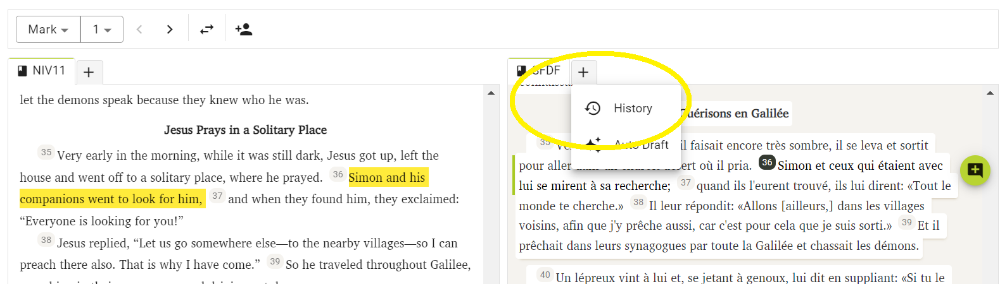

import ReactPlayer from "react-player";

# Einen Entwurf übernehmen und bearbeiten {#2a0f75e3f955442e9b4f4b375f8cc58f}

<ReactPlayer controls url="https://youtu.be/S4yvGDlcZ9o" />

# Wie man einen Entwurf übernimmt {#1430d745ac9e80878a51d2b8e2be7d05}

Nachdem ein Entwurf generiert wurde, kann er von einem Übersetzer überprüft und bearbeitet werden und muss die nächsten Übersetzungsschritte durchlaufen.

Um mit der Bearbeitung zu beginnen, muss der Entwurf zunächst zu Deinem Projekt hinzugefügt werden. Es gibt 3 Möglichkeiten, dies zu tun:

### **1) Kapitel für Kapitel** {#1430d745ac9e80a29085eecf41dc2997}

Klicke auf den Namen des Buches, das als Entwurf erstellt wurde. Dies führt Dich zur Schnittstelle "Bearbeiten und Überprüfen". Die folgende Abbildung zeigt den Entwurf von 5. Mose.

Hier siehst Du auf der einen Seite den Entwurf des ersten verfügbaren Kapitels. Auf der anderen Seite siehst Du Dein Projekt, das leer sein und keine Daten für das ausgewählte Kapitel enthalten sollte. Um den Entwurf zu Deinem Projekt hinzuzufügen, klicke auf "Zum Projekt hinzufügen". Dadurch wird nur das aktuelle Kapitel zu Deinem Projekt hinzugefügt und Du kannst mit der Überprüfung und Bearbeitung beginnen.

### 2. Das gesamte Buch hinzufügen {#1430d745ac9e803183c8d916bc54de64}

Sobald Dein Entwürfe generiert wurde, klicke auf das 3-Punkte-Menü neben dem Namen des Buches, das Du zu Deinem Projekt hinzufügen möchtest. Klicke dann auf "Zum Projekt hinzufügen", um das gesamte Buch zu Deinem Projekt hinzuzufügen.

### 3. Lade den Entwurf herunter und füge ihn über Paratext hinzu. {#1430d745ac9e80cdb498cad97099687e}

Klicke auf "Entwurf herunterladen", um den Entwurf als .usfm-Datei herunterzuladen. Diese Datei kann dann über Paratext zu Deinem Projekt hinzugefügt werden. Nachdem es in Paratext hinzugefügt wurde, stelle bitte sicher, dass Du Senden/Empfangen in Paratext und dann Synchronisieren in Scripture Forge ausführst, um den Entwurf in Deinem Projekt in Scripture Forge zu anzuzeigen.

# **Wie man einen Entwurf bearbeitet** {#1430d745ac9e80cb8debce126560e7b5}

Klicke dazu in Scripture Forge auf "Bearbeiten und Überprüfen", woraufhin Du zu dem unten abgebildeten Bildschirm gelangst. Das Bild unten zeigt das Buch Markus.

Die Schnittstelle bietet Dir zwei Abschnitte; einer zeigt die primäre Referenzübersetzung (genannt Quelle), der andere den neu erstellten Entwurf (genannt Ziel). Hier kannst Du den Entwurf überprüfen und gegebenenfalls Änderungen vornehmen, genau wie in Paratext.

### Im Entwurf navigieren {#1430d745ac9e803187c2ff37b7ee519c}

Falls Du einen Entwurf für mehr als ein Buch erstellt hast, kannst Du über die Dropdown-Liste oben links auf dem Bildschirm durch die Bücher navigieren (siehe unten).

Du kannst auch zu einem bestimmten Kapitel navigieren, indem Du die Dropdown-Liste rechts daneben verwendest. Alternativ kannst Du auch zum vorherigen oder nächsten Kapitel navigieren, indem Du die Pfeile neben dem Dropdown-Menü verwendest.

Falls Du die Platzierung der Quelle und des Ziels (linkes und rechtes Fenster) vertauschen möchtest, kannst Du dies tun, indem Du auf die Schaltfläche "Tauschen" klickst (siehe unten).

Beachte, dass die Auswahl eines Verses im Entwurf den entsprechenden Vers der Primären Referenzübersetzung gelb markiert.

Sobald Du einen Vers auswählst und mit der Arbeit daran beginnst, wird die zugehörige Hauptübersetzung automatisch angezeigt und zeigt denselben Vers in der Ausgangssprache an, sodass Du leichter den Überblick behältst und dem Entwurf folgen kannst.

### **Kommentar hinzufügen** {#1430d745ac9e8038aee0f2290df4172b}

Scripture Forge ermöglicht es Benutzern, während der Arbeit an den Entwürfen zusätzliche Kommentare hinzuzufügen.

Wähle dazu den Vers aus, zu der der Kommentar hinzugefügt werden soll, und klicke dann auf die Schaltfläche "Kommentar hinzufügen".

Sobald ein Kommentar hinzugefügt wurde, wird er mit einem Sternchen markiert, wie unten dargestellt. Um den Kommentar zu aktualisieren oder zu bearbeiten, klicke einfach auf den Stern und Du wirst aufgefordert, die gewünschten Änderungen vorzunehmen.

Wenn der Entwurf in Dein Paratext-Projekt übernommen wird, werden die Kommentare als Notizen in Dein Paratext-Projekt exportiert.

### **Verlauf anzeigen** {#1430d745ac9e809d90bbf0371c2d6c6d}

Scripture Forge speichert bei jeder Synchronisierung einen Verlauf der Entwürfe. Falls Du mal zu einer älteren Version des Entwurfs zurückkehren musst, kannst Du dies tun, indem Du den Verlauf ansiehst.

Klicke dazu auf die Schaltfläche Neue Registerkarte (siehe unten) und wähle "Verlauf".

Wähle nun im Dropdown-Menü das Datum aus, an dem Du die gewünschte Version Deines Entwurfs öffnen möchtest.

**Bitte beachte, dass bei der Erstellung eines neuen Entwurfs alle älteren Entwürfe, die nicht gespeichert wurden, verloren gehen. Denke daran, den Entwurf herunterzuladen oder ihn in Dein Paratext-Projekt zu übernehmen und eine Synchronisierung durchzuführen, bevor Du einen neuen Entwurf erstellst.**
