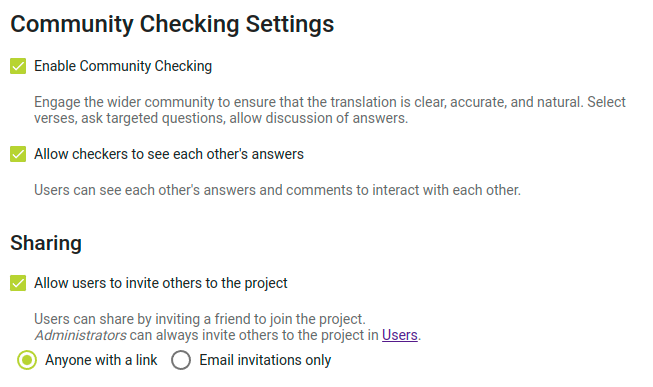
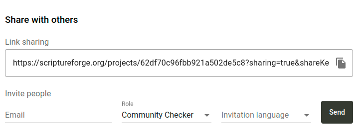

import ReactPlayer from "react-player";

Diese Anleitung beschreibt, wie [Scripture Forge](https://scriptureforge.org/) für die Überprüfung mit der Zielgruppe verwendet werden kann. Die grundlegenden Schritte sind wie folgt:

1. Ein [Paratext-Projekt](https://paratext.org/) mit Scripture Forge verbinden
2. Fragen für Überprüfer erstellen oder importieren
3. Audioaufnahme des Textes anhängen (optional)
4. Leute einladen, Dein Projekt zu überprüfen
5. Antworten auf die Fragen erhalte und damit austauschen
6. Das Projekt synchronisieren, damit Antworten als Notizen in Paratext angezeigt werden

## Ein Paratext-Projekt mit Scripture Forge verbinden {#a49ffad707ee4ff69860080e6e805c3b}

1. Gehe zu [scriptureforge.org](https://scriptureforge.org/) und klicke auf **Anmelden**.
2. Klicke auf der Anmeldeseite auf **Mit Paratext anmelden**.
3. Melde Dich über Paratext an und ermächtige Scripture Forge zum Zugriff auf Dein Paratext-Konto.
4. Wenn Du wieder zu Scripture Forge zurückgeleitet wirst, gehe auf die [Seite Projekt verbinden](https://scriptureforge.org/connect-project). Wenn Du noch keine Projekte hast, wirst Du automatisch dorthin weitergeleitet. Wenn Du bereits Projekte in Scripture Forge hast, klicke auf die Projektauswahl in der oberen linken Ecke und dann auf **Projekt verbinden**.
5. Die Seite Projekt verbinden zeigt eine Liste der Projekte, auf die Du in Paratext Zugriff hast. Wähle das Projekt, das Du verbinden möchtest, aus der Liste aus.
6. Stelle sicher, dass das Kontrollkästchen **Prüfung mit Zielgruppe aktivieren** aktiviert ist. Sorge Dich jetzt nicht um den Ausgangstext. Diese Einstellung kann später auf der Seite mit den Projekteinstellungen geändert werden.
7. Klicke auf **Verbinden**. In weniger als einer Minute solltest Du zum Projekt in Scripture Forge weitergeleitet werden.

## Fragen zum Projekt hinzufügen {#47b7c1e2e8a74a3489b167849470745e}

Um Rückmeldungen zu Deiner Übersetzung zu erhalten, musst Du Fragen zur Überprüfung des Verständnisses hinzufügen. Du kannst Fragen importieren, die von anderen erstellt wurden, oder eigene Fragen erstellen.

:::note

Im Moment ist die einzige Möglichkeit, Rückmeldungen von Überprüfern aus der Zielgruppe zu erhalten, indem Überprüfungsfragen gestellt werden. Einige Projektadministratoren haben darum gebeten, dass die Überprüfer Kommentare zum Text hinzufügen können, auch wenn keine Frage vorhanden ist. Wenn dies etwas ist, von dem Dein Projekt profitieren könnte, [unterstütze den Vorschlag](https://community.scripture.software.sil.org/t/feature-request-comments-to-any-bible-verse-chosen/2506/6) bitte auf der [Scripture Forge Community Seite](https://community.scripture.software.sil.org/).

:::

<ReactPlayer controls url="https://youtu.be/J-led5En3D8" />

### Fragen individuell in Scripture Forge erstellen {#0c67e74b02944b61a33b3ea2d101effd}

Um Fragen zu Deinem Projekt hinzuzufügen, klicke in der Navigationsleiste unter dem Abschnitt **Überprüfung mit der Zielgruppe** auf **Übersicht**. Klicke dann auf die Schaltfläche **Frage hinzufügen**. Ein Dialogfeld wird geöffnet, in dem Du eine Frage erstellen kanst.

Eine Frage kann sich auf einen einzelnen Vers oder auf mehrere Verse beziehen. Gib einen Verweis in das Feld für die **Bibelstelle** ein, oder klicke auf den Dropdown-Pfeil, um ein Buch, ein Kapitel und einen Vers auszuwählen. Wenn sich die Frage über mehrere Verse erstrecken soll, gib in das zweite Feld einen Endverweis ein. Sobald Du einen Verweis eingegeben hast, wird der Text angezeigt, wobei die von Dir ausgewählten Verse hervorgehoben sind.

Gib Deine Frage in das Feld **Frage** ein. Wenn Du eine Audioversion der Frage hinzufügen möchtest, klicke auf die Schaltfläche **Aufnehmen**. Unter Umständen wirst Du aufgefordert, den Zugriff auf Dein Mikrofon zu gestatten. Wenn Du die Aufnahme beenden möchstest, klicke auf **Aufnahme beenden**. Du kannst dann die Aufnahme abspielen, um zu hören, wie sie klingt. Klicke auf die Schaltfläche **Erneut versuchen**, wenn Du mit dem Ergebnis nicht zufrieden bist. Du kannst anstelle einer Aufnahme auch eine Audiodatei hochladen, wenn Du das bevorzugst.

Klicke auf " **Speichern"** und Deine Frage wird in die Liste der Fragen zur Überpfrüfung mit der Zielgruppe aufgenommen.

### Fragen aus einer Tabelle importieren {#42107c9def434bf396442d0004577710}

Da es mühsam sein kann, eine Frage nach der anderen zu erstellen, haben wir auch die Möglichkeit geschaffen, Fragen aus einer Tabelle zu importieren. Du kannst ein Programm wie Microsoft Excel, Google Sheets oder LibreOffice Calc verwenden, um eine Liste von Fragen zu erstellen oder zu bearbeiten. Wenn Du auf der Suche nach einer Reihe vorgefertigter Fragen bist, solltest Du die [unfoldingWord®-Übersetzungsfragen](https://git.door43.org/unfoldingWord/en_tq) in Betracht ziehen. Wenn Du auf die verlinkte Seite gehst und auf eine der Dateien klickst, kannst Du sie herunterladen, als Tabellenkalkulation öffnen und die Liste der Fragen bearbeiten.

Hier siehst Du ein Beispiel dafür, wie die Zeilen in Deiner Tabelle aussehen sollten, damit Du sie in Scripture Forge importieren könnst:

| Verweis   | Frage                                                      |
| --------- | ---------------------------------------------------------- |
| HEB 1:1   | Worauf bezieht sich "unsere Väter"?                        |
| HEB 1:2   | Was bedeutet es, dass der Sohn „Erbe aller Dinge“ ist?     |
| HEB 1:2-3 | Wer ist der "Sohn", von dem in diesen Versen die Rede ist? |

Die Tabelle kann auch mehr als zwei Spalten haben, aber nur die Spalten "Referenz" und "Frage" werden verwendet. Die von unfoldingWord veröffentlichten TSV-Dateien haben ein etwas anderes Format, können aber ebenfalls in Scripture Forge importiert werden.

:::note

Der Verweis muss den Buchnamen in der gleichen Weise abkürzen, wie Paratext Buchnamen abkürzt. Zum Beispiel funktioniert **HEB 1:1**, aber **Hebräer 1,1** funktioniert nicht.

:::

Wenn Du Hilfe benötigst, um Deine Tabelle in das richtige Format für den Import in Scripture Forge zu bringen, helfen wir Dir gerne. Sende einfach eine E-Mail an [help@scriptureforge.org](mailto:help@scriptureforge.org).

1. Speichere Deine Tabelle als CSV-Datei.
2. Klicke dann in Scripture Forge auf **Übersicht** unter dem Abschnitt **Überprüfung mit der Zielgruppe** in der Navigationsleiste.
3. Klicke dann auf die Schaltfläche **Massenimport**. Es wird ein Dialog geöffnet, in dem Du wählen kannst, woher Du Fragen importieren möchtest.
4. Klicke auf **Import aus CSV-Datei** und wähle die Datei aus.
    1. Wenn Du einige Zeilen in Deiner Datei hast, die keine gültige Referenz und Frage haben, wird eine Warnung angezeigt, die Dich darauf hinweist, dass diese Zeilen übersprungen werden.
    2. Andernfalls wird Dir eine Liste von Fragen angezeigt.

### Alle Fragen importieren {#3f10139da5904f1883acafad811b422c}

Um alle Fragen in der CSV-Datei zu importieren, gehe wie folgt vor:

1. Klicke auf das Kontrollkästchen am Anfang der Liste. Damit werden alle Fragen ausgewählt.
2. Klicke auf **Ausgewählte Fragen importieren**.

### Ein Teil der Fragen importieren {#f8f6b299154e4caca7aa04661a820efd}

Du kannst auch nach einem Teil der Fragen filtern:

1. Verwende die Felder **Verweis von** und **Verweis auf**, um die Verse anzugeben, mit denen die Fragen beginnen und enden sollen.
2. Wenn Du zum Beispiel nur Fragen für Markus 5 importieren möchten:
    1. Gib **MRK 5:1** in das Feld **Referenz von** ein.
    2. Gib **MRK 5:43** in das Feld **Verweis auf** ein.
3. Klicke auf das Kontrollkästchen am Anfang der Liste, um alle Fragen auszuwählen. Nur die angezeigten Fragen werden ausgewählt.
4. Klicke auf **Ausgewählte Fragen importieren**.

:::note

Du musst Dir nicht merken, dass Markus 5 43 Verse hat, um nach allen Versen des Kapitels zu filtern. Wenn Du auf den Dropdown-Pfeil im Feld **Verweis auf** klickst, wird ein Dialogfeld geöffnet, in dem Du ein Buch, ein Kapitel und einen Vers auswählen kannst. Wenn Du Markus 5 auswählst, werden die Verse in Markus 5 aufgelistet, und Du kannst den letzten Vers, nämlich Vers 43, auswählen. Alternativ kannst Du auch **MRK 5:100** in das Feld **Verweis auf** eingeben, und alle Verse in Markus 5 werden einbezogen, obwohl es in Markus 5 eigentlich keinen Vers 100 gibt.

:::

### Fragen aus Transcelerator importieren {#1ed2e353d94847a3861ad3a69d531aac}

[Transcelerator](https://software.sil.org/transcelerator/) ist ein Plugin für Paratext, das eine Reihe von vorgefertigten Fragen zur Überprüfung des Textverständnisses in mehreren wichtigen Sprachen enthält. Diese Fragen können in Paratext übersetzt, in Scripture Forge exportiert und dann nach einer Synchronisierung in Scripture Forge importiert werden.

Um Fragen aus Transcelerator zu importieren:

1. Lade Transcelerator von [software.sil.org/transcelerator/download](https://software.sil.org/transcelerator/download/) herunter und installiere es.
2. Starte Transcelerator in Paratext.
3. Öffne in Transcelerator das Menü **Datei** und klicke auf **Scripture Forge-Datei erzeugen**.
4. Gib die Übersetzungen der englischen Fragen, die Du verwenden möchten, in die Spalte **Übersetzung** ein. Aktiviere für jede Frage, die bereit ist, das Kontrollkästchen **Bestätigt**.
5. Schließe Transcelerator und führe "Senden/Empfangen" in Paratext aus.
6. Klicke in Scripture Forge in der Navigationsleiste auf **Synchronisieren**. Klicke auf der sich öffnenden Seite auf **Synchronisieren**, um die Transcelerator-Fragen von Paratext zu senden und zu empfangen.
7. Klicke auf **Übersicht** unter dem Abschnitt **Überprüfung mit der Zielgruppe ** in der Navigationsleiste. Klicke dann auf die Schaltfläche **Massenimport**.
8. Es wird ein Dialog geöffnet, in dem Du wählen kannst, woher Du Fragen importieren möchtest. Klicke auf **Import aus Transcelerator**.
9. Wähle die Fragen aus, die Du importieren möchtest. Die Schritte hierfür sind genau die gleichen wie in dem Abschnitt oben mit dem Titel **Fragen aus einer Tabelle importieren**. In diesem Abschnitt findest Du Anweisungen zum Filtern für die gewünschten Fragen.
10. Klicke auf **Importieren ausgewählter Fragen** und Deine Fragen werden dem Projekt hinzugefügt.

## Audioaufnahme des Textes anhängen {#fd31ef9b6d74417099996e7dadb5068e}

Scripture Forge kann eine Audioaufnahme von jedem Textabschnitt für Überprüfer der Zielgruppe abspielen. Dazu musst Du für jedes Kapitel eine Audiodatei und eine Zeitdatei hochladen. Zeitdateien erlauben es Scripture Forge jeden Vers hervorzuheben, während er gesprochen wird.

### Den Text aufnehmen {#1926abf6118c46bba16353d2ef85169f}

Scripture Forge unterstützt Audio in den Dateiformaten .mp3 und .wav. Zeitdateien werden von HearThis, aeneas, Audacity und Adobe Audition unterstützt.

Eine der einfachsten Optionen ist [HearThis](http://software.sil.org/hearthis) zu verwenden, um die Übersetzung aufzunehmen. [Diese Anleitung](https://software.sil.org/downloads/r/scriptureappbuilder/Scripture-App-Builder-08-Using-HearThis-for-Audio-Recording.pdf) führt Dich durch den Prozess der Aufzeichnung von Bibeltexten und dem Erstellung von Audio- und Zeitdateien. Überspringe die Schritte am Ende über die Verwendung von Scripture App Builder.

Die [Ressourcen](https://software.sil.org/scriptureappbuilder/resources/) für Scripture App Builder diskutiert fortgeschrittene Ansätze, wie etwa die Verwendung von Glyssen für eine dramatisierte Audioaufnahme.

### Zeitdateien erstellen {#066182aa22c64dc7a74ad0556619c4b9}

Wenn Du bereits Audioaufnahmen hast, gibt es mehrere Optionen zum Erstellen von Zeitdaten.

Du kannst automatisch Zeitdateien mit Aeneas generieren, indem Du [diesen Anweisungen](https://software.sil.org/downloads/r/scriptureappbuilder/Scripture-App-Builder-07-Using-aeneas-for-Audio-Text-Synchronization.pdf) folgst.

Alternativ kannst Du mit Audacity manuell Zeitdateien erstellen, indem Du [dieser Anleitung](https://software.sil.org/downloads/r/scriptureappbuilder/Scripture-App-Builder-06-Using-Audacity-for-Audio-Text-Synchronization.pdf) folgst. Eine weitere Option ist Adobe Audition. Zeitdaten von Adobe Audition werden in dezimalen oder FPS Zeitformaten unterstützt. Wir unterstützen das „Samples“-Format nicht.

### Audio anhängen {#a4d3ee4a4d8b4e1d9bca42b837e57f77}

Um Audio- und Zeitdateien hochzuladen, klicke in der Seitenleiste auf **Fragen & Antworten**, navigiere zu dem Kapitel, an das du Audio anhängen möchtest und klicke dann auf das **Audio**-Symbol in der oberen rechten Ecke. Klicke auf **Dateien durchsuchen** und wähle die Audioaufzeichnung und dazugehörige Zeitdatei für dieses Kapitel aus und klicke dann auf **Speichern**.

## Leute einladen, Dein Projekt zu überprüfen {#678dca00aaa54fd79319ecf815049301}

<ReactPlayer controls url="https://youtu.be/aBPHCF56hxA" />

Sobald Du die Fragen zu Deinem Projekt hast, wird es Zeit, Überprüfer aus der Zielgruppe einzuladen.

Klicke in der Seitenleiste auf **Einstellungen** und scrolle nach unten zu **Einstellungen Überprüfung mit der Zielgruppe**.

### Einstellungen Benutzerinteraktion {#84a006f1fbaa4c50a8ce8bac248c0e1d}

Die erste Einstellung, die es zu beachten gilt, ist die Einstellung **Überprüfer können die Antworten der anderen sehen**. Wenn Überprüfern der Zielgruppe eine Frage angezeigt wird, werden existierende Antworten von anderen Überprüfern der Zielgruppe nicht angezeigt, damit dies die erhaltene Antwort nicht beeinflusst. Sobald eine Frage beantwortet ist, werden alle anderen Antworten auf die Frage angezeigt, und die Überprüfer können die Antworten des anderen kommentieren und gegenseitig Antworten mit "Gefällt mir" markieren. Wenn Du diese Interaktion nicht willst, aber möchtest, dass Antworten von anderen Überprüfern immer ausgeblendet werden, deaktiviere **Überprüfer können die Antworten der anderen sehen**.

### Freigabeeinstellungen {#5aa7e3d8451f40cfa6b33c5dd39a3c6f}

Wenn du möchtest, dass Überprüfer der Zielgruppe Freunde zum Projekt einladen können, achte darauf, dass **Benutzern erlauben, andere in das Projekt einzuladen** aktiviert ist. Wenn diese Einstellung deaktiviert ist, können nur Projektadministratoren Überprüfer der Zielgruppe zum Projekt hinzufügen.

Wenn Du diese Einstellung aktivierst, gibt es zwei Freigabemodi zur Auswahl. Wenn Du **Jeder mit einem Link**wählst, kannst Du Personen einen Link zum Projekt schicken und jeder, der auf den Link klickt, kann dem Projekt beitreten. Dies ist ideal, wenn Du eine Gruppe von Personen einladen möchtest (zum Beispiel kannst Du den Link in einer Facebook- oder WhatsApp-Gruppe teilen). Jeder mit dem Link wird in der Lage sein, den Link an alle anderen zu senden, um dem Projekt beizutreten. Alternativ kannst Du auch die Option **Nur E-Mail-Einladungen** wählen. Dann können Überprüfer der Zielgruppe nur Freunde einladen, indem sie eine Einladung in Scripture Forge senden (Scripture Forge sendet dann eine E-Mail-Einladung an die Person).

### Einladende Überprüfer der Zielgruppe {#2271d918980445fd8bc89587ccf33c4f}

Klicke in der Seitenleiste auf **Benutzer** und es werden Dir Freigabeoptionen angezeigt.

Wenn Du die Freigabe von Links im vorherigen Schritt aktiviert hast, gibt es einen Link, den Du kopieren kannst, um das Projekt zu teilen. Um den Link zu kopieren, klicke auf das Kopiersymbol auf der rechten Seite des Links.

Wenn die Linkfreigabe deaktiviert ist, oder wenn Du E-Mail-Einladungen an Benutzer senden möchtest, gib die E-Mail des Benutzers ein, den Du einladen möchtest, wähle die Rolle **Überprüfer der Zielgruppe** aus und wähle eine Einladungssprache. Klicke dann auf **Senden**. Eine E-Mail mit einem Link wird an die Person gesendet, die dann den Link anklicken und sich anmelden muss, um dem Projekt beizutreten.

## Antworten auf die Fragen erhalten und damit austauschen {#d09b7e47859e451783e6dcca8a80f40a}

<ReactPlayer controls url="https://youtu.be/C3bgh3yufVg" />

Um Antworten bei der Überprüfung mit der Zielgruppe zu überwachen, klicke auf **Übersicht** unter dem Abschnitt **Überprüfung mit der Zielgruppe** in der Navigationsleiste. Neben einer Liste von Fragen werden grundlegende Statistiken über die Antworten angezeigt.

Um Antworten von Überprüfern der Zielgruppe zu sehen, klicke auf eines der Bücher unter **Überprüfung mit der Zielgruppe** in der Navigationsleiste. Dann klicke auf eine Frage, um die Antworten zu sehen, die gegeben wurden. Wenn Du eine Antwort nach Paratext exportieren möchtest, klicke auf **Für Export markieren** für diese Antwort. Wenn Du mit der Antwort nichts weiter tun möchtest, klicke auf **Erledigt**. Damit wird die Antwort nicht entfernt, aber sie so markiert, dass keine weiteren Maßnahmen erforderlich sind.

Wenn Du Antworten finden möchtest, die nicht für den Export oder als erledigt markiert wurden, findest Du mit dem Filter oben auf der Liste der Fragen **Nicht überprüfte Antworten**.

Wenn Du es vorziehst, alle Antworten nach Paratext zu exportieren, ohne sie einzeln für den Export zu markieren, gehe zu den Projekteinstellungen und suche den Abschnitt **Antworten exportieren**. Die Standardoption besteht darin, nur **Für den Export markierte Antworten** zu exportieren, aber diese Einstellung kann auf **Alle Antworten** oder **Keine Antworten** geändert werden.

## Das Projekt synchronisieren, damit Antworten als Notizen in Paratext angezeigt werden {#1502b9d293ff4c3aacbe91834fd02bb2}

Klicke in der Navigationsleiste auf **Synchronisieren**. Klicke auf der sich öffnenden Seite auf **Synchronisieren**, um Änderungen von Paratext zu senden und zu empfangen. Öffne dann Dein Projekt in Paratext und führe "Senden/Empfangen" aus. Antworten von Überprüfern der Zielgruppe werden in Deinem Projekt als Notizen angezeigt. Bitte beachte, dass, wenn Du auf diese Notizen in Paratext antwortest, Deine Antworten nicht als Kommentare zu der Antwort in Scripture Forge erscheinen.

Die Notiz zeigt die ursprüngliche Frage, den Namen des Überprüfers der Zielgruppe, der geantwortet hat, und die Antwort selbst, wie unten gezeigt.

Notizen, die aus Antworten durch die Überprüfung mit der Zielgruppe generiert wurden, werden ein eigenes Notizsymbol haben, das sich von anderen Notizen in Deinem Paratext-Projekt unterscheidet. Du kannst das Symbol ändern, indem Du das Notizsymbol bearbeitest. Details dazu findest Du im [Paratext-Hilfeartikel über benutzerdefinierte Notizensymbole](https://paratext.org/paratext-training/tutorials/custom-project-note-tags-tutorial/). Auch kannst Du [die Notizen nach Notizensymbol filtern](https://paratext.org/2022/08/15/custom-note-tags/#Filter_for_Custom_Note_Tags), sodass Du nur die Antworten auf die Überprüfung durch die Zielgruppe anzeigen oder sie ganz ausblenden kannst.

:::note

Im Moment werden Audioantworten in Paratext angezeigt, aber der Ton kann nicht abgespielt werden. Um das Audio von einer Antwort abzuspielen, muss es in Scripture Forge geöffnet werden. Das wird unter Umständen in Zukunft erweitert.

:::

## Rückmeldungen {#f7d132ecbb04437e9d5a81440f84b6df}

Wenn Du Fragen, Probleme oder Anregungen hast, wende Dich bitte an das Scripture Forge-Team unter [help@scriptureforge.org.](mailto:help@scriptureforge.org). Du kannst auch auf der [Community-Support-Seite](https://community.scripture.software.sil.org/c/scripture-forge/19)posten, was es anderen erlaubt, an der Unterhaltung teilzunehmen. Wir freuen uns über Deine Rückmeldung und machen häufig Änderungen oder beheben Probleme auf Wunsch unserer Nutzer.

