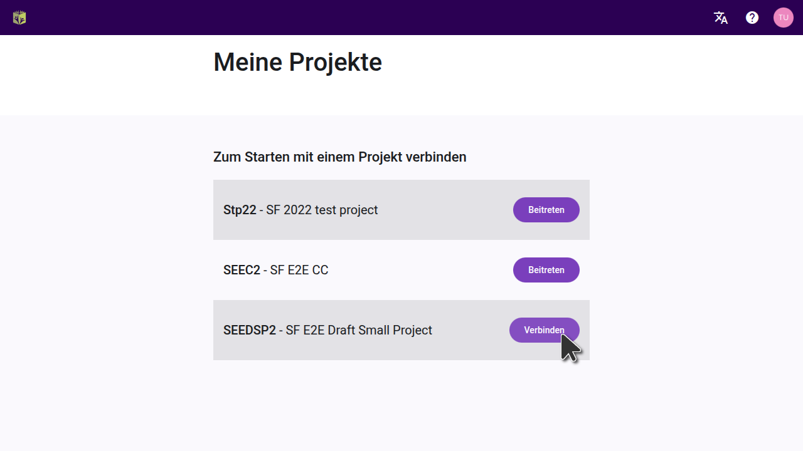

import ReactPlayer from "react-player";

## Einführung {#6222bdf3db3a44b4bf01a9cc6ffdaa80}

:::tip

Paratext-Projekte müssen nur einmal innerhalb mit Scripture Forge verbunden werden.

:::

Nachdem ein Paratext-Projekt mit Scripture Forge verbunden wurde, kann jeder Benutzer, der Mitglied des Projekts in Paratext ist (unter Benutzerberechtigungen), das Projekt in Scripture Forge öffnen.

Um ein Projekt in Scripture Forge öffnen zu können, muss ein Benutzer sich nur [bei Scripture Forge mit seinen Paratext-Kontoinformationen](/log-in) anmelden.

<ReactPlayer controls url="https://youtu.be/exEJxc19Zm4" />

## Wie man ein Paratext-Projekt mit Scripture Forge verbindet {#a71dfc268ebb43a0b19c0ab7018f92b4}

1. Wenn Du noch **nie** ein Projekt mit Scripture Forge verbunden hast:
    1. Klicke auf die Schaltfläche Projekt verbinden:

        

2. If you have already connected a project to Scripture Forge, follow these instructions to connect any additional projects:

    To view the list of projects you have access to in Paratext, click on the Scripture Forge icon on the top left of the screen.

Alternatively, you can also click on your profile icon on the top right of the screen and from the drop-down menu click “My Projects.”

From the displayed list, you shall be able to Open projects if they are already connected. You can also join a project or click on “Connect” to connect a project for the first time in Scripture Forge.

After clicking on “Connect” you will be asked to select your Project Source. From the available drop-down list, select the source you wish to use for your project.

Optional: Übersetzungsvorschläge aktivieren (#1 unten)

Optional: Überprüfgung mit Zielgruppe aktivieren (#2 oben)

When you are ready, Click Connect:

Warte darauf, dass sich Scripture Forge mit dem Paratext-Projekt verbindet:

Scripture Forge benötigt eine Weile, um Dein Projekt zu verbinden. Die grüne Fortschrittsleiste wird nicht mehr in Bewegung sein, wenn Dein Projekt vollständig verbunden ist:

Bemerkung: Unter Umständen kannst Du in Scripture Forge arbeiten, bevor das Projekt vollständig verbunden ist.

