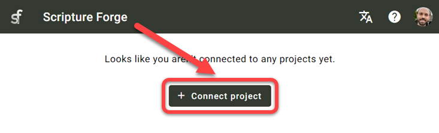
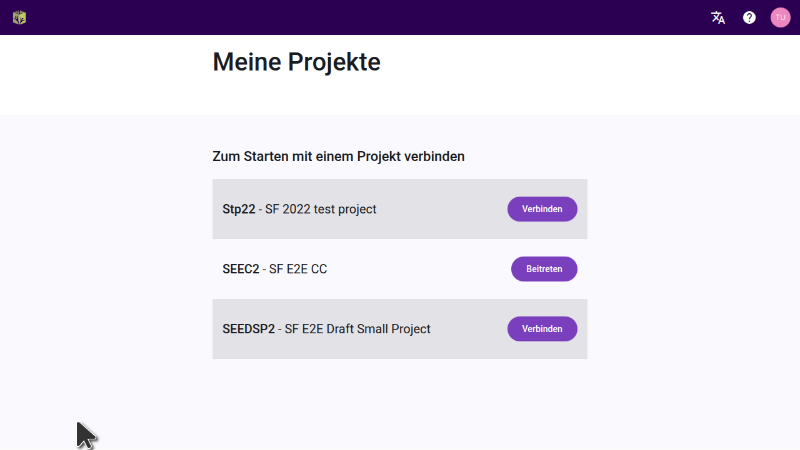
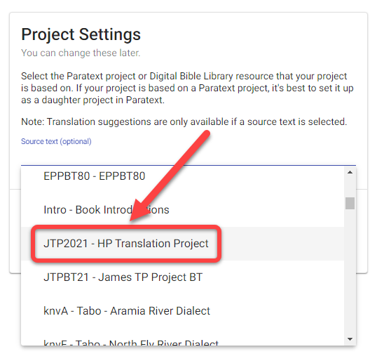
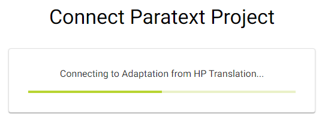

import ReactPlayer from "react-player";

## Einführung {#6222bdf3db3a44b4bf01a9cc6ffdaa80}

:::tip

Paratext projects only need to be connected once within Scripture Forge.

:::

Nachdem ein Paratext-Projekt mit Scripture Forge verbunden wurde, kann jeder Benutzer, der Mitglied des Projekts in Paratext ist (unter Benutzerberechtigungen), das Projekt in Scripture Forge öffnen.

Um ein Projekt in Scripture Forge öffnen zu können, muss ein Benutzer sich nur [bei Scripture Forge mit seinen Paratext-Kontoinformationen](/log-in) anmelden.

<ReactPlayer controls url="https://youtu.be/exEJxc19Zm4" />

## Wie man ein Paratext-Projekt mit Scripture Forge verbindet {#a71dfc268ebb43a0b19c0ab7018f92b4}

1. Wenn Du noch **nie** ein Projekt mit Scripture Forge verbunden hast:
    1. Klicke auf die Schaltfläche Projekt verbinden:

        

2. Falls Du bereits ein Projekt mit dem Scripture Forge verbunden hast, folge diesen Anweisungen, um weitere Projekte zu verbinden:

    Um die Liste der Projekte anzuzeigen, auf die Du in Paratext Zugriff hast, klicke auf das Scripture Forge-Symbol oben links auf dem Bildschirm.

Alternativ kannst Du auch auf Dein Profilsymbol oben rechts auf dem Bildschirm und im Dropdown-Menü auf "Meine Projekte" klicken.

In der angezeigten Liste kannst Du Projekte öffnen, wenn diese bereits verbunden sind. Du kannst auch einem Projekt beitreten oder auf "Verbinden" klicken, um ein Projekt zum ersten Mal in Scripture Forge zu verbinden.

Nach dem Klicken auf "Verbinden" wirst Du aufgefordert, Deine Projektquelle auszuwählen. Wähle aus der verfügbaren Dropdown-Liste die Quelle aus, die Du für Dein Projekt verwenden möchtest.

Optional: Übersetzungsvorschläge aktivieren (#1 unten)

Optional: Überprüfgung mit Zielgruppe aktivieren (#2 oben)

Wenn Du bereit bist, klicke auf Verbinden:

Warte darauf, dass sich Scripture Forge mit dem Paratext-Projekt verbindet:

Scripture Forge may take a while to connect your project. The green progress bar will stop moving when your project is fully connected:

Bemerkung: Unter Umständen kannst Du in Scripture Forge arbeiten, bevor das Projekt vollständig verbunden ist.

