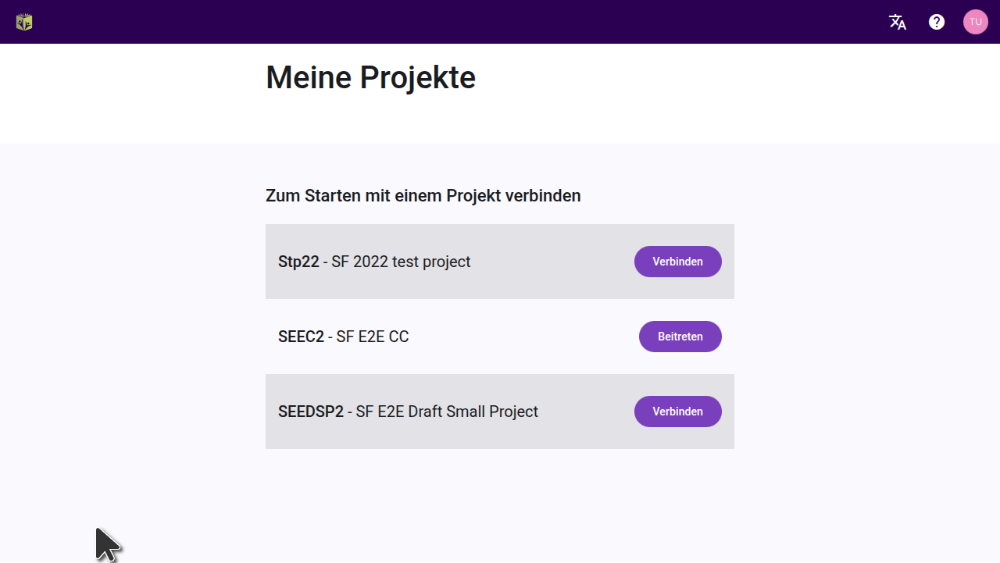

Bevor Du in Scripture Forge auf ein Paratext-Projekt zugreifen kannst, muss es mit Scripture Forge verbunden sein. Beim Verbinden eines Projekts wird eine Kopie des Paratext-Projekts in Scripture Forge erstellt, die [mit Paratext synchronisiert](syncing-with-paratext) werden kann.

<!-- The following paragraph is an EXACT copy of one of the paragraphs on the /syncing-with-paratext page and should be kept in sync with it. Both pages have the need to explain the relationship between Paratext and Scripture Forge projects, and having them identical means translators only have to translate it once. -->

In Paratext hat jedes Mitglied des Projekts eine Kopie des Projekts auf seinem eigenen Computer, und Senden/Empfangen wird verwendet, um Änderungen mit anderen Mitgliedern zu teilen. Wenn ein Projekt mit Scripture Forge verbunden ist, arbeiten alle Mitglieder des Projekts in Scripture Forge an einer einzigen Kopie des Projekts, so dass jede von einem Mitglied vorgenommene Änderung sofort von einem anderen Mitglied gesehen wird, wenn beide Mitglieder online sind. Diese Änderungen werden an das Paratext-Projekt gesendet, wenn eine Synchronisierung in Scripture Forge durchgeführt wird, und alle in Paratext vorgenommenen Änderungen werden mit dem Scripture Forge-Projekt synchronisiert.

Um ein Paratext-Projekt in Scripture Forge zu verbinden, [melde Dich mit Paratext](log-in) an. Wenn Du Dich anmeldest, wird die Seite **Meine Projekte** geladen. Wenn Du Dich auf einer anderen Seite in Scripture Forge befindest, kannst Du die Seite **Meine Projekte** aufrufen, indem Du auf das Scripture Forge-Logo in der oberen linken Ecke der Seite klickst. Die Seite **Meine Projekte** listet alle Projekte auf, an denen Du in Paratext beteiligt bist, einschließlich derer, die mit Scripture Forge verbunden sind, und derer, die noch nicht verbunden sind. Wenn bereits ein Projekt verbunden wurde und Du Mitglied des Paratext-Projekts bist, kannst Du dem Scripture Forge-Projekt beitreten, indem Du auf **Beitreten** klickst. Falls das Projekt noch nicht verbunden wurde und Du einer der Administratoren des Projekts bist, klicke auf **Verbinden**. Nur Administratoren können ein Projekt auf dieser Seite verbinden.

