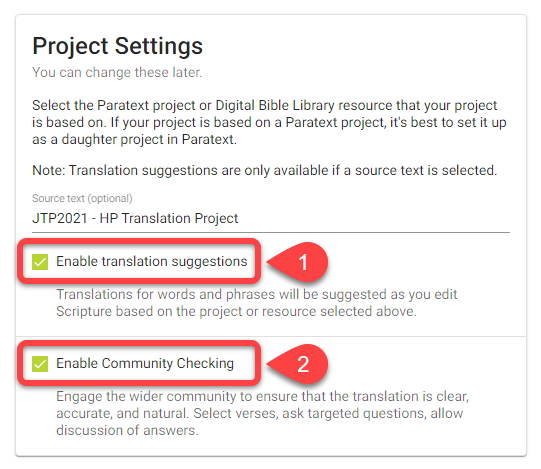

## Einführung {#6222bdf3db3a44b4bf01a9cc6ffdaa80}

:::tip

Paratext-Projekte müssen nur einmal innerhalb mit Scripture Forge verbunden werden.

:::

Nachdem ein Paratext-Projekt mit Scripture Forge verbunden wurde, kann jeder Benutzer, der Mitglied des Projekts in Paratext ist (unter Benutzerberechtigungen), das Projekt in Scripture Forge öffnen.

Um ein Projekt in Scripture Forge öffnen zu können, muss ein Benutzer sich nur [bei Scripture Forge mit seinen Paratext-Kontoinformationen](/log-in) anmelden.

## Wie man ein Paratext-Projekt mit Scripture Forge verbindet {#a71dfc268ebb43a0b19c0ab7018f92b4}

1. Wenn Du noch **nie** ein Projekt mit Scripture Forge verbunden hast:
    1. Klicke auf die Schaltfläche Projekt verbinden:

        

2. Wenn Du bereits ein Projekt mit dem Scripture Forge verbunden hast, folge diesen Anweisungen, um weitere Projekte zu verbinden:
    1. Klicke auf die Scripture Forge-Navigationsleiste:

        

    2. Die Navigationsleiste könnte auch so aussehen:

        

    3. Klicke auf Projekt verbinden:

        

3. Klicke in der Paratext-Projekt-Dropdown-Liste:

    

4. Wähle das Projekt, das Du verbinden möchtest:

    

5. Optional: Wenn Du Übersetzungsvorschläge verwenden oder ein anderes Projekt/eine andere Ressource neben Deinem Projekt anzeigen möchtest:
    1. Klicke auf den Bereich Ausgangstext:

        

    2. Wähle das Ausgangsprojekt aus:

        

6. Optional: Übersetzungsvorschläge aktivieren (#1 unten)

    

7. Optional: Überprüfgung mit Zielgruppe aktivieren (#2 oben)
8. Klicke auf Verbinden:

    

9. Warte darauf, dass sich Scripture Forge mit dem Paratext-Projekt verbindet:

    

10. Scripture Forge benötigt eine Weile, um Dein Projekt zu verbinden. Die grüne Fortschrittsleiste wird nicht mehr in Bewegung sein, wenn Dein Projekt vollständig verbunden ist:

    

Bemerkung: Unter Umständen kannst Du in Scripture Forge arbeiten, bevor das Projekt vollständig verbunden ist.

