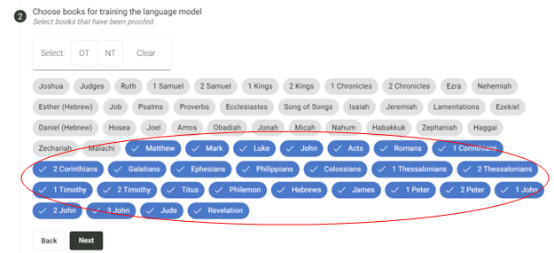
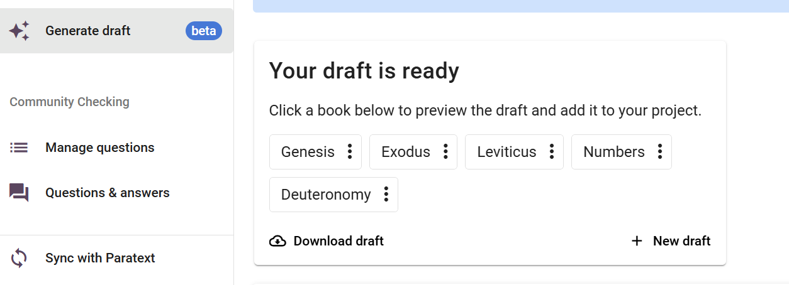

import ReactPlayer from "react-player";

<ReactPlayer controls url="https://youtu.be/binHoeAGGvU" />

Nachdem Du Dich für das Entwerfen angemeldet und die erforderlichen Einstellungen konfiguriert hast, kannst Du auf <i>Scripture Forge AI Drafting</i> zugreifen, indem Du im Hauptmenü auf die Schaltfläche "Entwurf generieren" klicken. Du solltest nun Zugriff auf die Schaltfläche "Neuen Entwurf generieren" haben.

Sobald Du darauf klickst, wirst Du zu einem **2-stufigen Verfahren** weitergeleitet, um Deinen Entwurf zu generieren.

- **Schritt 1:** Der erste Schritt zum Generieren eines Entwurfs besteht darin, die Bücher auszuwählen, die Du übersetzen möchtest. Hier werden nur die Bücher angezeigt, die bereits in Deinem Paratext-Projekt vorhanden sind. Wir empfehlen, gleichzeitig bis zu 5 Bücher für die Übersetzung auszuwählen.

- **Schritt 2:** Als Nächstes wähle die Bücher aus, die zum Schulen des Sprachmodells verwendet werden sollen. Diese Bücher sollten gut überprüft worden sein, müssen aber nicht von einem Berater überprüft worden werden. Je mehr Bücher, desto besser das Ergebnis des Entwurfes. Wenn Du in Schritt 1 ein Buch zum Übersetzen ausgewählt hast, kannst Du es in diesem Schritt nicht zum Schulen des Modells auswählen

- Schritt 3 (optional): Als Nächstes kannst Du auch zusätzliche Dateien für die Schulung des Sprachmodells hochladen. Diese müssen im .csv-Format vorhanden sein. Dieser Schritt ist optional.

Nachdem Du diese Schritte ausgeführt hast, wird die Schaltfläche "Entwurf generieren" angezeigt. Sobald Du darauf klickst, gib Scripture Forge bitte Zeit, die Entwürfe zu generieren. Dies kann etwa 3 Stunden oder länger dauern, je nachdem, wie ausgelastet unsere Server sind.

Sobald der Entwurf fertig ist, solltest Du eine Benachrichtigung erhalten, wie in der folgenden Abbildung dargestellt.

