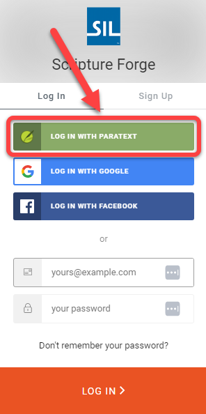
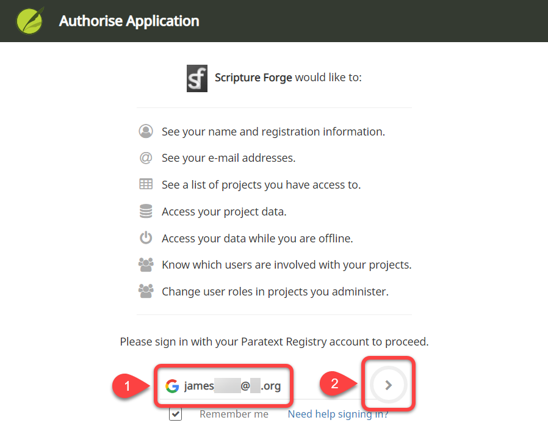

## Mit einem Paratext-Konto bei Scripture Forge anmelden {#68acbb7da03045a7b357e41c0107f6d1}

1. Gehe zu [https://scriptureforge.org/](https://scriptureforge.org/)
2. Wenn Sie Du bereits eine Paratext-Registrierung hast (oder ein Scripture Forge-Konto angelegt hast), klicke auf die Schaltfläche Anmelden:

    

3. Klicke auf Anmelden mit Paratext:

    

4. Ermächtige Scripture Forge, eine Verbindung mit Deinem Paratext-Konto herzustellen.
    1. Gib die E-Mail-Adresse ein, die mit Deinem [Paratext-Konto](https://registry.paratext.org/users/me) verbunden ist (#1 unten):

        

    2. Klicke auf den Login-Pfeil (#2 oben).
