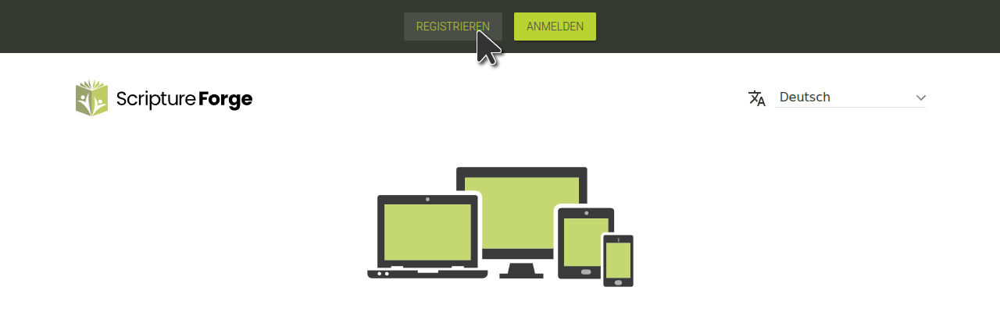

## Mit einem Paratext-Konto bei Scripture Forge anmelden

1. Gehe zu [https://scriptureforge.org/](https://scriptureforge.org/)
2. If you already have a Paratext registration (or have created a Scripture Forge account), click the **Log In** button. Otherwise click the **Sign Up** button.

Then click **Log in with Paratext** or **Sign up with Paratext**, depending on which button you clicked previously:

Als Nächstes autorisiere Scripture Forge, sich mit Deinem Paratext-Konto zu verbinden. Wenn Du dazu aufgefordert wirst, gib die E-Mail-Adresse ein, die mit Deinem [Paratext-Konto](https://registry.paratext.org/users/me) verbunden ist, und klicke dann auf den Login-Pfeil (oder drücke die Eingabetaste)

