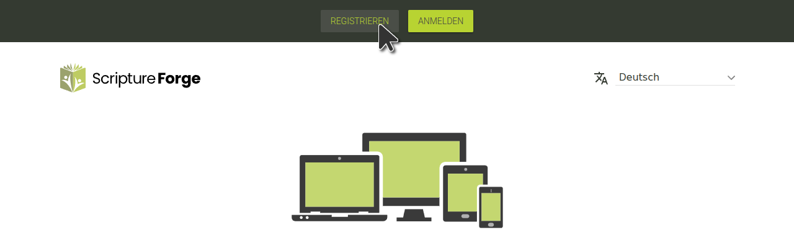

## Mit einem Paratext-Konto bei Scripture Forge anmelden

1. Gehe zu [https://scriptureforge.org/](https://scriptureforge.org/)
2. Falls Du bereits bei Paratext angemeldet bist (oder ein Scripture Forge-Konto angelegt hast), klicke auf die Schaltfläche Einloggen:

Klicke dann auf Einloggen mit Paratext:

Als Nächstes autorisiere Scripture Forge, sich mit Deinem Paratext-Konto zu verbinden. Wenn Du dazu aufgefordert wirst, gib die E-Mail-Adresse ein, die mit Deinem [Paratext-Konto](https://registry.paratext.org/users/me) verbunden ist, und klicke dann auf den Login-Pfeil (oder drücke die Eingabetaste)

