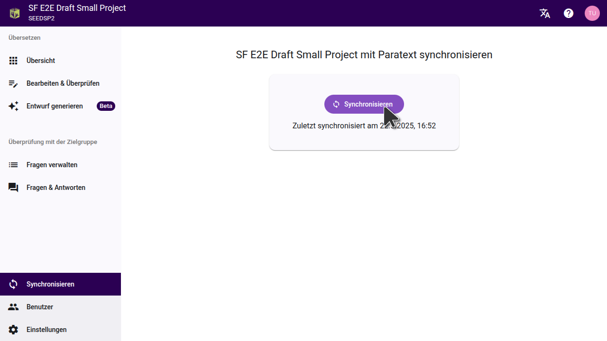

Dein Scripture Forge-Projekt mit Paratext zu synchronisieren ist sehr wichtig, da dies es ermöglicht, dass Änderungen in Scripture Forge auf den Paratext-Servern gespeichert werden können und auch die neuesten Daten aus Deinem Paratext-Projekt in Scripture Forge imporiert werden.

Es ist ähnlich wie der Funktion "Senden/Empfangen" in Paratext.

Beachte, dass die Synchronisierung eines Projekts in Scripture Forge auf _**ALLE NUTZER**_ des SF-Projekts angewndet wird. Es wird auch auf den Paratext-Server angewendet wie die Funktion "Senden/Empfangen".

## **So synchronisierst Du Dein Projekt** {#d0af3ae0f98640c6a88fe4132a015be0}

Um ein Projekt zu synchronisieren, klicke auf „Synchronisieren“ im Hauptmenü. Dies zeigt Dir die Schaltfläche „Synchronisieren“ in Deinem Fenster. Sobald Du darauf klickst, warte bitte bis die Synchronisation abgeschlossen ist und die beiden Pfeile aufhören zu wechseln, bevor Du etwas anderes tust, wie im untenstehenden Bild angezeigt.

## **Wann ist es notwendig, ein Projekt zu synchronisieren** {#b19f92d1a5714c4fb57b61672d95b898}

- Eine automatische Synchronisierung wird durchgeführt, wenn Du zum ersten Mal ein Paratext-Projekt mit Scripture Forge verbindest. Scripture Forge importiert noch während der Synchronisierung Deine Projektdaten vom Paratext-Server. Es ist wichtig zu warten, bis die Synchronisation abgeschlossen ist (die beiden Pfeile gehen nicht mehr weiter), bevor Du versuchst, etwas anderes zu tun.
- Nachdem Du irgendwelche Änderungen in Deine Paratext-Projekt vorgenommen und auf "Senden/Empfangen" geklickt hast, ist es wichtig, eine Synchronisation in Scripture Forge durchzuführen, damit diese Änderungen in Scripture Forge importiert werden können. Nur die Funktion „Senden/Empfangen“ in Paratext reicht nicht aus, um die Änderungen in Scripture Forge wiederzugeben.
- Eine automatische Synchronisierung erfolgt, wenn Du eine Referenzübersetzung auswählst oder einen Entwurf generierst. Bei Verbindungsproblemen mit der automatischen Synchronisation, empfehlen wir dies auch manuell zu tun, um sicherzustellen, dass der Entwurf auf den neuesten Daten des Projekts basiert.
- Nachdem Du einen Entwurf zu Deinem Projekt in Scripture Forge hinzugefügt hast, vergiss bitte nicht, eine Synchronisierung durchzuführen, um die Daten auf dem Paratext-Server zu speichern. Generiere keinen neuen Entwurf, es sei denn, der erste wurde Deinem Projekt hinzugefügt. Ansonsten wird er nicht auf dem Paratext-Server gespeichert und die Daten gehen verloren.
- Änderungen oder Überarbeitungen an Deinem Projekt in Scripture Forge müssen synchronisiert werden, um sie auf dem Paratext-Server zu speichern. Sobald dies erledigt ist, musst Du auch ein "Senden/Empfangen" in Deinem lokalen Paratext-Projekt durchführen, um diese Änderungen zu importieren.
