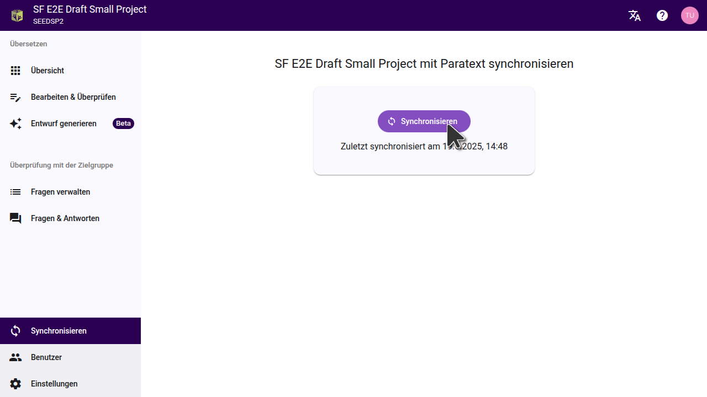

<!-- The following paragraph is an EXACT copy of one of the paragraphs on the /connect-paratext-project page and should be kept in sync with it. Both pages have the need to explain the relationship between Paratext and Scripture Forge projects, and having them identical means translators only have to translate it once. -->

In Paratext hat jedes Mitglied des Projekts eine Kopie des Projekts auf seinem eigenen Computer, und Senden/Empfangen wird verwendet, um Änderungen mit anderen Mitgliedern zu teilen. Wenn ein Projekt mit Scripture Forge verbunden ist, arbeiten alle Mitglieder des Projekts in Scripture Forge an einer einzigen Kopie des Projekts, so dass jede von einem Mitglied vorgenommene Änderung sofort von einem anderen Mitglied gesehen wird, wenn beide Mitglieder online sind. Diese Änderungen werden an das Paratext-Projekt gesendet, wenn eine Synchronisierung in Scripture Forge durchgeführt wird, und alle in Paratext vorgenommenen Änderungen werden mit dem Scripture Forge-Projekt synchronisiert.

## So synchronisierst Du Dein Projekt {#d0af3ae0f98640c6a88fe4132a015be0}

Um ein Projekt zu synchronisieren, klicke auf **Synchronisieren mit Paratext** im Hauptnavigationsmenü. Klicke dann auf die Schaltfläche **Synchronisieren mit Paratext** wie unten beschrieben. Der Fortschritt wird während der Synchronisierung angezeigt, die in der Regel 1 bis 3 Minuten dauert, je nach Größe des Projekts.

Falls Scripture Forge mit der Synchronisierung anderer Projekte beschäftigt ist, kann es eine Weile dauern, bis die Synchronisierung tatsächlich beginnt, was jedoch selten vorkommt. Manchmal schlägt eine Synchronisierung fehl und Du musst es erneut versuchen. Falls eine Synchronisierung immer wieder fehlschlägt oder sehr lange dauert, wende Dich bitte [an uns für Hilfe](mailto:help@scriptureforge.org).

## Wann synchronisierst Du ein Projekt {#b19f92d1a5714c4fb57b61672d95b898}

Scripture Forge synchronisiert Ihr Projekt zu verschiedenen Zeitpunkten automatisch mit Paratext. Dazu gehören:

- Wenn Du ein Projekt zum ersten Mal verbindest.
- Wenn Du mit der Erstellung eines neuen Entwurfs beginnst.
- Wenn der Ausgangstext für ein Projekt geändert wird, oder wenn Ausgangstexte für den Entwurf konfiguriert werden.

Du solltest eine Synchronisierung durchführen, wenn Du Änderungen von Paratext an Scripture Forge oder von Scripture Forge an Paratext senden willst. Hier sind einige Beispiele dafür, wann Du eine Synchronisierung durchführen solltest:

- Du hast gerade ein Buch in Paratext fertiggestellt und möchtest einen Entwurf für ein anderes Buch erstellen. Du solltest einen Sende-/Empfangsvorgang in Paratext und dann eine Synchronisierung in Scripture Forge durchführen, damit das fertige Buch als Schulungsdaten in Scripture Forge verfügbar ist.
- Ein Buch ist bereit für die Überprüfung mit der Zielgruppe. Du solltest einen Sende-/Empfangsvorgang in Paratext und dann eine Synchronisierung in Scripture Forge durchführen, damit den Überprüfern der Zielgruppe die neueste Kopie des Buches angezeigt wird.
- Übersetzer haben den Text in Scripture Forge bearbeitet oder andere Änderungen vorgenommen, die Du in Paratext wünschst. Du solltest eine Synchronisierung in Scripture Forge und dann ein Senden/Empfangen in Paratext durchführen, um die neuesten Änderungen zu erhalten.

Du solltest nach der Bearbeitung des Textes in Scripture Forge nicht lange mit der Synchronisierung warten. Falls jemand Bearbeitungen in Paratext vornimmt, bevor Du die Änderungen mit Paratext synchronisierest, kann dies zu Konflikten in Paratext führen.