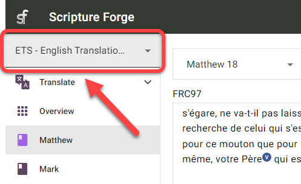
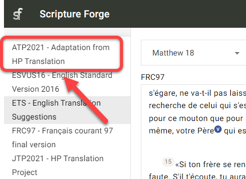
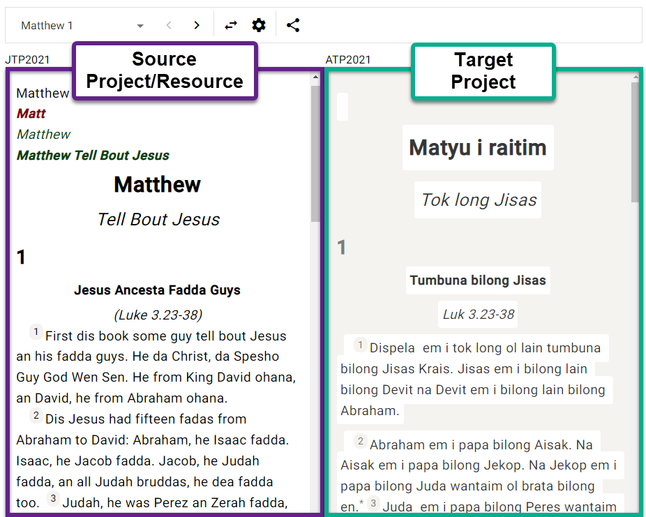
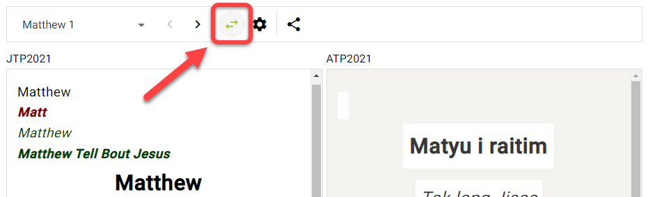
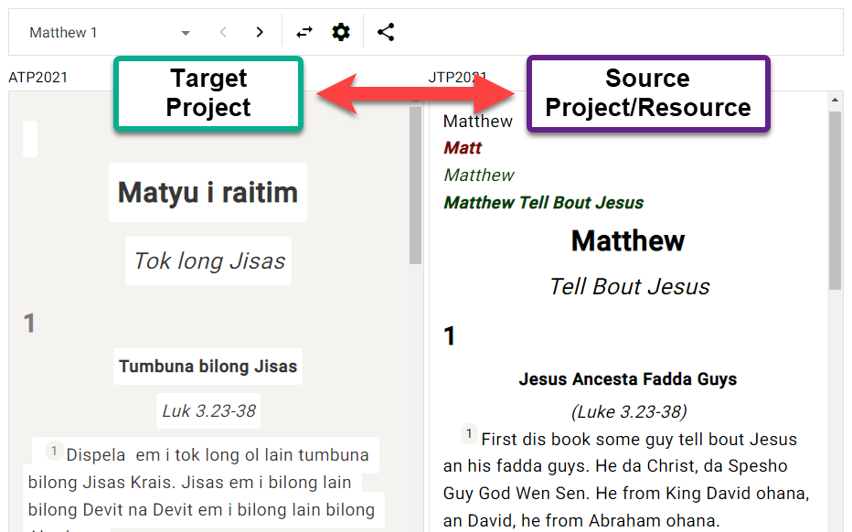
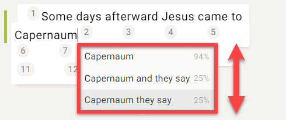
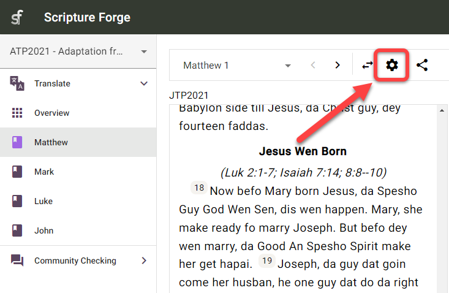
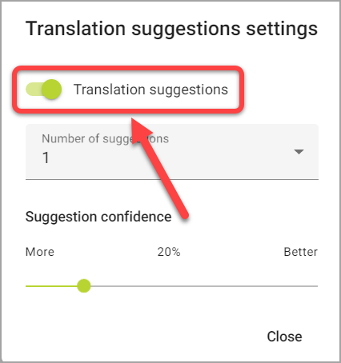
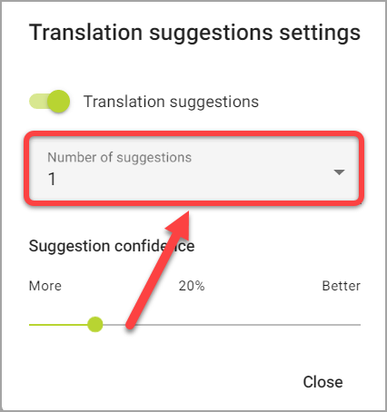
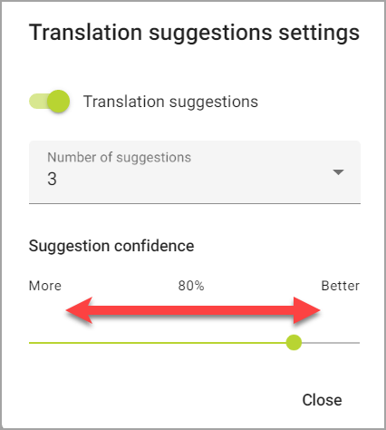

## Was sind Übersetzungsvorschläge? {#5f721bd65922446f8eefb001acc89f30}

:::info

"Translation suggestions" is an older Scripture Forge feature that provides interactive suggestions to translators as they type within Scripture Forge. It works best when translating between very similar languages.

Translation drafting is a newer, more flexible, and more powerful translation tool in Scripture Forge that creates drafts for translators to review and edit.

:::

Übersetzungsvorschläge erlauben es Scripture Forge, eine Ausgangs- und Zielsprache zusammen zu analysieren und automatisch Wörter/Begriffe vorzuschlagen, die im Übersetzungsprozess verwendet werden sollen.

- Übersetzungsvorschläge basieren auf der Analyse von Versen im Zielprojekt, die bereits aus dem Ausgangsprojekt übersetzt wurden.
- Je mehr Verse Du sowohl in der Ausgangssprache als auch in der Zielsprache hast, desto besser werden die Vorschläge sein.
- Vorschläge funktionieren besser mit Sprachen, die eher ähnlich sind, und funktionieren nicht gut mit Sprachen, die nicht miteinander verwandt sind.
- Bevor Du Übersetzungsvorschläge verwendest, muss ein Administrator des Paratext-Projekts Übersetzungsvorschläge für Dein Projekt aktivieren.

## Fenster mit Übersetzungsvorschlägen einrichten {#055dfd61aa9442e3b6c787613c8085d6}

:::note

This must be done by each user who wants to use translation suggestions.

:::

### Dein Projekt wählen {#4de2ee23101e4a498e465465740c5a51}

:::tip

First you need to **select your project** from the navigation page, if you haven't already.

:::

1. Klicke auf die Scripture Forge-Navigationsleiste:

    

2. Wähle Dein Projekt:

    

**ODER**

1. Klicke auf das Scripture Forge-Menüsymbol:

    

2. Klicke auf die Projekt-Dropdown-Liste:

    

3. Klicke auf Dein Projekt:

    

### Das Übersetzungsvorschlagsfenster einrichten {#8798a078b0464f5190de5d6dd7e4d132}

1. Klicke in der Navigationsleiste auf den Abschnitt Übersetzen:

    

2. Klicke auf das Buch, das Du bearbeiten möchtest:

    

3. Der Ausgangstext wird auf der linken Seite und der Zieltext auf der rechten Seite angezeigt:

    

    1. **Hinweis:** Der Name des Projekts/Ressources, das Du verwendest, befindet sich in der oberen linken Ecke jedes Fensters:

        

4. Um zwischen den Büchern zu wechseln:
    1. Gehe zur Navigationsleiste > Abschnitt Übersetzen.
    2. Klicke auf den Namen des Buches:

    

5. Um zwischen den Kapiteln zu wechseln:
    1. Klicke auf die Pfeile rechts und links oben im Fenster:

    

6. Um die Ausgangs- und Zielprojektseiten zu wechseln:
    1. Click the "swap source and target" button:

    

    1. Dies verschiebt das Zielprojekt nach links und das Ausgangsprojekt/-ressource nach rechts:

    

## Was ist ein Segment? {#3931f83c77104d27bfa1bcd797303914}

:::tip

Before doing translation work in Scripture Forge, you should understand what a "**segment**" is.

:::

In Scripture Forge ist ein Segment ein Abschnitt des zu übersetzenden Bibeltextes. Dies kann eine Abschnittsüberschrift, ein Vers oder ein Teil eines Verses sein (wie in der Poesie).

Zum Beispiel hat der folgende Abschnitt 6 Segmente (Titel, Überschrift, Vers 1, etc):

In diesem nächsten Abschnitt gibt es insgesamt 8 Segmente (Anmerkung: Vers 23 hat 6 Segmente):

## Wie man Übersetzungsvorschläge nutzt {#007fd10ab17d498ea44ffb913d92663f}

Now that you understand how to navigate in Scripture Forge, it's time to learn how to use **translation suggestions**. Denke daran, Übersetzungsvorschläge sind, wenn Scrpture Forge Deine Übersetzungsarbeit analysiert und automatisch Wörter/Begriffe vorschlägt, die im Übersetzungsprozess verwendet werden sollen.

1. In Deinem Projekt gehe zum Buch und Kapitel, das Du übersetzen möchtest.
2. Klicke ins Segment, das Du übersetzen möchtest.
3. Gib Deine Übersetzung ein (rechts):

    

    1. Bemerkung: Scripture Forge speichert die Bearbeitungen während des Schreibens.
4. Bei der Eingabe können Vorschläge in einem Feld unten erscheinen, wo Du schreibst:

    

5. Next to the suggestions is a percentage:

    

    1. Das zeigt, wie zuversichtlich das System ist, dass dieser Vorschlag richtig ist. Ein höherer Prozentsatz ist eher ein Vorschlag für eine höhere Qualität.
6. Wenn du einen Vorschlag verwenden möchtest, klicke darauf oder drücke **Enter** wenn dieser Vorschlag hervorgehoben wird.

    

7. Damit wird der Vorschlag in den Text eingefügt:

    

8. Wenn dir kein Vorschlag gefällt, der in den Text eingefügt wurde:
    1. Lösche oder bearbeite einfach alle Wörter, die geändert werden müssen.

        

9. Wenn keiner der Vorschläge gut genug ist, kannst Du die Vorschläge ignorieren und weiter übersetzen.

### Weiter übersetzen {#9e130c3ad9c048a4822e37e0d0ba0750}

:::tip

Scripture Forge will continue to learn and make better suggestions as you translate.

To adjust the _**translation suggestion settings**_ for your user, see the [steps here 🔗](/translation-suggestions).

:::

### Tastaturkürzel {#228a943ddd984192b78ae4ccb39c6211}

1. Wenn Dir Scripture Forge Übersetzungsvorschläge anzeigt, kannst Du die Pfeiltasten **nach oben** und **nach unten** verwenden, um den gewünschten Vorschlag zu markieren.

    

    1. Drücke dann **Enter**, um den Vorschlag zu benutzen.
2. Du kannst auch **STRG +&lt;a number key&gt;** drücken, um die Anzahl der Wörter für den hervorgehobenen Vorschlag einzufügen.
    1. For example, if "Capernaum and they say" was highlighted:

        

    2. So würden die Tastenkombinationen aussehen:

        | Kürzel   | Eingefügte Wörter       |
        | -------- | ----------------------- |
        | Strg + 1 | Kapernaum               |
        | Strg + 2 | Kapernaum und           |
        | Strg + 3 | Kapernaum und sie       |
        | Strg + 4 | Kapernaum und sie sagen |

## Übersetzungs-Einstellungen anpassen - Pro Benutzer {#3822d035acfd42ae888cefbd7b71fcb5}

:::note

You can configure the translation suggestion settings for your individual user.

:::

1. Wähle Dein Projekt aus der Navigationsleiste.
2. Klicke auf den Abschnitt Übersetzen.
3. Klicke auf das Buch, das Du bearbeiten möchtest:
    1. **Hinweis:** Du kannst ein Buch für diesen Teil auswählen, die Einstellungen sind für alle Bücher identisch.
4. Klicke auf die Schaltfläche Einstellungen zu Übersetzungsvorschläge:

    

5. Das Dialogfeld mit den Einstellungen für die Übersetzungsvorschläge wird angezeigt:

    

6. **Übersetzungsvorschläge**: Dies zeigt oder verbirgt nur Vorschläge im **aktuellen Projekt** für **Deinen Benutzer**.
    1. Klicke auf den Übersetzungsvorschlag, um Übersetzungsvorschläge anzuzeigen oder zu verstecken, während Du schreibst:

    

7. **Anzahl der Vorschläge**: Dies ändert die Anzahl der Vorschläge, die Du auf einmal sehen wirst.
    1. Klicke auf den Bereich für die Anzahl der Vorschläge:

        

    2. Klicke dann auf die maximale Anzahl von Vorschlägen, die Du auf einmal sehen möchtest:

        

8. **Zuverlässigkeit der Vorschläge:** Der prozentuale Wert, der über dem Schieberegler erscheint, zeigt das Mindestmaß an Zuverlässigkeit der Vorschläge, die angeboten werden.
    1. Klicke und ziehe den Schieberegler, um die Zuverlässigkeit anzupassen:

        

    2. **Mehr** _erhöht_ die Anzahl der Vorschläge durch Einfügen von _weiteren_ Vorschlägen, die eine niedrige Zuverlässigkeit aufweisen.
    3. **Bessere** _verringert_ die Anzahl der Vorschläge durch Einfügen von _besseren_ Vorschlägen, die eine höhere Zuverlässigkeit aufweisen.
9. Klicke auf Schließen, wenn Du fertig bist.
