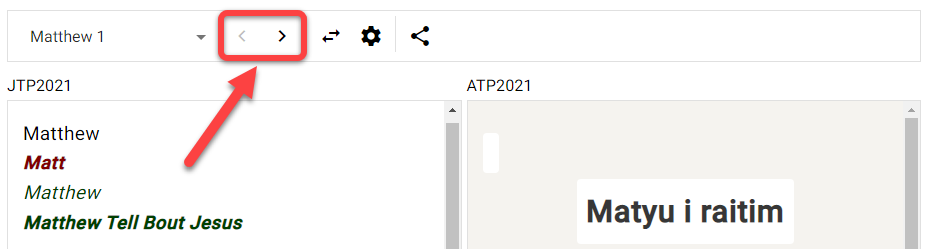

## Was sind Übersetzungsvorschläge? {#5f721bd65922446f8eefb001acc89f30}

:::info

"Übersetzungsvorschläge" ist eine ältere Funktion von Scripture Forge, die Übersetzern während der Eingabe in Scripture Forge interaktive Vorschläge macht. Es funktioniert am besten, wenn man zwischen sehr ähnlichen Sprachen übersetzt.

Erstellen von Übersetzungsentwürfen ist ein neueres, flexibleres und leistungsfähigeres Übersetzungswerkzeug in Scripture Forge, mit dem Entwürfe erstellt werden, die Übersetzer überprüfen und bearbeiten können.

:::

Übersetzungsvorschläge erlauben es Scripture Forge, eine Ausgangs- und eine Zielsprache zusammen zu analysieren und automatisch Wörter/Begriffe vorzuschlagen, die im Übersetzungsprozess verwendet werden sollen.

- Übersetzungsvorschläge basieren auf der Analyse von Versen im Zielprojekt, die bereits aus dem Ausgangsprojekt übersetzt wurden.
- Je mehr Verse Du sowohl in der Ausgangssprache als auch in der Zielsprache hast, desto besser werden die Vorschläge sein.
- Vorschläge funktionieren besser mit Sprachen, die eher ähnlich sind, und funktionieren nicht gut mit Sprachen, die nicht miteinander verwandt sind.
- Bevor Du Übersetzungsvorschläge verwendest, muss ein Administrator des Paratext-Projekts Übersetzungsvorschläge für Dein Projekt aktivieren.

## Fenster mit Übersetzungsvorschlägen einrichten {#055dfd61aa9442e3b6c787613c8085d6}

:::note

Dies muss von jedem Benutzer gemacht werden, der Übersetzungsvorschläge verwenden möchte.

:::

### Dein Projekt wählen {#4de2ee23101e4a498e465465740c5a51}

:::tip

Zuerst musst Du auf der Navigationsseite **Dein Projekt auswählen**, wenn Du dies noch nicht getan hast.

:::

1. Klicke auf die Scripture Forge-Navigationsleiste:

    

2. Wähle Dein Projekt:

    

**ODER**

1. Klicke auf das Scripture Forge-Menüsymbol:

    

2. Klicke auf die Projekt-Dropdown-Liste:

    

3. Klicke auf Dein Projekt:

    

### Das Übersetzungsvorschlagsfenster einrichten {#8798a078b0464f5190de5d6dd7e4d132}

1. Klicke in der Navigationsleiste auf den Abschnitt Übersetzen:

    

2. Klicke auf das Buch, das Du bearbeiten möchtest:

    

3. Der Ausgangstext wird auf der linken Seite und der Zieltext auf der rechten Seite angezeigt:

    

    1. **Hinweis:** Der Name des Projekts/Ressources, das Du verwendest, befindet sich in der oberen linken Ecke jedes Fensters:

        

4. Um zwischen den Büchern zu wechseln:
    1. Gehe zur Navigationsleiste > Abschnitt Übersetzen.
    2. Klicke auf den Namen des Buches:

    

5. Um zwischen den Kapiteln zu wechseln:
    1. Klicke auf die Pfeile rechts und links oben im Fenster:

    

6. Um die Ausgangs- und Zielprojektseiten zu wechseln:
    1. Klicke auf die Schaltfläche "Ausgangs- und Zieltext tauschen":

    

    1. Dies verschiebt das Zielprojekt nach links und das Ausgangsprojekt/-ressource nach rechts:

    

## Was ist ein Segment? {#3931f83c77104d27bfa1bcd797303914}

:::tip

Bevor Du in Scripture Forge an Übersetzungen arbeiten kannst, solltest Du verstehen, was ein “**Segment**” ist.

:::

In Scripture Forge ist ein Segment ein Abschnitt des zu übersetzenden Bibeltextes. Dies kann eine Abschnittsüberschrift, ein Vers oder ein Teil eines Verses sein (wie in der Poesie).

Zum Beispiel hat der folgende Abschnitt 6 Segmente (Titel, Überschrift, Vers 1, etc):

In diesem nächsten Abschnitt gibt es insgesamt 8 Segmente (Anmerkung: Vers 23 hat 6 Segmente):

## Wie man Übersetzungsvorschläge nutzt {#007fd10ab17d498ea44ffb913d92663f}

Jetzt, da Du verstehst, wie Du in Scripture forge navigieren kannst, ist es an der Zeit zu lernen, wie Du **Übersetzungsvorschläge** verwenden kannst. Denke daran, Übersetzungsvorschläge sind, wenn Scrpture Forge Deine Übersetzungsarbeit analysiert und automatisch Wörter/Begriffe vorschlägt, die im Übersetzungsprozess verwendet werden sollen.

1. In Deinem Projekt gehe zum Buch und Kapitel, das Du übersetzen möchtest.
2. Klicke ins Segment, das Du übersetzen möchtest.
3. Gib Deine Übersetzung ein (rechts):

    

    1. Bemerkung: Scripture Forge speichert die Bearbeitungen während des Schreibens.
4. Bei der Eingabe können Vorschläge in einem Feld unten erscheinen, wo Du schreibst:

    

5. Neben den Vorschlägen ist ein Prozentsatz angegeben:

    

    1. Das zeigt, wie zuversichtlich das System ist, dass dieser Vorschlag richtig ist. Ein höherer Prozentsatz ist eher ein Vorschlag für eine höhere Qualität.
6. Wenn du einen Vorschlag verwenden möchtest, klicke darauf oder drücke **Enter** wenn dieser Vorschlag hervorgehoben wird.

    

7. Damit wird der Vorschlag in den Text eingefügt:

    

8. Wenn dir kein Vorschlag gefällt, der in den Text eingefügt wurde:
    1. Lösche oder bearbeite einfach alle Wörter, die geändert werden müssen.

        

9. Wenn keiner der Vorschläge gut genug ist, kannst Du die Vorschläge ignorieren und weiter übersetzen.

### Weiter übersetzen {#9e130c3ad9c048a4822e37e0d0ba0750}

:::tip

Scripture Forge lernt weiter und macht bessere Vorschläge, während Du übersetzt.

Um die _**Einstellungen für Übersetzungsvorschläge**_ für Deinen Benutzer anzupassen, lies bitte die [Schritte hier](/translation-suggestions).

:::

### Tastaturkürzel {#228a943ddd984192b78ae4ccb39c6211}

1. Wenn Dir Scripture Forge Übersetzungsvorschläge anzeigt, kannst Du die Pfeiltasten **nach oben** und **nach unten** verwenden, um den gewünschten Vorschlag zu markieren.

    

    1. Drücke dann **Enter**, um den Vorschlag zu benutzen.
2. Du kannst auch **STRG +&lt;a number key&gt;** drücken, um die Anzahl der Wörter für den hervorgehobenen Vorschlag einzufügen.
    1. Wenn zum Beispiel „Capernaum und sie sagen“ hervorgehoben wurde:

        

    2. So würden die Tastenkombinationen aussehen:

        | Kürzel   | Eingefügte Wörter       |
        | -------- | ----------------------- |
        | Strg + 1 | Kapernaum               |
        | Strg + 2 | Kapernaum und           |
        | Strg + 3 | Kapernaum und sie       |
        | Strg + 4 | Kapernaum und sie sagen |

## Übersetzungs-Einstellungen anpassen - Pro Benutzer {#3822d035acfd42ae888cefbd7b71fcb5}

:::note

Du kannst die Einstellungen für Übersetzungsvorschläge für Deine individuellen Benutzer konfigurieren.

:::

1. Wähle Dein Projekt aus der Navigationsleiste.
2. Klicke auf den Abschnitt Übersetzen.
3. Klicke auf das Buch, das Du bearbeiten möchtest:
    1. **Hinweis:** Du kannst ein Buch für diesen Teil auswählen, die Einstellungen sind für alle Bücher identisch.
4. Klicke auf die Schaltfläche Einstellungen zu Übersetzungsvorschläge:

    

5. Das Dialogfeld mit den Einstellungen für die Übersetzungsvorschläge wird angezeigt:

    

6. **Übersetzungsvorschläge**: Dies zeigt oder verbirgt nur Vorschläge im **aktuellen Projekt** für **Deinen Benutzer**.
    1. Klicke auf den Übersetzungsvorschlag, um Übersetzungsvorschläge anzuzeigen oder zu verstecken, während Du schreibst:

    

7. **Anzahl der Vorschläge**: Dies ändert die Anzahl der Vorschläge, die Du auf einmal sehen wirst.
    1. Klicke auf den Bereich für die Anzahl der Vorschläge:

        

    2. Klicke dann auf die maximale Anzahl von Vorschlägen, die Du auf einmal sehen möchtest:

        

8. **Zuverlässigkeit der Vorschläge:** Der prozentuale Wert, der über dem Schieberegler erscheint, zeigt das Mindestmaß an Zuverlässigkeit der Vorschläge, die angeboten werden.
    1. Klicke und ziehe den Schieberegler, um die Zuverlässigkeit anzupassen:

        

    2. **Mehr** _erhöht_ die Anzahl der Vorschläge durch Einfügen von _weiteren_ Vorschlägen, die eine niedrige Zuverlässigkeit aufweisen.
    3. **Bessere** _verringert_ die Anzahl der Vorschläge durch Einfügen von _besseren_ Vorschlägen, die eine höhere Zuverlässigkeit aufweisen.
9. Klicke auf Schließen, wenn Du fertig bist.
