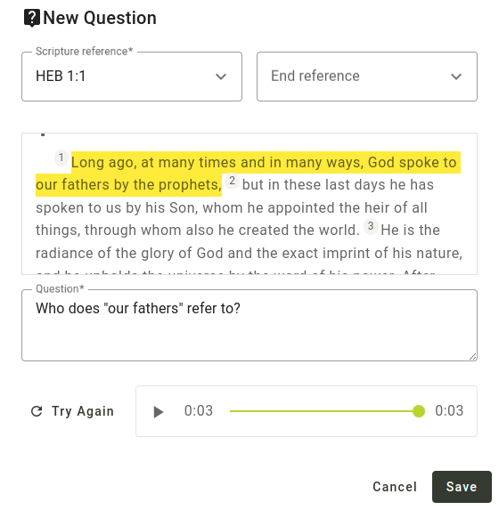

import ReactPlayer from "react-player";

## Añadir preguntas al proyecto {#1850d745ac9e80e09444cb3564752e31}

Para obtener comentarios sobre tu traducción, tendrás que añadir preguntas de comprobación de la comprensión. Puedes importar preguntas creadas por otra persona o crear las tuyas propias.

:::note

Actualmente, la única forma de obtener opiniones de los revisores de la comunidad es hacer preguntas de verificación. Algunos administradores de proyectos han pedido que los revisores puedan añadir comentarios al texto incluso sin que haya una pregunta presente. Si es algo de lo que puede beneficiarse tu proyecto, [expresa tu apoyo a la propuesta](https://community.scripture.software.sil.org/t/feature-request-comments-to-any-bible-verse-chosen/2506/6) en el [sitio de la comunidad de la Fragua de las Escrituras](https://community.scripture.software.sil.org/).

:::

<ReactPlayer controls url="https://youtu.be/J-led5En3D8" />

### Crear preguntas individualmente en la Fragua de las Escrituras {#1850d745ac9e8031908ef693ff578eec}

Para añadir preguntas a tu proyecto, haz clic en **Visión general** en la sección **Comprobación de la comunidad** de la barra lateral de navegación. A continuación, haz clic en el botón **Añadir pregunta**. Se abrirá un diálogo que te permitirá crear una pregunta.

Una pregunta puede aplicarse a un solo versículo o a varios. Escribe una referencia en la casilla de **referencia de la Escritura**, o haz clic en la flecha desplegable para seleccionar un libro, un capítulo y un versículo. Si quieres que la pregunta abarque varios versículos, introduce una referencia final en la segunda casilla. Una vez que hayas introducido una referencia, aparecerá el texto, con los versículos que hayas elegido resaltados.

Escribe tu pregunta en la casilla **Pregunta**. Si quieres añadir una versión de audio de la pregunta, haz clic en el botón **Grabar**. Puede que se te pida permiso para acceder a tu micrófono. Cuando hayas terminado de grabar, haz clic en **Detener grabación**. Luego puedes reproducir la grabación para oír cómo suena. Haz clic en el botón **Inténtalo de nuevo** si no estás satisfecho. También puedes subir un archivo de audio en lugar de grabar, si lo prefieres.

Haz clic en **Guardar** y tu pregunta se añadirá a la lista de preguntas de comprobación de la comunidad.

### Importar preguntas de una hoja de cálculo {#1850d745ac9e8085960dd88b648f0c7a}

Crear preguntas una a una puede ser tedioso, así que también hemos hecho posible importar preguntas desde una hoja de cálculo. Puedes utilizar un programa como Microsoft Excel, Google Sheets o LibreOffice Calc para crear o editar una lista de preguntas. Si buscas un conjunto de preguntas prefabricadas, considera las [Preguntas de traducción de unfoldingWord®](https://git.door43.org/unfoldingWord/en_tq). Si vas a la página enlazada y haces clic en uno de los archivos, podrás descargarlo, abrirlo como hoja de cálculo y editar la lista de preguntas.

Aquí tienes un ejemplo de cómo deben ser las filas de tu hoja de cálculo para poder importarla a Scripture Forge:

| Referencia                | Pregunta                                                  |
| ------------------------- | --------------------------------------------------------- |
| HEB 1:1   | ¿A qué se refiere "nuestros padres"?                      |
| HEB 1:2   | ¿Qué significa que el Hijo es "heredero de todo"?         |
| HEB 1:2-3 | ¿Quién es el "Hijo" del que se habla en estos versículos? |

La hoja de cálculo también puede tener más columnas, pero no se utilizarán todas las columnas excepto las de "referencia" y "pregunta". Los archivos TSV publicados por unfoldingWord tienen un formato ligeramente distinto, pero también pueden importarse a Scripture Forge.

:::note

La referencia debe tener el nombre del libro abreviado de la misma forma que Paratext abrevia los nombres de los libros. Por ejemplo, **HEB 1:** 1 funcionará, pero **Hebreos 1:1** no funcionará.

:::

Si necesitas ayuda para poner tu hoja de cálculo en el formato adecuado para importarla a Scripture Forge, estaremos encantados de ayudarte. Sólo tienes que enviar un correo electrónico a [help@scriptureforge.org](mailto:help@scriptureforge.org).

1. Guarda tu hoja de cálculo como archivo CSV.

   :::note

   Si utiliza Microsoft Excel, asegúrese de seleccionar "CSV UTF-8 (delimitado por comas) (\*.csv)" como tipo de archivo al exportar como CSV.

   :::

2. A continuación, en Scripture Forge, haz clic en **Visión general** en la sección **Comprobación de la comunidad** de la barra lateral de navegación.

3. A continuación, haz clic en el botón **Importación masiva**. Se abrirá un diálogo pidiéndote que elijas de dónde quieres importar las preguntas.

4. Haz clic en **Importar desde archivo CSV** y selecciona el archivo.
   1. Si tienes algunas filas en tu archivo que no tienen una referencia y una pregunta válidas, se mostrará una advertencia haciéndote saber que esas filas se omitirán.
   2. De lo contrario, se te mostrará una lista de preguntas.

### Importar todas las preguntas {#1850d745ac9e80b59ae8cabac1b67e7f}

Para importar todas las preguntas del archivo CSV, sigue estos pasos:

1. Pulsa la casilla situada en la parte superior de la lista. Esto seleccionará todas las preguntas.
2. Haz clic en **Importar preguntas seleccionadas**.

### Importar un subconjunto de preguntas {#1850d745ac9e8045aa5bd2ab9ce99fbc}

También puedes filtrar por un subconjunto de preguntas:

1. Utiliza las casillas **Referencia desde** y **Referencia hasta** para especificar los versículos en los que quieres que empiecen y terminen las preguntas.
2. Por ejemplo, si sólo quieres importar preguntas para la Marca 5:
   1. Pon **MRK 5:1** en la casilla **Referencia de**.
   2. Pon **MRK 5:43** en la casilla **Referencia a**.
3. Haz clic en la casilla situada en la parte superior de la lista para seleccionar todas las preguntas. Sólo se seleccionarán las preguntas que se muestren.
4. Haz clic en **Importar preguntas seleccionadas**.

:::note

No hace falta que recuerdes que hay 43 versículos en Marcos 5 para filtrar todos los versículos del capítulo. Si haces clic en la flecha desplegable del cuadro **Referencia a**, se abrirá un cuadro de diálogo que te permitirá seleccionar un libro, un capítulo y un versículo. Una vez que selecciones Marcos 5, aparecerá una lista de los versículos de Marcos 5, y podrás seleccionar el último, que es el versículo 43. También puedes escribir **MRK 5:100** en la casilla **Referencia a**, y se incluirán todos los versículos de Marcos 5, aunque en realidad no haya un versículo 100 en Marcos 5.

:::

### Importar preguntas de Transcelerator {#1850d745ac9e8003815fc894b8baaeb7}

[Transcelerator](https://software.sil.org/transcelerator/) es un complemento para Paratext que cuenta con un banco de preguntas de comprobación de la comprensión ya preparadas en varios de los principales idiomas. Esas preguntas pueden traducirse en Paratext, exportarse a Scripture Forge y, tras una sincronización, importarse a Scripture Forge.

Para importar preguntas desde Transcelerator:

1. Descarga e instala Transcelerator desde [software.sil.org/transcelerator/download](https://software.sil.org/transcelerator/download/).
2. Reiniciar Paratext.
3. Desde Paratext, lanza Transcelerator.
4. Dentro de Transcelerator, abre el menú **Archivo** y haz clic en **Producir archivos Scripture Forge**.
5. Escribe las traducciones de las preguntas en inglés que quieras utilizar en la columna **Traducción**. Para cada pregunta que esté lista, selecciona la casilla **Confirmada** para las preguntas.
6. Cierra Transcelerator, y haz un envío y recepción con Paratext.
7. En Scripture Forge, en la barra lateral de navegación, haz clic en **Sincronizar**. En la página que se abre, haz clic en **Sincronizar** para enviar y recibir las preguntas del Transcelerator desde Paratext.
8. A continuación, en Scripture Forge, haz clic en **Visión general** en la sección **Comprobación de la comunidad** de la barra lateral de navegación. A continuación, haz clic en el botón **Importación masiva**.
9. Se abrirá un diálogo pidiéndote que elijas de dónde quieres importar las preguntas. Haz clic en **Importar desde Transcelerator**.
10. Selecciona las preguntas que quieres importar. Los pasos para hacerlo son exactamente los mismos que en la sección anterior titulada **Importar preguntas desde una hoja de cálculo**. Consulta esa sección para obtener instrucciones sobre cómo filtrar las preguntas que desees.
11. Haz clic en **Importar preguntas seleccionadas** y tus preguntas se añadirán al proyecto.

## Adjuntar grabación de audio del texto {#1850d745ac9e80e795f3d611356e74d5}

Scripture Forge puede reproducir una grabación de audio de cada pasaje para los revisores de la comunidad. Para ello, deberá cargar un archivo de audio y un archivo de tiempo para cada capítulo. Los archivos de tiempo permiten a Scripture Forge resaltar cada versículo a medida que se pronuncia.

### Grabación del texto {#1850d745ac9e805eb4b1c0f05d6da02a}

Scripture Forge admite audio en formatos de archivo .mp3 y .wav. Los archivos de tiempo son compatibles con HearThis, aeneas, Audacity y Adobe Audition.

Una de las opciones más sencillas es utilizar [HearThis](http://software.sil.org/hearthis) para grabar la traducción. [Esta guía](https://software.sil.org/downloads/r/scriptureappbuilder/Scripture-App-Builder-08-Using-HearThis-for-Audio-Recording.pdf) le guiará a través del proceso de grabación de las escrituras y la producción de archivos de audio y tiempo. Sáltese los pasos del final sobre el uso de Scripture App Builder.

Los [recursos](https://software.sil.org/scriptureappbuilder/resources/) para Scripture App Builder tratan enfoques más avanzados, como el uso de Glyssen para una grabación de audio dramatizada.

### Creación de archivos de temporización {#1850d745ac9e80c7b583c6d50193d7c9}

Si ya tiene audio grabado, existen varias opciones para crear datos de temporización.

Puede generar automáticamente archivos de temporización utilizando aeneas siguiendo [estas instrucciones](https://software.sil.org/downloads/r/scriptureappbuilder/Scripture-App-Builder-07-Using-aeneas-for-Audio-Text-Synchronization.pdf).

Alternativamente, puede crear manualmente archivos de sincronización utilizando Audacity siguiendo [esta guía](https://software.sil.org/downloads/r/scriptureappbuilder/Scripture-App-Builder-06-Using-Audacity-for-Audio-Text-Synchronization.pdf). Otra opción es Adobe Audition. Los datos de tiempo de Adobe Audition se admiten en formatos de tiempo decimal o FPS. No admitimos el formato "muestras".

### Adjuntar audio {#1850d745ac9e80668685c9ea58252d6b}

Para cargar archivos de audio y cronometraje, en la barra lateral haga clic en **Preguntas y respuestas**, navegue hasta el capítulo al que desee adjuntar audio y, a continuación, haga clic en el icono **Gestionar audio** de la esquina superior derecha. Haga clic en **Examinar archivos** y seleccione la grabación de audio y el archivo de sincronización asociado para ese capítulo, después haga clic en **Guardar**.

