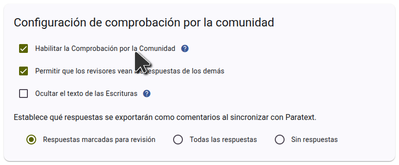

Para configurar la comprobación comunitaria en Scripture Forge, [inicie sesión con Paratext](log-in). Debe ser un administrador del proyecto para configurar la comprobación comunitaria.

Si el proyecto aún no se ha conectado a Scripture Forge, [conecta el proyecto](connect-paratext-project) y mantén marcada la casilla **Activar comprobación comunitaria**.

Si el proyecto ya se ha conectado, puede activar la comprobación comunitaria en la página **Configuración**. En la sección **Comprobación comunitaria** de la página de configuración, marque la casilla **Activar Comprobación comunitaria** como se muestra en la siguiente captura de pantalla.

