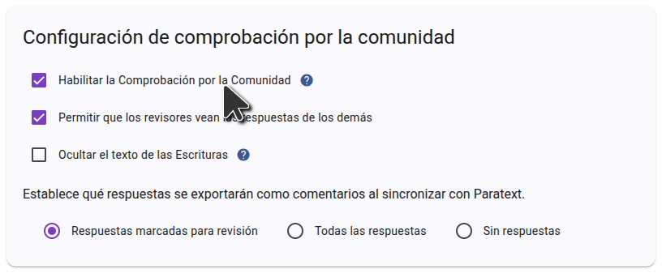

Para utilizar la comprobación de la Comunidad de Scripture Forge, primero debe iniciar sesión en Scripture Forge usando sus credenciales de Paratext y Conectar su proyecto. Una vez conectado su proyecto, vaya a Configuración y desplácese hasta la sección Comprobación de la Comunidad. Asegúrate de que la casilla "Habilitar la Comprobación por la Comunidad" está seleccionada.

