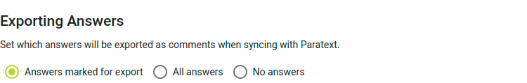

import ReactPlayer from "react-player";

## Recibe las respuestas a las preguntas e interactúa con ellas {#1850d745ac9e800db3dacdee0053beca}

<ReactPlayer controls url="https://youtu.be/C3bgh3yufVg" />

Para supervisar las respuestas de la comprobación comunitaria, haz clic en **Resumen** en la sección **Comprobación comunitaria** de la barra lateral de navegación. Junto con una lista de preguntas, se mostrarán estadísticas básicas sobre las respuestas.

Para ver las respuestas de los revisores de la comunidad, haz clic en uno de los libros de la sección **Verificación comunitaria** de la barra lateral de navegación. A continuación, haz clic en una pregunta para ver las respuestas que se han dado. Si quieres que una respuesta se exporte a Paratext, haz clic en **Marcar para exportar** en esa respuesta. Si no quieres hacer nada más con la respuesta, haz clic en **Resolver**. Esto no elimina la respuesta, sino que la marca como que no necesita ninguna otra acción.

Si quieres encontrar respuestas que no han sido marcadas para exportar, o marcadas como resueltas, utiliza el filtro situado encima de la lista de preguntas para encontrar **Respuestas no revisadas**.

Si prefieres que todas las respuestas se exporten a Paratext sin marcarlas individualmente para su exportación, ve a la configuración del proyecto y busca la sección **Exportar respuestas**. La opción por defecto es exportar sólo **las Respuestas marcadas para exportar**, pero este ajuste puede cambiarse a **Todas las respuestas** o **Sin respuestas**.

## Sincroniza el proyecto para que las respuestas aparezcan como notas en Paratext {#1850d745ac9e80a8b3f0f50bcdd0be58}

En la barra lateral de navegación, haz clic en **Sincronizar**. En la página que se abre, haz clic en **Sincronizar** para enviar y recibir cambios desde Paratext. Después abre tu proyecto en Paratext y haz un envío y una recepción. Las respuestas de los revisores de la comunidad aparecerán en tu proyecto como notas. Ten en cuenta que si respondes a estas notas en Paratext, tus respuestas no aparecerán como comentarios sobre la respuesta en Scripture Forge.

La nota mostrará la pregunta original, el nombre del revisor de la comunidad que respondió y la propia respuesta, como se muestra a continuación.

Las notas generadas a partir de las respuestas de comprobación comunitaria tendrán una etiqueta de nota única, con un icono diferente al de otras notas de tu proyecto Paratext. Puedes cambiar el icono editando la etiqueta de la nota. Para más detalles, consulta [el artículo de ayuda de Paratext sobre etiquetas de notas personalizadas](https://paratext.org/paratext-training/tutorials/custom-project-note-tags-tutorial/). También puedes [filtrar las notas por su etiqueta de nota](https://paratext.org/2022/08/15/custom-note-tags/#Filter_for_Custom_Note_Tags), lo que te permite mostrar sólo las respuestas de comprobación de la comunidad, u ocultarlas por completo de la vista.

:::note

Actualmente las respuestas de audio aparecen en Paratext pero no se puede reproducir el audio. Para reproducir el audio de una respuesta hay que abrirla en Scripture Forge. Esto puede mejorarse en el futuro.

:::

