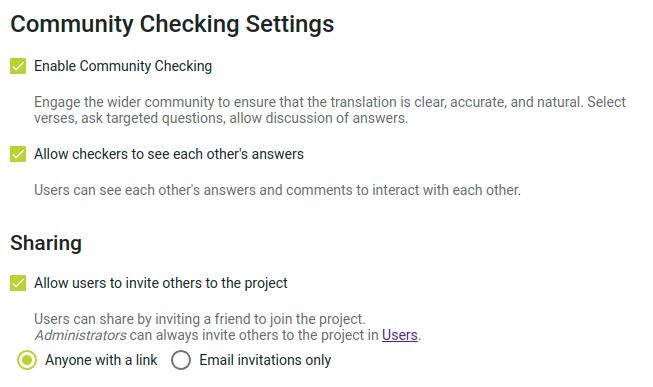

import ReactPlayer from "react-player";

## Invita a la gente a comprobar tu proyecto {#1850d745ac9e80caacf5e643bb216f77}

<ReactPlayer controls url="https://youtu.be/aBPHCF56hxA" />

Una vez que tengas las preguntas sobre tu proyecto, es hora de invitar a los verificadores de la comunidad.

En la barra lateral, haz clic en **Configuración** y desplázate hasta **Configuración de la comprobación comunitaria**.

### Ajustes de interacción con el usuario {#1850d745ac9e8018b5a7ff9f3ea349e9}

El primer ajuste a tener en cuenta es **Permitir que los correctores vean las respuestas de los demás**. Cuando se presenta una pregunta a los verificadores de la comunidad, no se muestran las respuestas existentes de otros verificadores de la comunidad para que no influyan en la respuesta que se dé. Una vez contestada una pregunta, se mostrarán las demás respuestas a la pregunta, y los verificadores podrán comentar y dar "me gusta" a las respuestas de los demás. Si no deseas esta interacción y quieres que las respuestas de otros correctores estén siempre ocultas, desactiva **Permitir que los correctores vean las respuestas de los demás**.

### Ajustes compartidos {#1850d745ac9e8097ad4efcb063fc2603}

Si quieres que los verificadores de la comunidad puedan invitar a amigos al proyecto, asegúrate de que la opción **Permitir que los usuarios inviten a otros** al proyecto está activada. Si esta opción está desactivada, sólo los administradores del proyecto podrán añadir verificadores comunitarios al proyecto.

Si activas este ajuste, puedes elegir entre dos modos de compartir. Si seleccionas **Cualquiera con un enlace**, puedes enviar a la gente un enlace al proyecto, y cualquiera que haga clic en el enlace puede unirse al proyecto. Esto es ideal si quieres invitar a un grupo de personas (por ejemplo, podrías compartir el enlace en un grupo de Facebook o WhatsApp). Cualquiera que tenga el enlace podrá enviarlo a otra persona para que se una al proyecto. También puedes seleccionar **Sólo invitaciones por correo electrónico**, y los verificadores de la comunidad sólo podrán invitar a amigos enviando una invitación en Scripture Forge (Scripture Forge enviará una invitación por correo electrónico a la persona).

### Invitar a verificadores comunitarios {#1850d745ac9e802d84d8e00da4fe25c2}

En la barra lateral, haz clic en **Usuarios**, y se te presentarán las opciones para compartir.

Si activaste la opción de compartir enlaces en el paso anterior, habrá un enlace que podrás copiar para compartir el proyecto. Para copiar el enlace, haz clic en el icono de copia situado a la derecha del enlace.

Si el uso compartido de enlaces está desactivado, o si quieres enviar invitaciones por correo electrónico a los usuarios, escribe el correo electrónico del usuario al que quieres invitar, selecciona el rol de **Community Checker** y elige un idioma de invitación. Luego haz clic en **Enviar**. Se enviará un correo electrónico con un enlace a la persona, que tendrá que hacer clic en el enlace e inscribirse para unirse al proyecto.

