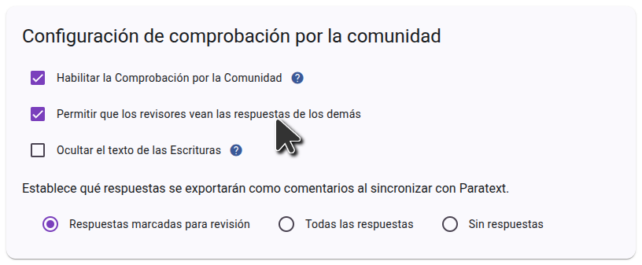
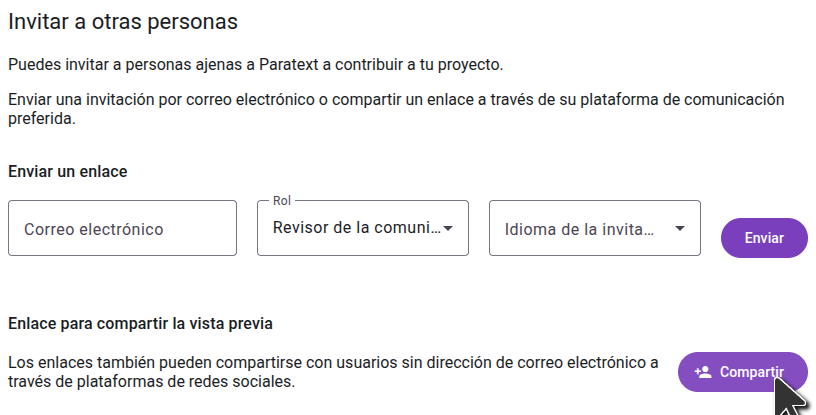

import ReactPlayer from "react-player";

## Invita a la gente a comprobar tu proyecto {#1850d745ac9e80caacf5e643bb216f77}

<ReactPlayer controls url="https://youtu.be/aBPHCF56hxA" />

Una vez que tengas las preguntas sobre tu proyecto, es hora de invitar a los revisores de la comunidad.

En la barra lateral, haz clic en **Configuración** y desplázate hasta **Configuración de compartir**.

### Ajustes de interacción con el usuario {#1850d745ac9e8018b5a7ff9f3ea349e9}

El primer ajuste a tener en cuenta es **Permitir que los correctores vean las respuestas y comentarios de los demás**. Cuando se presenta una pregunta a los revisores de la comunidad, no se muestran las respuestas existentes de otros revisores de la comunidad para que no influyan en la respuesta que se dé. Una vez contestada una pregunta, se mostrarán las demás respuestas a la pregunta, y los revisores podrán comentar y dar "me gusta" a las respuestas de los demás. Si no deseas esta interacción y quieres que las respuestas de otros correctores estén siempre ocultas, desactiva **Permitir que los correctores vean las respuestas y comentarios de los demás**.

### Ajustes compartidos {#1850d745ac9e8097ad4efcb063fc2603}

Si quieres que los revisores de la comunidad puedan invitar a amigos al proyecto, asegúrate de que la opción **Permitir que los revisores de la comunidad inviten a revisores de la comunidad** al proyecto está activada. Si esta opción está desactivada, sólo los administradores del proyecto podrán añadir revisores de la comunidad al proyecto.

### Invitar a revisores de la comunidads {#1850d745ac9e802d84d8e00da4fe25c2}

En la barra lateral, haz clic en **Usuarios**, y se te presentarán las opciones para compartir.

Para invitar a alguien enviándole un enlace, haga clic en **Compartir**, seleccione el idioma en el que desea que Scripture Forge se muestre al destinatario y copie el enlace. A continuación, puede enviar este enlace a cualquier persona que desee invitar al proyecto. Cuando hagan clic en el enlace, podrán unirse al proyecto como revisor de la comunidad.

Si desea enviar invitaciones por correo electrónico a los usuarios, escriba el correo electrónico del usuario al que desea invitar, seleccione el rol **Revisor de la comunidad** y elija un idioma de invitación. Luego haz clic en **Enviar**. Se enviará un correo electrónico con un enlace a la persona, que tendrá que hacer clic en el enlace e inscribirse para unirse al proyecto.

