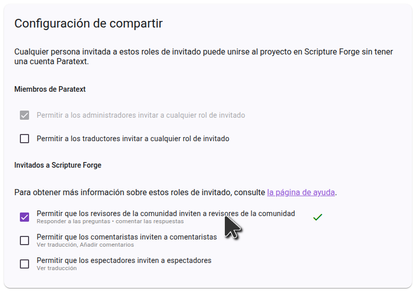

import ReactPlayer from "react-player";

## Invita a la gente a comprobar tu proyecto {#1850d745ac9e80caacf5e643bb216f77}

<ReactPlayer controls url="https://youtu.be/aBPHCF56hxA" />

Una vez que tengas las preguntas sobre tu proyecto, es hora de invitar a los verificadores de la comunidad.

In the side bar, click **Settings**, and scroll down to **Sharing settings**.

### Ajustes de interacción con el usuario {#1850d745ac9e8018b5a7ff9f3ea349e9}

The first setting to consider is **Allow checkers to see each other's answers and comments**. Cuando se presenta una pregunta a los verificadores de la comunidad, no se muestran las respuestas existentes de otros verificadores de la comunidad para que no influyan en la respuesta que se dé. Una vez contestada una pregunta, se mostrarán las demás respuestas a la pregunta, y los verificadores podrán comentar y dar "me gusta" a las respuestas de los demás. If you don’t want this interaction and want answers from other checkers to always be hidden, turn off **Allow checkers to see each other's answers and comments**.

### Ajustes compartidos {#1850d745ac9e8097ad4efcb063fc2603}

If you want community checkers to be able to invite friends to the project, make sure **Allow community checkers to invite community checkers** is enabled. Si esta opción está desactivada, sólo los administradores del proyecto podrán añadir verificadores comunitarios al proyecto.

### Invitar a verificadores comunitarios {#1850d745ac9e802d84d8e00da4fe25c2}

En la barra lateral, haz clic en **Usuarios**, y se te presentarán las opciones para compartir.

To invite someone by sending a link, click **Share**, select the language you want Scripture Forge to show the recipient, and copy the link. You can then send this link to anyone you want to invite to the project. When they click the link, they will be able to join the project as a community checker.

If you want to send email invitations to users, type the email of the user you want to invite, select the **Community Checker** role, and choose an invitation language. Luego haz clic en **Enviar**. Se enviará un correo electrónico con un enlace a la persona, que tendrá que hacer clic en el enlace e inscribirse para unirse al proyecto.

