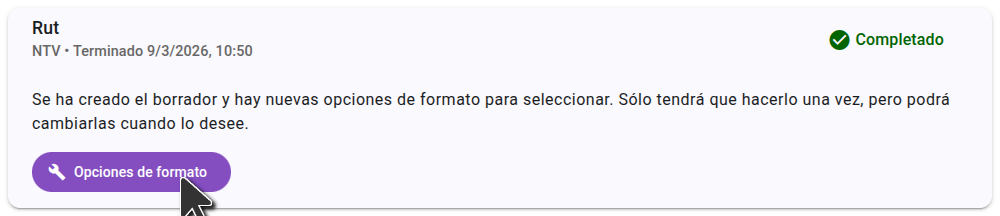
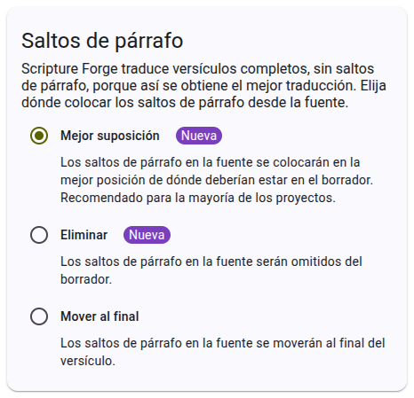
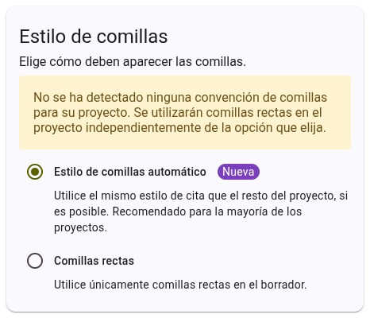

Tras generar un borrador en Scripture Forge, deberá seleccionar las opciones de formato. Estas opciones controlan cómo Scripture Forge formatea el borrador de texto.

Las opciones de formato se guardan en el proyecto, por lo que sólo tiene que elegirlas una vez, aunque puede cambiarlas más tarde si es necesario.

## Seleccionando opciones de salto de párrafo

Hay tres opciones para los saltos de párrafo. The default is "best guess" which is recommended for most projects. When you select an option, a preview is shown on the right side of the page to help you understand how the options will affect the formatting of your draft.

## Selecting quote style options

There are two options for quote style. The default is "automatic" which is recommended for most projects. When you select an option, a preview is shown on the right side of the page to help you understand how the options will affect the formatting of your draft.

Once you have selected your formatting options, click "Save" to save the options to your project. These options will be used for all future drafts generated for the project. You can change these options at any time, and they will be applied to all future drafts.