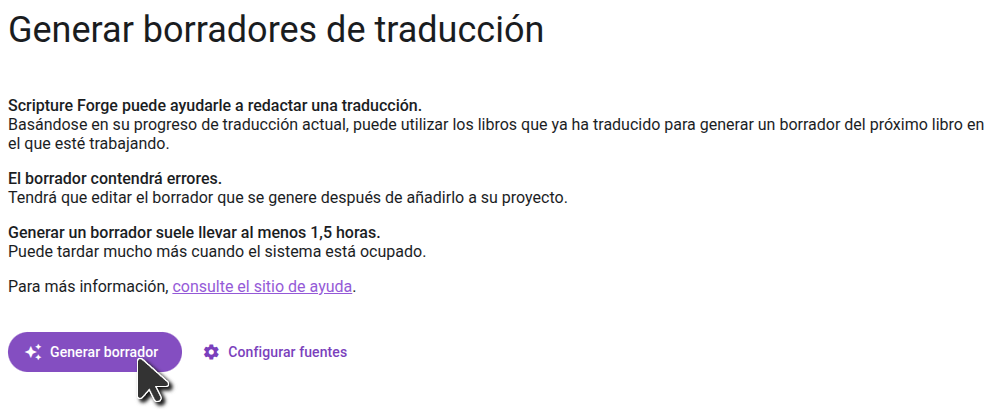
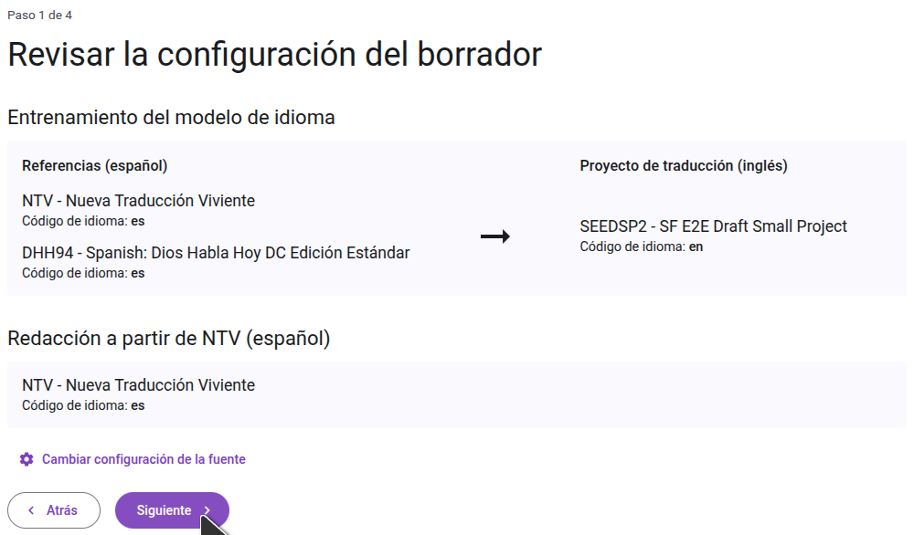
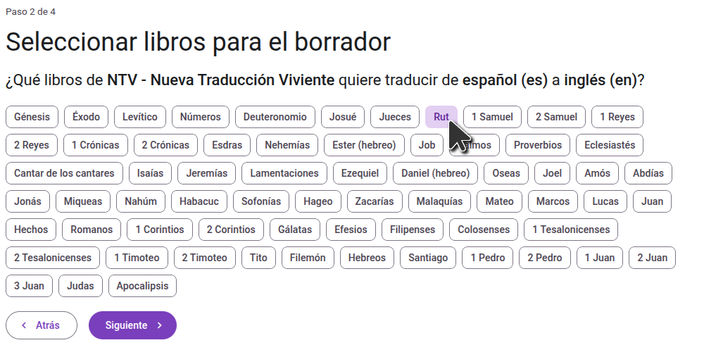
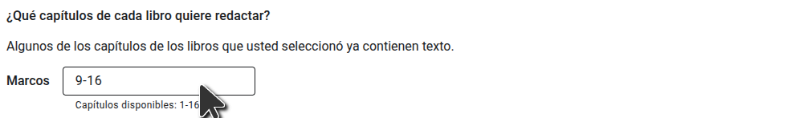
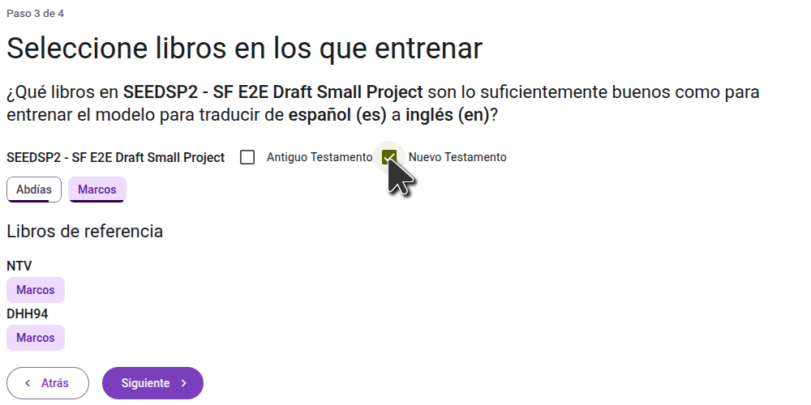
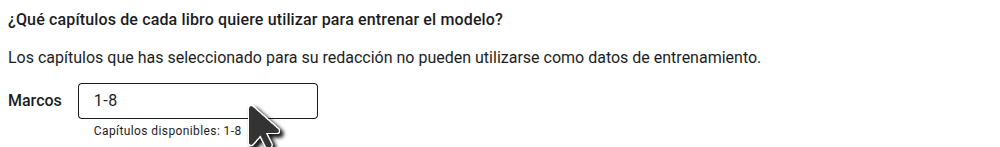
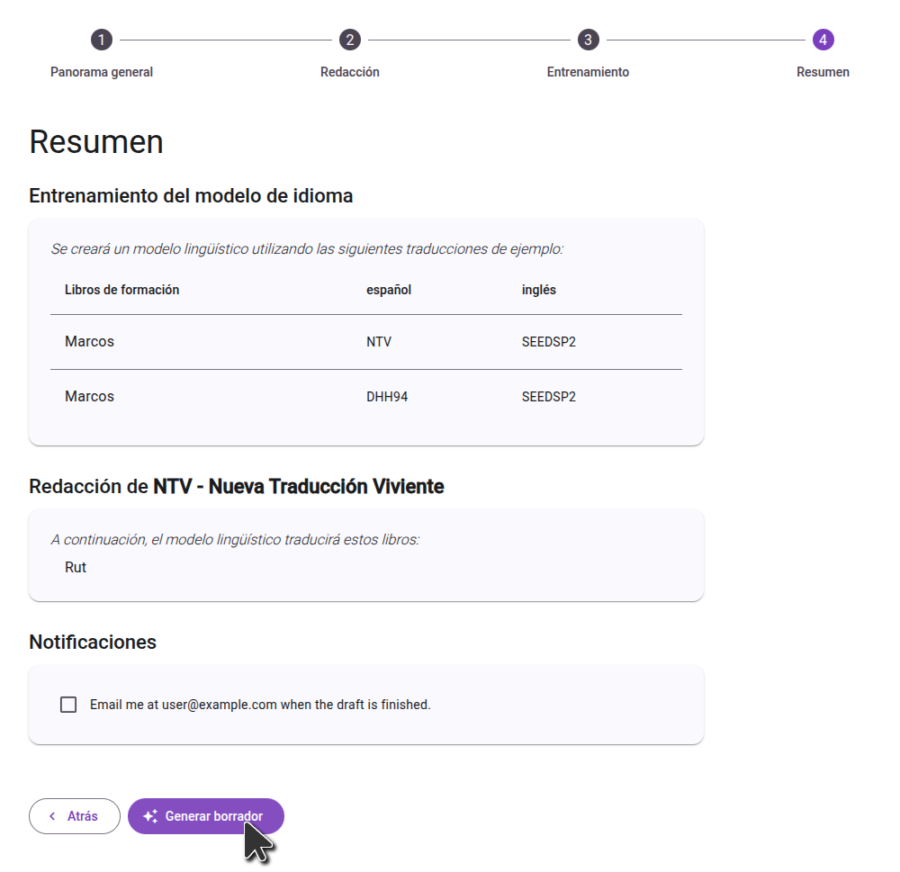

import ReactPlayer from "react-player";

<ReactPlayer controls url="https://youtu.be/binHoeAGGvU" />

## Generar un borrador

Una vez activado el proyecto y configuradas las fuentes, haga clic en el botón Generar borrador para empezar:

### Confirmar la configuración del proyecto

En la primera pantalla, revise las fuentes y los códigos de idioma configurados y compruebe que son correctos. A continuación, vaya al paso siguiente.

:::note

Si utilizas un proyecto Paratext independiente para almacenar los borradores generados por la IA, comprueba que tu proyecto de traducción de trabajo principal aparece en la sección **Datos del idioma de destino**. Los borradores deben generarse a partir de su proyecto principal para que el modelo pueda aprender de su trabajo de traducción terminado.

:::

### Seleccione los libros para redactar {#select-the-books-to-draft}

En el segundo paso, seleccione los libros que desea traducir. Si el libro que desea redactar no existe en su proyecto Paratext, tendrá que crear primero el libro en Paratext. En general, le sugerimos que redacte un libro a la vez, aunque si está redactando libros más pequeños, puede que le convenga redactar varios a la vez. En el caso de los libros largos, considera la posibilidad de crear un nuevo borrador después de haber completado una parte considerable del libro.

:::note

**Generación incremental de borradores:** Si seleccionas un libro que tenga al menos 12 capítulos y ya contenga algo de texto, verás la opción de seleccionar los capítulos de los que quieres crear un borrador. Si eliges utilizar solo algunos capítulos como borrador, podrás seleccionar algunos o todos los capítulos restantes para entrenar el modelo en el siguiente paso. Separa los capítulos con comas y utiliza un guion para indicar rangos de capítulos, por ejemplo: 1-10,25,40-50.

:::

:::tip

Cuando usas proyectos de generación temprano en la vida de un proyecto, recomendamos comenzar con los Evangelios y Actos, y generando un nuevo borrador incremental cada vez que se completan 8-10 capítulos más. Consulta las [Guidelines for New Testament Draft Generation](https://help.scriptureforge.org/new-testament-drafting). Por el momento no se dispone de recomendaciones específicas sobre la redacción gradual de los libros del Antiguo Testamento. Recomendamos generar un nuevo borrador después de traducir cada tercio de un libro extenso para ver si se pueden hacer posibles mejoras.

:::

### Seleccione los libros para entrenar el modelo de idioma

En el siguiente paso, seleccione los libros a utilizar para formar el modelo de idioma, tanto en su proyecto principal como en los proyectos de referencia. **Elija todos los libros de su proyecto que hayan sido revisados adecuadamente. Aunque no es necesario que estén revisados por consultores, deben ser traducciones precisas del libro de origen.**

:::note

Si en el paso anterior has elegido redactar solo algunos capítulos de un libro, puedes optar por incluir todos los capítulos restantes o solo una parte de ellos en el entrenamiento. Los capítulos seleccionados para la redacción no estarán disponibles para el entrenamiento. Separa los capítulos con comas y utiliza un guion para indicar rangos de capítulos, por ejemplo: 1-10,25,40-50.

:::

### Confirme sus selecciones

En el último paso, revise los libros que seleccionó para entrenar el modelo y los que seleccionó para el borrador. Si necesita realizar algún cambio, puede volver a los pasos anteriores. Una vez que esté satisfecho con sus selecciones, haga clic en el botón "Generar borrador" para iniciar el proceso.

