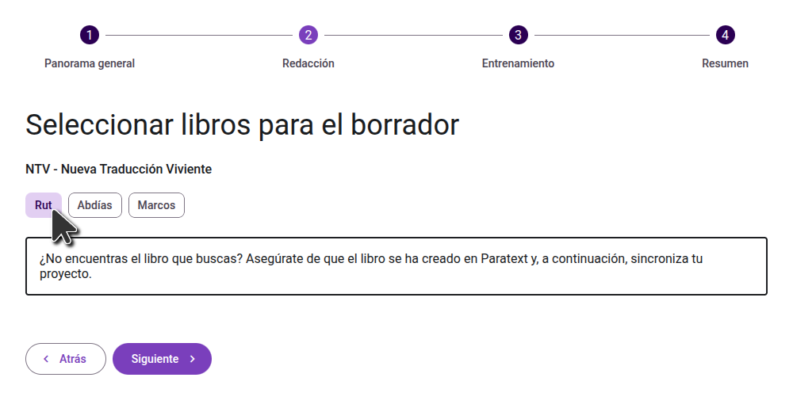
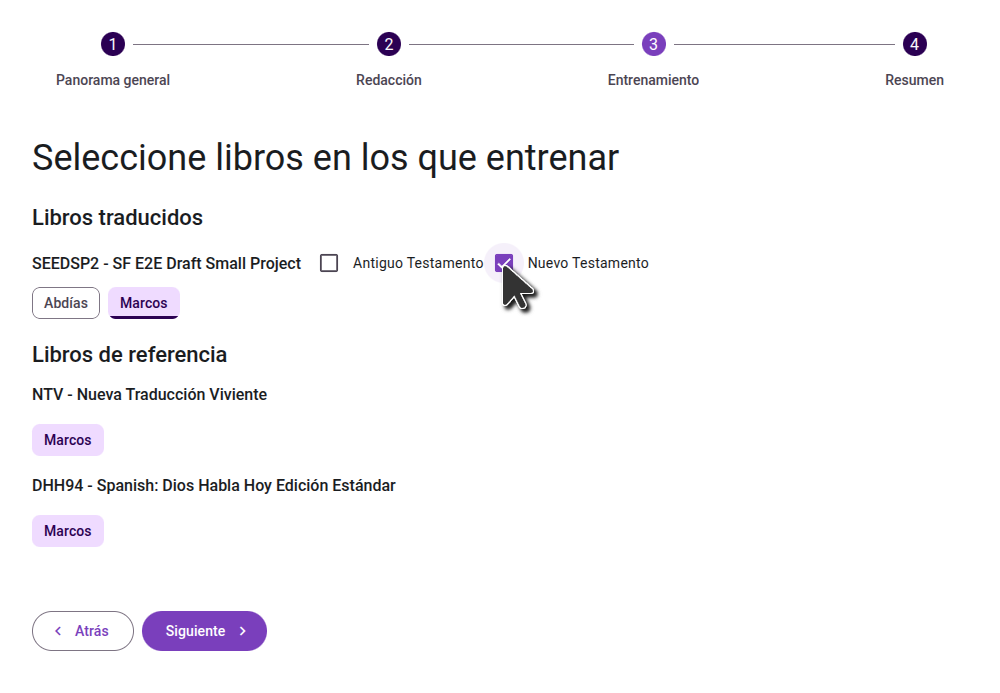
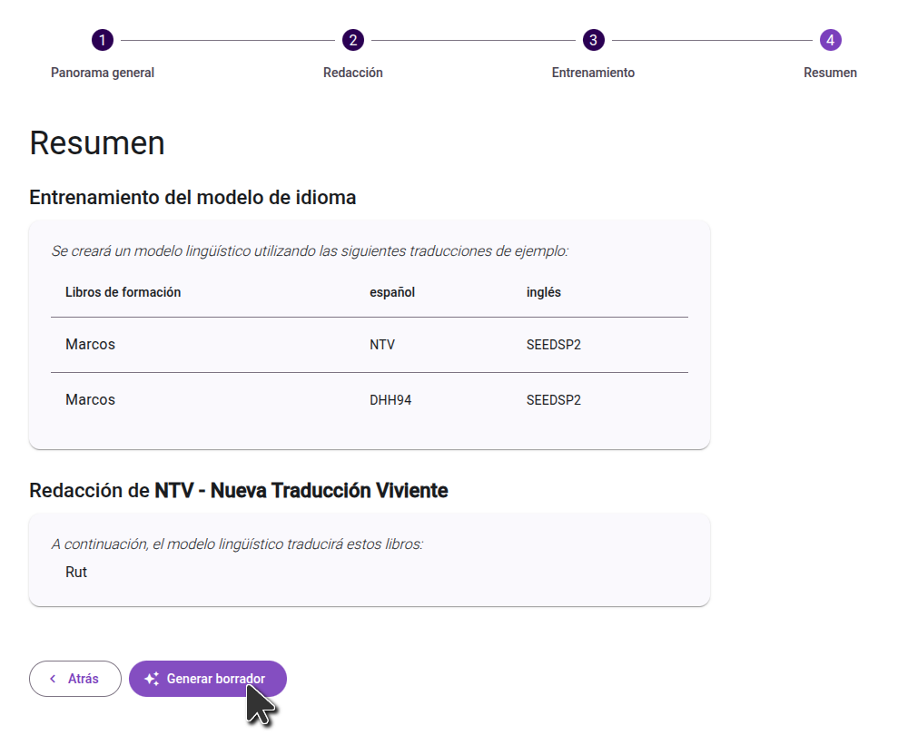

import ReactPlayer from "react-player";

<ReactPlayer controls url="https://youtu.be/binHoeAGGvU" />

## Generar un borrador

Una vez activado el proyecto y configuradas las fuentes, haga clic en el botón Generar borrador para empezar:

### Confirmar la configuración del proyecto

En la primera pantalla, revise las fuentes y los códigos de idioma configurados y compruebe que son correctos. A continuación, vaya al paso siguiente.

:::note

If you use a separate Paratext project to store AI-generated drafts, double check that your main working translation project is listed in the **Target language data** section. Drafts must be generated from your main project so that model can learn from your completed translation work.

:::

### Seleccione los libros para redactar

En el segundo paso, seleccione los libros que desea traducir. Si el libro que desea redactar no existe en su proyecto Paratext, tendrá que crear primero el libro en Paratext. En general, le sugerimos que redacte un libro a la vez, aunque si está redactando libros más pequeños, puede que le convenga redactar varios a la vez.

### Seleccione los libros para entrenar el modelo de idioma

En el siguiente paso, seleccione los libros a utilizar para formar el modelo de idioma, tanto en su proyecto principal como en los proyectos de referencia. **Elija todos los libros de su proyecto que hayan sido revisados adecuadamente. Aunque no es necesario que estén revisados por consultores, deben ser traducciones precisas del libro de origen.**

### Confirme sus selecciones

En el último paso, revise los libros que seleccionó para entrenar el modelo y los que seleccionó para el borrador. Si necesita realizar algún cambio, puede volver a los pasos anteriores. Una vez que esté satisfecho con sus selecciones, haga clic en el botón "Generar borrador" para iniciar el proceso.

