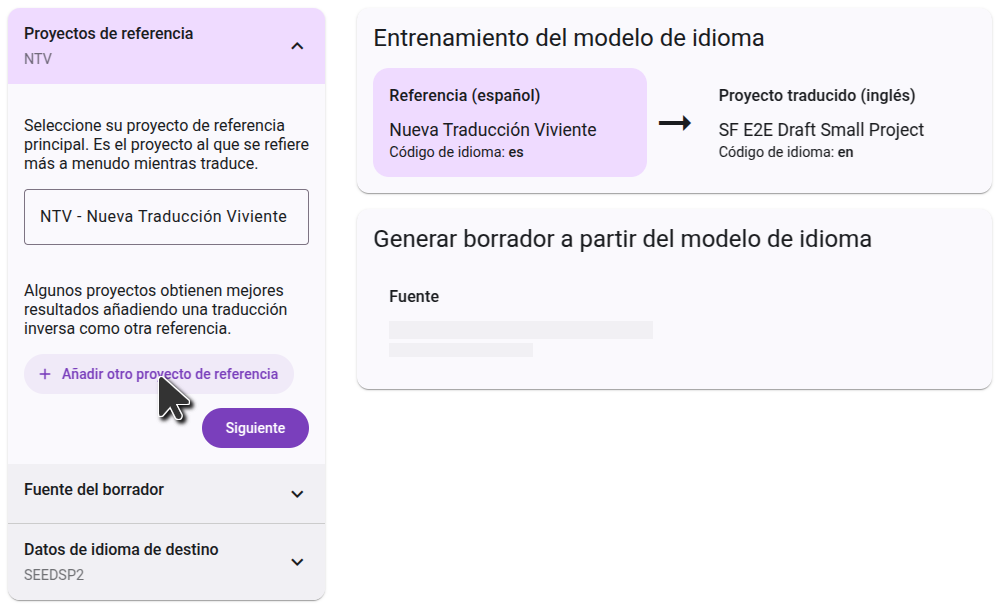
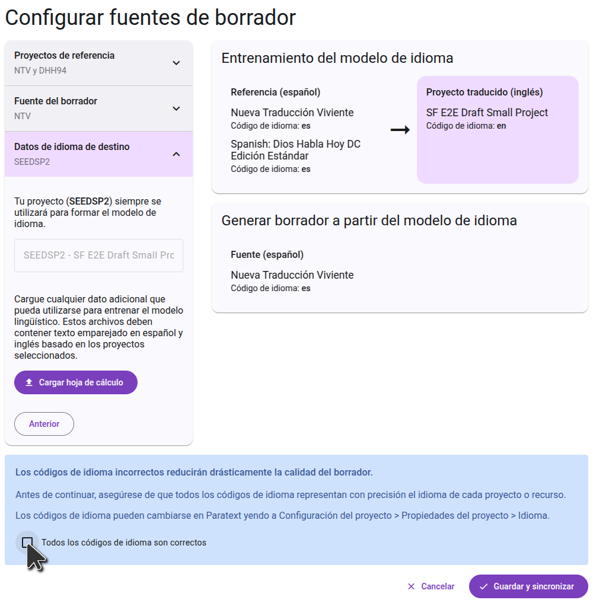

## Regístrese para generar borradores {#c01e77600a3b440ead3f1b816837d614}

Para generar borradores en Forja de Escritura, haga clic en el botón "Generar borrador" en el menú principal. A continuación, haga clic en el botón "Regístrese para generar borradores" y rellene el formulario que se abre para obtener acceso a su proyecto. Los proyectos de retrotraducción están activados por defecto y no necesitan rellenar el formulario.

Después de rellenar el formulario, el equipo de Scripture Forge revisará su solicitud y trabajará para encontrar la mejor configuración para su proyecto. Se le proporcionará uno o más borradores para revisar. Si decide que la generación de borradores es adecuada para su proyecto, el equipo habilitará la generación de borradores en su proyecto y le guiará en el proceso de selección de los ajustes que hayan resultado mejores.

## Configurando el borrador {#26e1244e99c0459bad277d7cff4417b8}

Una vez que se haya habilitado la redacción de su proyecto, el botón "Inscribirse en la redacción" se sustituirá por un botón "Configurar fuentes". Haga clic en este botón para seleccionar los proyectos que se utilizarán como fuente para su borrador.

### Eligiendo el proyecto fuente

El primer paso es seleccionar el proyecto del que desea traducir el borrador. Por lo general, será en una lengua de comunicación más amplia. Esto puede ser un proyecto de Paratext o un recurso de Biblioteca Bíblica Digital. Comience a escribir el nombre del proyecto (o el nombre abreviado del proyecto), y la lista se filtrará para mostrar sólo los proyectos que coincidan. Haga clic en el proyecto que desea utilizar como fuente y vaya al paso siguiente.

### Elegir los proyectos de referencia

El proyecto de referencia se utiliza para entrenar el modelo lingüístico. A menudo utilizará el mismo proyecto que el proyecto fuente, pero en algunos casos puede obtener mejores resultados utilizando un proyecto diferente. Algunos proyectos pueden seleccionar un segundo proyecto de referencia. Un caso de uso común es seleccionar su traducción inversa como segundo proyecto de referencia.

Cada proyecto es diferente, así que siga las instrucciones que haya recibido del equipo de incorporación.

### Confirmando los idiomas

El paso final muestra los datos del idioma de destino. Esto incluirá siempre su propio proyecto, que ya está seleccionado y no puede eliminarse. Actualmente no es posible añadir datos de entrenamiento adicionales en este paso.

A la derecha, verá un diagrama de cómo se utilizarán los proyectos seleccionados para generar el borrador. En el primer paso, el modelo lingüístico aprenderá del

