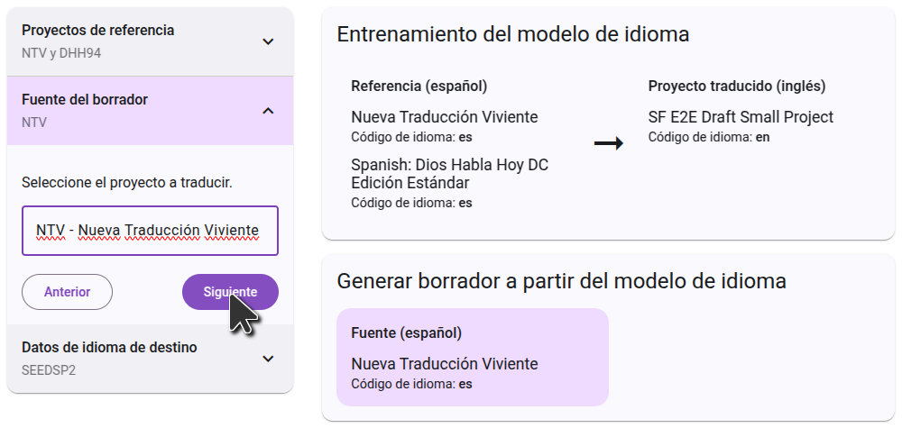

## Regístrese para generar borradores {#c01e77600a3b440ead3f1b816837d614}

Para generar borradores en Forja de Escritura, haga clic en el botón "Generar borrador" en el menú principal. A continuación, haga clic en el botón "Regístrese para generar borradores" y rellene el formulario que se abre para obtener acceso a su proyecto. Los proyectos de retrotraducción están activados por defecto y no necesitan rellenar el formulario.

Después de rellenar el formulario, el equipo de Scripture Forge revisará su solicitud y trabajará para encontrar la mejor configuración para su proyecto. Se le proporcionará uno o más borradores para revisar. Si decide que la generación de borradores es adecuada para su proyecto, el equipo habilitará la generación de borradores en su proyecto y le guiará en el proceso de selección de los ajustes que hayan resultado mejores.

## Configurando el borrador {#26e1244e99c0459bad277d7cff4417b8}

Una vez que se haya habilitado la redacción de su proyecto, el botón "Inscribirse en la redacción" se sustituirá por un botón "Configurar fuentes". Haga clic en este botón para seleccionar los proyectos que se utilizarán como fuente para su borrador.

### Eligiendo el proyecto fuente

The first step is to select the project you want the draft to be translated from. Usually this will be in a language of wider communication. This can be a Paratext project, or a Digital Bible Library resource. Start typing the name of the project (or the project short name), and the list will filter to show only the projects that match. Click on the project you want to use as a source, then go to the next step.

### Choosing the reference projects

The reference project is used for training the language model. Often you will use the same project as the source project, but in some cases you can get better results by using a different project. Some projects may select a second reference project. One common uses-case is to select your back translation as a second reference project.

Every project is different, so follow the instructions you received from the onboarding team.

### Confirming the languages

The final step shows the target language data. This will always include your project itself, which is already selected and cannot be removed. Currently it's not possible to add additional training data at this step.

On the right side, you will see a diagram of how the projects you selected will be used to generate the draft. In the first step, the language model will learn from the

